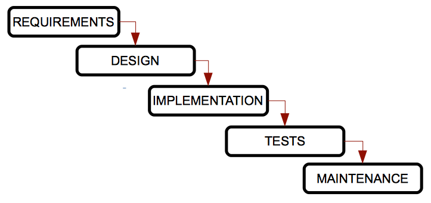
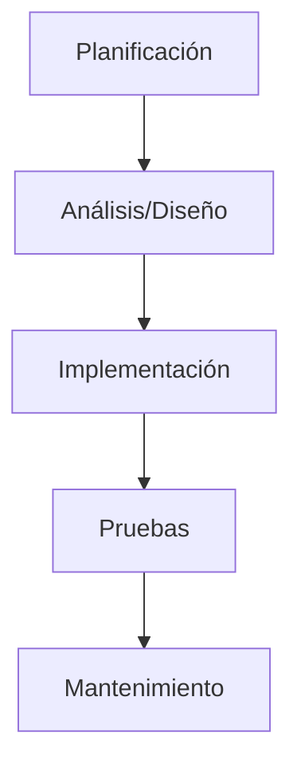
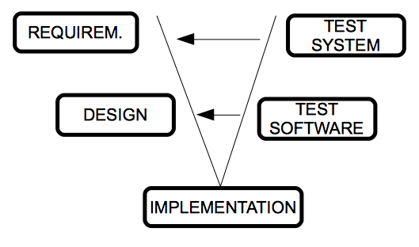
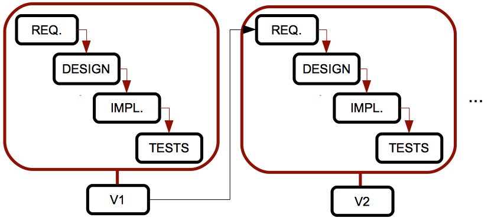
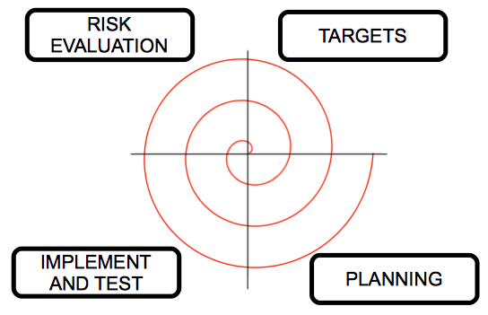

# 1 Ingeniería de Software

Para desarrollar software de manera adecuada, debemos seguir ciertos pasos o un enfoque determinado para este desarrollo. La **ingeniería de software** es la rama de la informática que nos ayuda a seguir estos enfoques y pasos correctamente.

<!-- @import "[TOC]" {cmd="toc" depthFrom=1 depthTo=6 orderedList=false} -->

<!-- code_chunk_output -->

- [1 Ingeniería de Software](#1-ingeniería-de-software)
  - [1. Etapas en el desarrollo de software](#1-etapas-en-el-desarrollo-de-software)
  - [2. Ciclos de vida del software](#2-ciclos-de-vida-del-software)
    - [2.1. Modelo en cascada o de cascada](#21-modelo-en-cascada-o-de-cascada)
    - [2.2. Modelo V](#22-modelo-v)
    - [2.3. Modelo iterativo](#23-modelo-iterativo)
    - [2.4. Modelo espiral](#24-modelo-espiral)

<!-- /code_chunk_output -->

## 1. Etapas en el desarrollo de software

En (casi) todos los procesos de ingeniería de software, podemos seguir los siguientes pasos:

  * **Análisis de requisitos:** Esta etapa incluye la comunicación con el cliente para aclarar sus necesidades, y una fase de análisis para esbozar el comportamiento principal de la aplicación. Se puede dividir en dos fases:

      * **Especificación de requisitos:** La comunicación con el cliente, en la cual organizaremos algunas entrevistas u otras maneras de obtener información. Debemos aclarar las necesidades que hay que cumplir, y una vez que se han recopilado los requisitos, escribimos un documento llamado **especificación de requisitos**, que debe ser lo más completo posible.
      * **Análisis:** A partir de la especificación de requisitos creada en la etapa anterior, ahora debemos crear un nuevo documento donde utilizaremos algunos diagramas útiles para representar las funcionalidades principales de la aplicación y sus conexiones o dependencias.

  * **Diseño:** A partir de los documentos de análisis establecidos antes, ahora podemos determinar cómo funcionará el software. Aquí utilizaremos otros diagramas que nos ayudarán a implementar el software.

  * **Implementación:** Esta etapa debe comenzar desde la etapa de diseño anterior, utilizando un lenguaje de programación específico (o más de uno).

  * **Pruebas:** Una vez que el producto ha sido implementado, debemos probarlo para comprobar si cumple todos los requisitos y no hay ningún error. Estas pruebas deben ser revisadas por alguien que no esté implicado en el proceso de implementación.

  * **Mantenimiento:** Esta última etapa consiste en mejorar el rendimiento del producto de software, añadiendo nuevas extensiones o corrigiendo algunos errores.

Para resumir estas etapas, podríamos decir que la ingeniería de software proporciona un enfoque que nos ayuda a entender el problema a resolver (**análisis de requisitos**), diseñar una posible solución, implementarla, probarla y luego obtener una mejor calidad o rendimiento (**mantenimiento**).

Sin embargo, estos pasos a veces pueden ser un obstáculo, ya que muchos desarrolladores piensan que la ingeniería de software es demasiado estructurada y no les permite desarrollar software rápidamente. Pero debemos ver la ingeniería de software como algo **adaptativo**, que proporciona diferentes modelos y metodologías que se pueden adaptar a nuestro proceso de desarrollo, como veremos más adelante.

## 2. Ciclos de vida del software

Un **ciclo de vida** es una lista de etapas por las cuales debe pasar un sistema (en este caso, un proyecto de software) desde su nacimiento hasta que deja de utilizarse. En cada ciclo de vida establecemos tanto las etapas como los requisitos para pasar de una etapa a la siguiente, incluyendo las entradas y salidas esperadas para cada etapa.

Los productos generados después de cada etapa se denominan **entregables**, y forman parte de la entrada de la etapa siguiente o son una evaluación del proyecto en un momento determinado.

Algunos ciclos de vida son **repetitivos**, es decir, podemos pasar por la misma etapa más de una vez, dependiendo del estado del producto. Este proceso también se conoce como **retroalimentación**.

Vamos a ver algunos de los ciclos de vida más típicos en el desarrollo de software, así como sus ventajas y desventajas. En todos ellos encontraremos las etapas vistas anteriormente (análisis de requisitos, diseño, implementación...), o cualquier variación de estas.

### 2.1. Modelo en cascada o de cascada

Este es el modelo más antiguo y el más difundido. Fue creado por W. Royce en los años 70, y ordena las etapas del desarrollo de software de manera rigurosa, de forma que el comienzo de una etapa debe esperar al final de la etapa anterior.

Se denomina modelo en cascada porque las etapas están dispuestas una debajo de la otra, y el proceso fluye desde las etapas superiores hacia las inferiores, como si fuesen una cascada.

**Ventajas:**

  * Adecuado para proyectos pequeños y bien conocidos, donde todos los requisitos están perfectamente establecidos desde el principio.
  * Bien estructurado, las etapas no se mezclan.
  * Fácil de usar, gracias a su rigidez.

**Inconvenientes:**

  * No podemos aplicarlo a la mayoría de proyectos reales, ya que los requisitos pocas veces son conocidos desde el principio.
  * No podemos ver ningún resultado hasta el final del proceso, por lo que los clientes pueden sentirse preocupados por el resultado final.
  * No es habitual que una etapa esté perfectamente acabada antes de comenzar la siguiente.
  * Los errores no se detectan hasta la etapa de pruebas, al final del proceso.

**Variaciones:**

Hay algunas variaciones de este modelo, como el **modelo Sashimi**, en el que las etapas se solapan, como hace el pescado japonés. En este modelo, hay un solapamiento temporal entre dos etapas secuenciales; de esta manera, comenzamos la etapa de diseño mientras acabamos de establecer los requisitos (y podemos cambiarlos a medida que avanzamos con el diseño), y comenzamos a implementar el sistema mientras acabamos con el diseño (así podemos mejorar el diseño por algunos problemas detectados durante la implementación).

### 2.2. Modelo V

Uno de los principales problemas del modelo tradicional en cascada es que los errores no se detectan hasta que llegamos a las etapas finales del proceso. Con el modelo V, las pruebas comienzan tan pronto como sea posible y son realizadas en paralelo por otro equipo de trabajo. De esta manera, las pruebas se integran en cada etapa del ciclo de vida.

La rama izquierda de la V representa el análisis de requisitos, el diseño y la implementación, y la rama derecha integra las pruebas de cada etapa. Nos desplazamos por la rama izquierda hasta llegar al fondo, y luego validamos las pruebas de la rama derecha, desde las más específicas (pruebas unitarias para comprobar algunos módulos concretos del producto) hasta las más generales (pruebas de integración y pruebas del sistema). Cada vez que detectamos un problema, volvemos a la etapa asociada de la rama izquierda.

**Ventajas:**

  * Fácil de usar.
  * Hay entregables para cada etapa.
  * Mayor probabilidad de éxito gracias a los planes de pruebas asociados a cada etapa del proceso.
  * Útil para proyectos pequeños con requisitos fáciles de entender.

**Inconvenientes:**

  * También es rígido.
  * El usuario no ve ningún resultado hasta etapas posteriores, porque no se desarrolla ningún prototipo intermedio.
  * A veces es complicado pasar de la rama derecha a la izquierda para solucionar los problemas.

### 2.3. Modelo iterativo

Los modelos vistos hasta ahora solo son adecuados para proyectos con requisitos sencillos y bien especificados, pero esto no es muy habitual en los proyectos de software reales. Para mejorarlo, el modelo iterativo repite el modelo en cascada y genera una versión intermedia o prototipo después de cada iteración. Este prototipo puede ser revisado por el cliente, los problemas se pueden detectar antes, y así podemos mejorar el sistema.

**Ventajas:**

  * No es necesario especificar todos los requisitos al principio.
  * Los riesgos se gestionan mejor, porque entregamos prototipos intermedios después de cada iteración.

**Inconvenientes:**

  * Si no necesitamos tener todos los requisitos al principio, pueden aparecer más tarde inesperadamente y afectar significativamente el diseño o la arquitectura del sistema.

**Variaciones:**

Hay algunas variaciones interesantes de este modelo, con otros nombres y características particulares:

  * **Modelo incremental:** cada prototipo tiene solo unas pocas mejoras respecto al anterior. Esto hace que los prototipos sean más fáciles de probar (solo hay que probar estos pequeños cambios). Sin embargo, necesitamos mucha experiencia para construir estos prototipos de manera proporcional.

  * **Modelo basado en prototipos:** se basa en el desarrollo de prototipos de la aplicación. Al principio, solo recogemos algunos requisitos rápidamente, hacemos un diseño simple y obtenemos un prototipo básico, de manera que el cliente puede comprobar rápidamente la aplicación y darnos su opinión. La principal ventaja de este modelo es que el cliente está implicado en el proceso desde el comienzo. Pero puede ser muy costoso, ya que podemos desarrollar muchos prototipos inútiles. Además, el cliente puede sentirse decepcionado si comprueba algunas versiones del producto que no funcionan como esperaba, y el desarrollador puede sentirse tentado a acelerar el proceso para incluir todo lo que el cliente quiere, eludiendo todos los patrones de calidad y mantenimiento.

### 2.4. Modelo espiral

Este modelo fue creado por Boehm en 1988, e intenta combinar los modelos en cascada e iterativo. Las etapas están dispuestas en una espiral dividida en cuatro secciones, de manera que cada sección hace una tarea, y cada giro de la espiral pasa por todas las secciones y tareas, generando un prototipo después de cada giro completo.

Este modelo gestiona los riesgos del desarrollo de software. Comenzamos desde el centro de la espiral, y en cada bucle analizamos todas las alternativas de desarrollo, identificamos los riesgos más asumibles y luego realizamos un ciclo de espiral. Si el cliente aporta nuevos requisitos o mejoras, volvemos a evaluar los riesgos y realizamos otro ciclo, hasta que el producto sea finalmente aceptado.

  * En la etapa de **objetivos** establecemos el producto final a conseguir (requisitos, análisis, etc.).
  * En la etapa de **evaluación de riesgos** identificamos los posibles riesgos del proyecto y elegimos las opciones para reducirlos tanto como sea posible.
  * En la etapa de **implementación y pruebas** diseñamos, implementamos y probamos el producto, según las opciones elegidas en la etapa anterior.
  * En la etapa de **planificación** comprobamos el producto con el cliente, y luego decidimos si necesitamos otro ciclo de espiral para solucionar algunos problemas o añadir mejoras.

**Ventajas:**

  * Adecuado para proyectos grandes y complicados.
  * Los riesgos se minimizan.
  * La implementación y el mantenimiento están integrados.
  * Desarrollamos prototipos desde las etapas iniciales, para que el cliente pueda aportar su opinión durante el proceso.

**Inconvenientes:**

  * Necesitamos mucha experiencia para evaluar los riesgos correctamente.
  * Este modelo genera muchos productos adicionales (informes, prototipos…).
  * Puede ser muy costoso.
  * No es adecuado para proyectos pequeños.

> **Actividad**
>
> Crea una tabla como la que aparece a continuación (en una hoja de papel o en un editor de texto) y rellena cada celda con un **SÍ** o un **NO**, dependiendo de si la característica especificada forma parte del ciclo de vida correspondiente.

| Característica                                      | En cascada | En V | Iterativo | En espiral |
| --------------------------------------------------- | ---------- | ---- | --------- | ---------- |
| Es simple y fácil                                   |            |      |           |            |
| Genera versiones intermedias del producto           |            |      |           |            |
| Es adecuado para proyectos con requisitos inciertos |            |      |           |            |
| Permite evaluar los riesgos de la solución elegida  |            |      |           |            |

> **Actividad**
>
>Nuestro equipo va a desarrollar una aplicación para gestionar la contabilidad de una empresa de cines. El cliente aún no sabe qué espera exactamente de la aplicación, y queremos usar una tecnología muy nueva que todavía no dominamos.
>
>Según esta información, argumenta qué modelo(s) de ciclo de vida son los **más adecuados** para nuestro propósito, y cuáles **NO se recomiendan**.

> **Actividad**
>
>Un profesor de la Escuela Politécnica Superior de la Universidad de Alicante quiere desarrollar un programa para ayudarle a corregir los ejercicios de sus alumnos. Como está muy ocupado, ha pedido a un grupo de antiguos alumnos que lo hagan por él. Suponemos que, al ser informático, sabe perfectamente lo que quiere desde el principio. Es un proyecto pequeño que no debería llevar mucho tiempo.
>
>Según esta información, argumenta qué modelo(s) de ciclo de vida son los **más adecuados**.

[Fuente](https://nachoiborraies.github.io/entornos/md/en/03a)