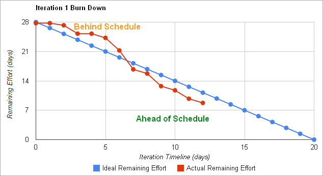
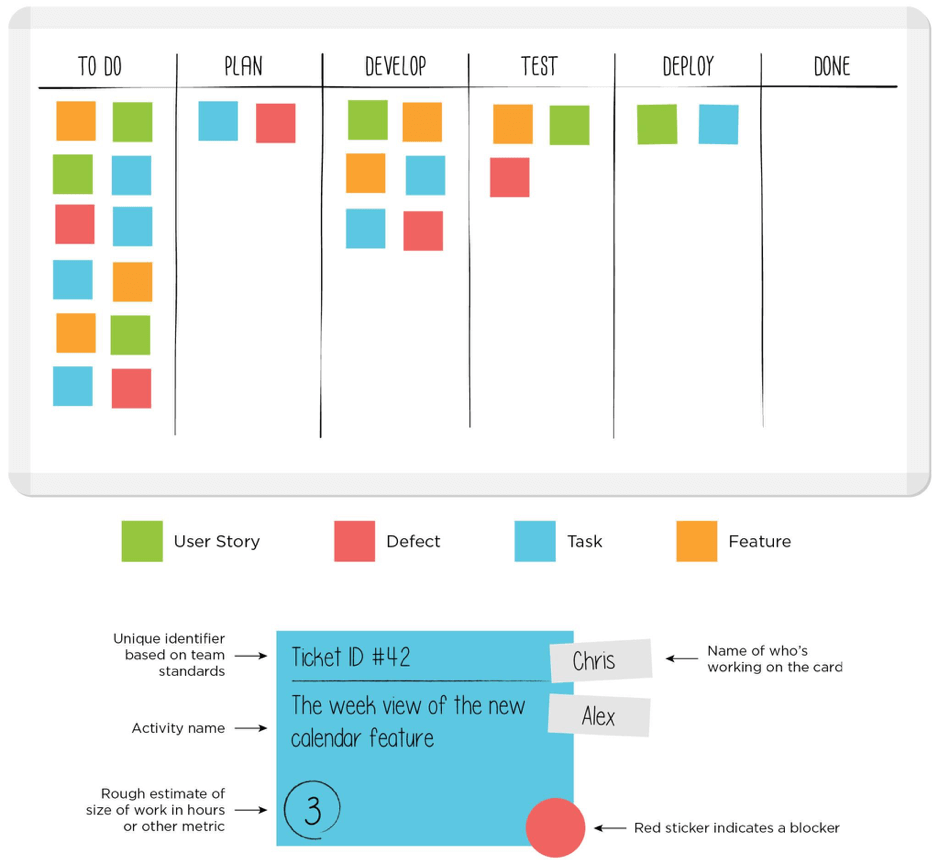

# **Metodologías de software**

## **Metodologías ágiles**

Puesto que desarrollar productos de software no es una tarea fácil, existen diferentes metodologías que podemos seguir para este desarrollo. Una metodología es un conjunto de técnicas y métodos que nos ayudan a afrontar cada fase de un ciclo de vida. Así, podemos:

  * Optimizar el proceso y el producto final.
  * Utilizar protocolos guiados para la planificación y el desarrollo.
  * Establecer qué hacer, cómo hacerlo y cuándo hacerlo, a lo largo de todo el proyecto.

Las metodologías tradicionales son muy útiles para proyectos grandes (en términos de tiempo y presupuesto), pero presentan algunos inconvenientes para proyectos no tan grandes, con plazos cortos o con requisitos inciertos. Por ejemplo, producen demasiada documentación y están demasiado planificadas.

Para afrontar estos otros proyectos, muchos equipos han probado **metodologías ágiles**, que son especialmente adecuadas para proyectos pequeños, a desarrollar en poco tiempo, con equipos de menos de 10 personas. Con estas metodologías, se promueve el trabajo en equipo, la responsabilidad propia, las necesidades del cliente y los objetivos de su empresa. La comunicación cara a cara entre los miembros del equipo, y con el cliente, es muy regular. Así, los miembros del equipo comparten sus avances y problemas, y tienen un feedback rápido del cliente.

Para cumplir su objetivo, el desarrollo ágil hace incrementos pequeños en el proyecto, con una mínima planificación. Cada incremento realiza una iteración completa sobre las fases del software (requisitos, diseño, implementación, pruebas...) en un período corto de tiempo (normalmente 1-4 semanas), lo cual se conoce como "**timebox**". De esta manera, minimizamos el riesgo general y el proyecto puede adaptarse a muchos cambios a lo largo de su desarrollo. La documentación solo se genera cuando realmente se necesita, y el objetivo es conseguir un prototipo funcional después de cada iteración, aunque con funcionalidades muy reducidas.

### 1\. El manifiesto ágil

El **Manifiesto Ágil** es una especificación creada en 2001 que recoge los principios principales que una metodología debe tener para que el equipo pueda construir un proyecto de software rápidamente y afrontar los cambios que pueda tener en el futuro.

Algunos de los principios más importantes son:

  * Las **personas** son el factor principal de éxito de un proyecto. Es mejor crear un buen equipo y dejarlo configurar su entorno de trabajo, que crear el entorno y forzar al equipo a acostumbrarse a él.
  * No se debe producir ninguna **documentación** a menos que sea necesaria para tomar una decisión inmediatamente.
  * Debe haber una **interacción constante** entre el cliente y el equipo de trabajo.
  * La capacidad de afrontar los **cambios** que el proyecto pueda tener durante el desarrollo es más importante que seguir una planificación rígida desde el principio.
  * La prioridad principal es **satisfacer al cliente** mediante la entrega continua de software funcional.
  * La **conversación cara a cara** es el método más eficiente para transmitir información en un equipo de trabajo.
  * **Simplicidad**.

### 2\. Algunas prácticas habituales

Además de los principios recogidos en el manifiesto ágil, algunas metodologías ágiles utilizan ciertas prácticas. Veamos algunas.

**Programación por parejas (PP)**

La **programación por parejas** es una técnica que ofrece muchas ventajas. Dos programadores trabajan juntos en el mismo ordenador. Uno de ellos está escribiendo código (conductor) y el otro está revisando lo que se está escribiendo (observador). Ambos intercambian sus roles con frecuencia (cada 30 minutos, por ejemplo). El observador es el encargado de guiar el trabajo del conductor y proporcionar ideas para resolver problemas futuros.

Las principales ventajas de esta técnica son:

  * Se producen programas más cortos, con menos errores y mejor diseñados (ya que el código debe ser legible para ambos miembros del equipo).
  * Es útil para aprender, si uno de los miembros es muy experimentado y el otro es recién llegado, o si ambos tienen conocimientos diferentes que pueden transferirse el uno al otro.
  * Si uno de los miembros abandona el equipo, hay otro que puede tomar su lugar apoyado por el antiguo miembro, de manera que los plazos no tienen que modificarse necesariamente.
  * Hay menos interrupciones durante el proceso, ya que ambos miembros intercambian sus tareas y pueden trabajar de manera más continua.

Sin embargo, también tiene algunos inconvenientes:

  * Algunos ingenieros prefieren trabajar por su cuenta.
  * Un novato puede sentirse intimidado si trabaja con alguien más experimentado que él, y viceversa (los trabajadores experimentados pueden aburrirse ayudando a un novato).
  * Es más costoso (se deben pagar dos salarios para una sola tarea).
  * Pueden haber hábitos de trabajo molestos en el equipo.

#### **Desarrollo guiado por pruebas (TDD)**

Esta es una técnica que utiliza iteraciones cortas basadas en casos de prueba escritos previamente. Así, cada iteración produce el código necesario para pasar esas pruebas, y una vez pasadas, integramos ese código con el anterior y lo optimizamos. El proceso es el siguiente:

1.  Añadimos una nueva prueba al conjunto actual.
2.  Escribamos el código para pasar esta última prueba.
3.  Volvemos a ejecutar el conjunto de pruebas y verificamos que todas se pasan.
4.  Refactorizamos el código final para optimizarlo.
5.  Volvemos al paso 1.

Es importante disponer de un conjunto de pruebas unitarias que puedan lanzarse automáticamente, de manera que se puedan añadir más pruebas de vez en cuando y se puedan volver a lanzar en cualquier momento. Más adelante en este módulo, veremos algunas técnicas para definir casos de prueba y conjuntos de pruebas.

El objetivo principal es definir las pruebas que el sistema debe superar antes de escribir el código correspondiente, de manera que nos aseguramos de que la aplicación se puede comprobar, y definimos pruebas para cada característica. De esta manera, evitamos escribir código innecesario (esto es, código que no está ligado a ninguna prueba).

### **Scrum**

**Scrum** es una metodología ágil que se puede utilizar en proyectos complejos. Utiliza procesos iterativos e incrementales, y se puede aplicar tanto a productos de software como a otros ámbitos. Su nombre proviene de la “melé” que hacen los jugadores de rugby.

**Roles**

Los roles principales en Scrum son:

  * **ScrumMaster**: es un papel equivalente al del gestor de proyectos, aunque este rol no existe implícitamente en Scrum, ya que el equipo de trabajo se autogestiona. Su tarea principal es asegurarse de que el método Scrum se utiliza correctamente y que no hay influencias externas que lo puedan perturbar.
  * **ProductOwner**: representa al cliente, aunque no tiene que formar parte necesariamente de la empresa del cliente. Incluso puede ser alguien del equipo de trabajo.
  * **Equipo de desarrolladores**.

**Proceso**

Para empezar, el equipo de trabajo debe recopilar los requisitos de usuario del cliente (tanto de directivos como de empleados que irán a utilizar la aplicación). Las funcionalidades de la aplicación se recopilan mediante las *user stories*, que básicamente son un conjunto de tarjetas de papel donde el cliente describe las características del sistema. Cada historia debe ser comprensible y concreta, para que el equipo pueda implementarla en pocas semanas. Se pide a cada usuario de la empresa cliente que escriba qué espera de la aplicación. El conjunto completo de historias se recoge en una colección llamada *backlog*. De este *backlog*, algunas historias acabarán formando parte de la aplicación (el resto serán descartadas).

A partir de aquí, comenzamos el proceso de desarrollo, basado en iteraciones llamadas *sprints*. Cada iteración dura de 2 a 4 semanas, y produce un prototipo o una versión operativa del producto. En este incremento, se añaden a la aplicación algunos requisitos extraídos del *backlog*. El conjunto de requisitos que se deben añadir en cada iteración se decide en una reunión de planificación, donde el *ProductOwner* elige algunos elementos para añadir, y el equipo decide cuáles se pueden incluir en la siguiente iteración. Durante la iteración, el *backlog* queda congelado, es decir, no se puede cambiar ningún requisito anterior hasta que comience la siguiente iteración.

Además de la reunión al inicio de la iteración, también hay reuniones diarias en Scrum, donde se discute el estado del proyecto, qué se ha hecho y qué se hará próximamente. También hay una reunión final al final de la iteración para revisar la versión o prototipo obtenido.

**Estimación de tiempo**

Cada *user story* en el *backlog* tiene asignado un tiempo, normalmente en horas, días o incluso semanas. Por lo tanto, el tiempo total estimado de un *sprint* es la suma de todas las *user stories* elegidas para ese *sprint*.

Para determinar si el tiempo total estimado difiere mucho del tiempo real, podemos utilizar algunas herramientas adicionales como los *burndown charts*, que nos ayudan gráficamente a determinar qué medidas podemos tomar para reducir esa diferencia.

> **Actividad**
>
>Intenta responder a estas preguntas:
>
>  * ¿Qué es un *sprint* en Scrum?
>  * ¿Quién se encarga de priorizar las tareas que se deben hacer en cada *sprint*?
>  * ¿Cómo se puede calcular la fecha final de entrega de un *sprint*?

### **Kanban**

**Kanban** es otra metodología ágil, que es muy fácil de aplicar. Su nombre es una combinación de dos palabras japonesas: *kan* (“visual”) y *ban* (“tarjeta”), así que podemos deducir que el componente principal de esta metodología consiste en utilizar tarjetas que representan las diferentes tareas que debemos completar en el proceso de desarrollo.

Los orígenes de la metodología Kanban se remontan a más de 60 años. A finales de los años 1940, Toyota comenzó a optimizar sus procesos de ingeniería, basándose en el mismo modelo que utilizan los supermercados para optimizar sus existencias. Como los niveles de inventario deberían ajustarse a los patrones de consumo, el exceso de stock se puede (y debe) controlar. De esta manera, Toyota podía alinear sus niveles de inventario con el consumo real de materiales. Los trabajadores pasaban una tarjeta entre los equipos cuando un contenedor de materiales se había vaciado, indicando la cantidad exacta de material necesaria. El almacén tendría un nuevo contenedor de material preparado para ser entregado a la fábrica, y luego enviarían un nuevo *kanban* al proveedor para proporcionar un nuevo contenedor.

Aplicado a los procesos de desarrollo de software, Kanban permite a los equipos ajustar la cantidad de trabajo en proceso (*WIP*) a la capacidad del equipo. Esto proporciona a los equipos opciones de planificación más flexibles, una entrega más rápida y un enfoque más claro.

**Proceso:**

El término general para referirse a la metodología Kanban es *flow*, ya que el trabajo fluye continuamente por el sistema en lugar de estar organizado en *timeboxes*, como hace Scrum con sus *sprints*.

Kanban utiliza mecanismos visuales, como los *Kanban boards*, para que los miembros del equipo puedan ver el estado de cada parte del trabajo en cualquier momento. Estos tableros pueden ser tanto físicos como virtuales.

La función principal del **tablero Kanban** es garantizar que el trabajo del equipo esté visualizado y que todos los bloqueos y dependencias se detecten inmediatamente. El tablero más básico tiene tres secciones (Por hacer, En proceso y Hecho), pero podemos añadir tantas columnas y estados como necesitemos para nuestro caso particular.

Cualquier sección o columna de un tablero Kanban puede llenarse con tarjetas Kanban. Estas tarjetas reflejan información crítica sobre una tarea de trabajo concreta, proporcionando a todo el equipo información sobre quién es el responsable de esa tarea, una breve descripción del trabajo a realizar y una estimación de cuánto tiempo durará.

**Principios:**

Algunos de los principales principios de la metodología Kanban son:

  * **Trabajo limitado en proceso**, o "dejar de empezar y empezar a acabar", esto quiere decir que el equipo no debería empezar otra tarea hasta que la actual se haya terminado.
  * **Calidad garantizada**: todo debe salir bien a la primera oportunidad, no hay margen de error. De esta manera, la velocidad no es tan importante como la calidad, porque corregir errores puede ser costoso.
  * **Reducción de desperdicios**: debemos hacer solo lo que necesitamos, y hacerlo bien.
  * **Flexibilidad**: el siguiente paso se decide desde el *backlog*, eligiendo la próxima tarea a completar. Así podemos priorizar la tarea elegida según las necesidades de cada momento concreto.

**Kanban vs Scrum**

Kanban tiene algunas similitudes con la metodología Scrum, ya que ambas son metodologías ágiles: ambas requieren equipos colaborativos y autogestionados, y ambas se centran en la liberación frecuente de software. Sin embargo, hay algunas diferencias importantes entre ellas:

| **Kanban** | **Scrum** |
|---|---|
| No hay roles prescritos | ScrumMaster, ProductOwner… |
| Entregas continuas | *Sprints* delimitados en tiempo |
| Se pueden hacer cambios en cualquier momento | No se permiten cambios durante el *sprint* |

Ambas metodologías se pueden aplicar a la vez. Scrum es más adecuado para dar retroalimentación al equipo y en la planificación a corto plazo, mientras que Kanban se puede utilizar para el trabajo diario o en entornos con un alto grado de variabilidad en las prioridades.

> **Actividad**
>
> Intenta responder a estas preguntas después de verlo:
>
>  * ¿Cuál es la función principal de los límites de trabajo en proceso (*WIP limits*)? ¿Qué pasa cuando intentamos mover una tarea a una columna que ya ha superado este límite?
>  * ¿Cómo se pueden combinar Kanban y Scrum? ¿Cuál es el objetivo principal de añadir Scrum a Kanban?

[Fuente](https://nachoiborraies.github.io/entornos/md/en/03c)