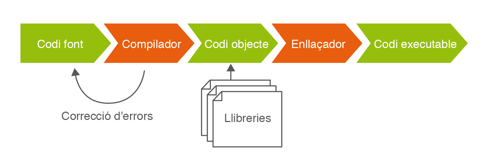
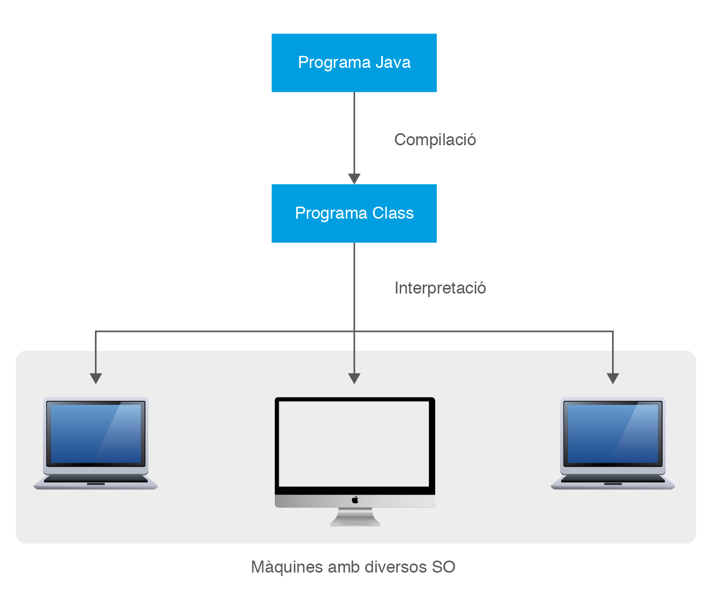
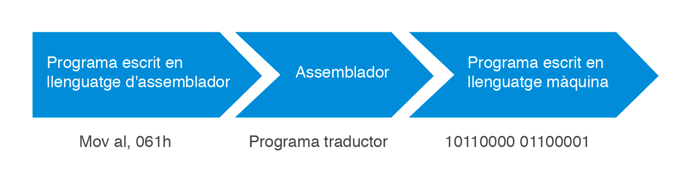
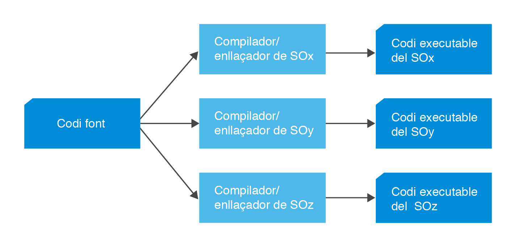
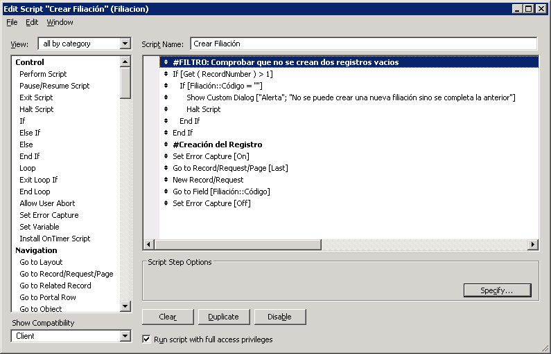

Aquí tienes el texto traducido al castellano, con el formato de encabezados y el resto de la estructura que solicitaste:

# Introducción al desarrollo de Software y a los lenguajes de programación

<!-- @import "[TOC]" {cmd="toc" depthFrom=1 depthTo=6 orderedList=false} -->

<!-- code_chunk_output -->

- [Introducción al desarrollo de Software y a los lenguajes de programación](#introducción-al-desarrollo-de-software-y-a-los-lenguajes-de-programación)
  - [Desarrollo de Software](#desarrollo-de-software)
  - [Concepto de programa informático](#concepto-de-programa-informático)
  - [Código fuente, código objeto y código ejecutable: máquinas virtuales](#código-fuente-código-objeto-y-código-ejecutable-máquinas-virtuales)
    - [Editores de texto simples](#editores-de-texto-simples)
    - [Máquina virtual](#máquina-virtual)
    - [La máquina virtual Java](#la-máquina-virtual-java)
  - [Tipos de lenguajes de programación](#tipos-de-lenguajes-de-programación)
    - [Características de los lenguajes de primera y segunda generación](#características-de-los-lenguajes-de-primera-y-segunda-generación)
    - [Compiladores](#compiladores)
    - [Los intérpretes](#los-intérpretes)
    - [Compiladores frente a Intérpretes](#compiladores-frente-a-intérpretes)
    - [Características de los lenguajes de tercera, cuarta y quinta generación](#características-de-los-lenguajes-de-tercera-cuarta-y-quinta-generación)
  - [Paradigmas de programación](#paradigmas-de-programación)
  - [Características de los lenguajes más difundidos](#características-de-los-lenguajes-más-difundidos)

<!-- /code_chunk_output -->

## Desarrollo de Software

Toda aplicación informática, ya sea utilizada en un soporte convencional (como un ordenador de sobremesa o un ordenador portátil) o en un soporte de nueva generación (por ejemplo, dispositivos móviles como un teléfono móvil de última generación o una tableta táctil PC), ha seguido un procedimiento planificado y desarrollado detalle a detalle para su creación. Este proceso va desde la concepción de la idea o de la funcionalidad que deberá satisfacer esta aplicación hasta la generación de uno o varios archivos que permitan su ejecución exitosa.

Para convertir esta concepción de una idea abstracta en un producto acabado que sea eficaz y eficiente, se necesitan muchos más pasos y tareas. Estas tareas deben estar bien planificadas y seguir un guion que puede tener en cuenta aspectos como:

  * **Analizar las necesidades** que tienen las personas que usarán este software, escuchar cómo lo querrán, atender a sus indicaciones…
  * **Diseñar una solución** que tenga en cuenta todas las necesidades antes analizadas: qué deberá hacer el software, qué interfaces gráficas tendrá y cómo serán estas, qué datos se deberán almacenar y cómo se hará…
  * **Desarrollar el software** que implemente todo aquello analizado y diseñado anteriormente, haciéndolo de la forma más modular posible para facilitar el posterior mantenimiento o manipulación por parte de otros programadores.
  * **Realizar las pruebas** pertinentes, tanto de forma individualizada para cada módulo como de forma completa, para validar que el código desarrollado es correcto y que hace lo que debe hacer según lo establecido en los requerimientos.
  * **Implantar el software** en el entorno donde los usuarios finales lo usarán.

Este apartado se centrará en el tercer punto, el desarrollo de software.

## Concepto de programa informático

Un primer paso para poder empezar a analizar cómo hacer un programa informático es tener claro qué es un programa y qué significa este concepto. En contraste con otros términos usados en informática, es posible referirse a un "programa" en el lenguaje coloquial sin estar hablando necesariamente de ordenadores. Se podría estar refiriendo al programa de un ciclo de conferencias o de cine. Pero, aunque no se trata de un contexto informático, este uso ya aporta una idea general de su significado.

> Un programa informático es un conjunto de eventos ordenados de manera que se suceden de forma secuencial en el tiempo, uno detrás de otro.

Otro uso habitual, ahora sí vinculado al contexto de las máquinas y los autómatas, podría ser referirse al programa de una lavadora o de un robot de cocina. En este caso, sin embargo, lo que se suceden no son tanto un conjunto de eventos, sino de órdenes que el electrodoméstico sigue ordenadamente. Una vez seleccionado el programa que queremos, el electrodoméstico realiza todas las tareas correspondientes de manera autónoma.

Por ejemplo, el programa de un robot de cocina para hacer una crema de zanahoria sería:

1.  Espera que introduzca las zanahorias bien limpiadas, una patata y especias al gusto.
2.  Gira durante 1 minuto, avanzando progresivamente hasta la velocidad 5.
3.  Espera que introduzca leche y sal.
4.  Gira durante 30 segundos a velocidad 7.
5.  Gira durante 10 minutos a velocidad 3 mientras cuece a una temperatura de 90 grados.
6.  Se detiene. ¡La crema de zanahoria está lista\!

Este conjunto de órdenes no es arbitrario, sino que sirve para llevar a cabo una tarea de cierta complejidad que no se puede hacer de una sola vez. Se debe hacer paso a paso. Todas las órdenes están vinculadas entre sí para lograr este objetivo y, sobre todo, es muy importante la disposición en que se llevan a cabo.

Entrando ya, ahora sí, en el mundo de los ordenadores, la forma en que se estructuran las tareas que deben ser ejecutadas es similar a los programas de electrodomésticos anteriormente citados. En este caso, sin embargo, en lugar de transformar ingredientes (o lavar ropa sucia, si se tratara de una lavadora), lo que el ordenador transforma es información o datos.

> Un programa informático no es más que una secuencia de órdenes que se llevan a cabo secuencialmente, aplicadas sobre un conjunto de datos.

¿Qué datos procesa un programa informático? Bien, esto dependerá del tipo de programa:

  * Un editor procesa los datos de un documento de texto.
  * Una hoja de cálculo procesa datos numéricos ubicados en un archivo.
  * Un videojuego procesa los datos que hacen referencia a la forma y ubicación de enemigos y jugadores, las interfaces gráficas donde se encontrará el jugador, los puntos conseguidos…
  * Un navegador web procesa las órdenes del usuario y los datos que recibe desde un servidor ubicado en internet.
  * Un reproductor de video procesa los fotogramas almacenados en un archivo y el audio relacionado.

Por lo tanto, la tarea de un programador informático es elegir qué órdenes constituirán un programa de ordenador, en qué orden se deben llevar a cabo y sobre qué datos hay que aplicarlas para que el programa realice la tarea que debe resolver. Por "ejecutar un programa" se entiende hacer que el ordenador siga todas sus órdenes, desde la primera hasta la última.

La dificultad de todo ello será mayor o menor dependiendo de la complejidad misma de lo que el programa debe hacer. No es lo mismo establecer qué debe hacer el ordenador para resolver una multiplicación de tres números que para procesar textos o visualizar páginas en Internet.

Por otro lado, una vez hecho el programa, cada vez que se ejecute, el ordenador cumplirá todas las órdenes del programa.

De hecho, un ordenador es incapaz de hacer absolutamente nada por sí mismo, siempre hay que decirle qué debe hacer. Y eso se le dice mediante la ejecución de programas. Aunque desde el punto de vista del usuario puede parecer que cuando se pone en marcha un ordenador este funciona sin ejecutar ningún programa concreto, hay que tener en cuenta que su sistema operativo es un programa que está siempre en ejecución.


## Código fuente, código objeto y código ejecutable: máquinas virtuales

### Editores de texto simples

Un **editor de texto simple** es aquel que permite escribir solo texto sin formato. Son ejemplos el Bloc de Notas (Windows), Gedit o Emacs (Unix).

Para crear un programa, se crea un archivo y se escribe en él la secuencia de instrucciones que se quiere que el ordenador ejecute. Estas instrucciones deben seguir unas pautas determinadas en función del lenguaje de programación elegido. Además, deberían seguir un orden determinado que dará sentido al programa escrito. Para empezar, será suficiente con un editor de texto simple.

> Una vez que se ha terminado de escribir el programa, el conjunto de archivos de texto resultantes, donde se encuentran las instrucciones, se dice que contienen el **código fuente**. Este código fuente puede ser desde un nivel muy alto, muy cerca del lenguaje humano, hasta uno de nivel más bajo, más cercano al código de las máquinas, como el código ensamblador.

En el apartado "Tipos de lenguajes de programación" se describen las características de los lenguajes máquina, ensamblador, de alto nivel y de propósito específico.

La tendencia actual es hacer uso de lenguajes de alto nivel, es decir, cercanos al lenguaje humano. Pero esto hace aparecer un problema, y es que los archivos de código fuente no contienen el lenguaje máquina que entenderá el ordenador. Por lo tanto, resultan incomprensibles para el procesador. Para poder generar código máquina, es necesario realizar un proceso de traducción desde los mnemónicos que contiene cada archivo a las secuencias binarias que entiende el procesador.

El código objeto de las instrucciones tiene este aspecto: `10101001000001101100110 10100101011100001110111`

El proceso llamado **compilación** es la traducción del código fuente de los archivos del programa a archivos en formato binario que contienen las instrucciones en un formato que el procesador puede entender. El contenido de estos archivos se denomina **código objeto**. El programa que realiza este proceso se llama **compilador**.

> El **código objeto** es el código fuente traducido (por el compilador) a código máquina, pero este código todavía no puede ser ejecutado por el ordenador.

> El **código ejecutable** es la traducción completa a código máquina, llevada a cabo por el **enlazador** (en inglés, *linker*). El código ejecutable es interpretado directamente por el ordenador.

El **enlazador** es el encargado de insertar en el código objeto las funciones de las bibliotecas que son necesarias para el programa y de llevar a cabo el proceso de montaje generando un archivo ejecutable.

Una **biblioteca** (*library* en inglés) es una colección de código predefinido que facilita la tarea del programador a la hora de codificar un programa.

En la Figura 1 se muestra un resumen ordenado de todos los conceptos definidos. El código fuente desarrollado por los programadores se convertirá en código objeto con la ayuda del compilador. Este ayudará a localizar los errores de sintaxis o de compilación que se encuentren en el código fuente. Con el enlazador, que recogerá el código objeto y las bibliotecas, se generará el código ejecutable.



### Máquina virtual

El concepto de **máquina virtual** surge con el objetivo de facilitar el desarrollo de compiladores que generan código para diferentes procesadores.

La compilación consta de dos fases:

1.  La primera parte del código fuente a un lenguaje intermedio, obteniendo un programa equivalente con un menor nivel de abstracción que el original y que no puede ser directamente ejecutado.
2.  La segunda fase traduce el lenguaje intermedio a un lenguaje comprensible por la máquina.

Llegado este punto se podría plantear la pregunta: ¿por qué dividir la compilación en dos fases? El objetivo es que el código de la primera fase, el código intermedio, sea común para cualquier procesador, y que el código generado en la segunda fase sea el específico para cada procesador. De hecho, la traducción del lenguaje intermedio al lenguaje máquina no se suele hacer mediante compilación sino mediante un intérprete, tal como se muestra en la Figura 2.



### La máquina virtual Java

La **máquina virtual Java (JVM)** es el entorno en el que se ejecutan los programas Java. Es un programa nativo, es decir, ejecutable en una plataforma específica, que es capaz de interpretar y ejecutar instrucciones expresadas en un código de bytes (o *bytecode* de Java) que es generado por el compilador del lenguaje Java.

**Código de bytes**
El código de bytes no es un lenguaje de alto nivel, sino un verdadero código máquina de bajo nivel, viable incluso como lenguaje de entrada para un microprocesador físico.

La máquina virtual Java es una pieza fundamental de la tecnología Java. Se sitúa en un nivel superior al hardware sobre el cual se quiere ejecutar la aplicación y actúa como un puente entre el código de bytes a ejecutar y el sistema. Así, cuando un programador escribe una aplicación Java, lo hace pensando en la JVM encargada de ejecutar la aplicación y no hay ningún motivo para pensar en las características de la plataforma física sobre la cual se debe ejecutar la aplicación. La JVM será la encargada, al ejecutar la aplicación, de convertir el código de bytes a código nativo de la plataforma física.

La gran ventaja de la JVM es que posibilita la **portabilidad** de la aplicación a diferentes plataformas y, así, un programa Java escrito en un sistema operativo Windows se puede ejecutar en otros sistemas operativos (Linux, Solaris y Apple OS X) con el único requerimiento de disponer de la JVM para el sistema correspondiente.

El concepto de máquina virtual Java se usa en dos ámbitos: por un lado, para hacer referencia al conjunto de especificaciones que debe cumplir cualquier implementación de la JVM; por otro lado, para hacer referencia a las diversas implementaciones de la máquina virtual Java existentes y de las cuales hay que utilizar alguna para ejecutar las aplicaciones Java.

En los materiales web se puede encontrar una explicación, paso a paso, de cómo descargar e instalar la máquina virtual Java.

La empresa Sun Microsystems es la propietaria de la marca registrada Java, y esta se utiliza para certificar las implementaciones de la JVM que se ajustan y son totalmente compatibles con las especificaciones de la JVM, en cuyo prefacio se dice: "Esperamos que esta especificación documente suficientemente la máquina virtual de Java para hacer posibles implementaciones desde cero. Sun proporciona tests que verifican que las implementaciones de la máquina virtual Java operan correctamente."

## Tipos de lenguajes de programación

Una vez establecido el concepto de programa informático y los conceptos de código fuente, código objeto y código ejecutable (así como el de máquina virtual), es necesario ahora establecer las diferencias entre los diversos tipos de código fuente existentes, a través de los cuales se llega a obtener un programa informático.

> Un **lenguaje de programación** es un lenguaje que permite establecer una comunicación entre el hombre y la máquina. El lenguaje de programación identificará el código fuente, que el programador desarrollará para indicar a la máquina, una vez este código se haya convertido en código ejecutable, qué pasos debe dar.

A lo largo de los últimos años ha existido una evolución constante en los lenguajes de programación. Se ha establecido una creciente evolución en la que se van incorporando elementos que permiten crear programas cada vez más sólidos y eficientes. Esto facilita mucho la tarea del programador para el desarrollo del software, su mantenimiento y la adaptación. Hoy en día, existen, incluso, lenguajes de programación que permiten la creación de aplicaciones informáticas a personas sin conocimientos técnicos de informática, por el hecho de existir una creación prácticamente automática del código a partir de unas preguntas.

Los diferentes tipos de lenguajes son:

  * **Lenguaje de primera generación** o lenguaje máquina.
  * **Lenguajes de segunda generación** o lenguajes de ensamblador.
  * **Lenguajes de tercera generación** o lenguajes de alto nivel.
  * **Lenguajes de cuarta generación** o lenguajes de propósito específico.
  * **Lenguajes de quinta generación**.

El primer tipo de lenguaje que se desarrolló es el llamado **lenguaje de primera generación** o **lenguaje máquina**. Es el único lenguaje que entiende el ordenador directamente.

Su estructura está totalmente adaptada a los circuitos impresos de los ordenadores o procesadores electrónicos y muy alejada de la forma de expresión y análisis de los problemas propios de los humanos (las instrucciones se expresan en código binario). Esto hace que la programación en este lenguaje resulte tediosa y complicada, ya que se requiere un conocimiento profundo de la arquitectura física del ordenador. Además, se debe valorar que el código máquina hace posible que el programador utilice la totalidad de recursos del hardware, con lo cual se pueden obtener programas muy eficientes.

```assembly
10110000 01100001
```
Esta línea contiene una instrucción que mueve un valor al registro del procesador.
Actualmente, debido a la complejidad del desarrollo de este tipo de lenguaje, está prácticamente en desuso. Solo se usará en procesadores muy concretos o para funcionalidades muy específicas.

> El segundo tipo de lenguaje de programación son los **lenguajes de segunda generación** o **lenguajes de ensamblador**. Se trata del primer lenguaje de programación que utiliza códigos mnemotécnicos para indicar a la máquina las operaciones que debe llevar a cabo. Estas operaciones, muy básicas, han sido diseñadas a partir del conocimiento de la estructura interna de la propia máquina.

Cada instrucción en lenguaje ensamblador corresponde a una instrucción en lenguaje máquina. Este tipo de lenguajes dependen totalmente del procesador que utilice la máquina, por eso se dice que están orientados a las máquinas.

En la Figura 3 se muestra un esquema del funcionamiento de los lenguajes de segunda generación. A partir del código escrito en lenguaje ensamblador, el programa traductor (ensamblador) lo convierte en código de primera generación, que será interpretado por la máquina.



En general, se utiliza este tipo de lenguajes para programar **controladores (drivers)** o aplicaciones de tiempo real, ya que requiere un uso muy eficiente de la velocidad y de la memoria.

### Características de los lenguajes de primera y segunda generación

Como **ventajas** de los lenguajes de primera y segunda generación se pueden establecer:

  * Permiten escribir programas muy optimizados que aprovechan al máximo el hardware disponible.
  * Permiten al programador especificar exactamente qué instrucciones quiere que se ejecuten.

Los **inconvenientes** son los siguientes:

  * Los programas escritos en lenguajes de bajo nivel están completamente ligados al hardware donde se ejecutarán y no se pueden trasladar fácilmente a otros sistemas con un hardware diferente.
  * Es necesario conocer a fondo la arquitectura del sistema y del procesador para escribir buenos programas.
  * No permiten expresar de forma directa conceptos habituales a nivel de algoritmo.
  * Son difíciles de codificar, documentar y mantener.

> El siguiente grupo de lenguajes se conoce como **lenguajes de tercera generación** o **lenguajes de alto nivel**. Estos lenguajes, más evolucionados, utilizan palabras y frases relativamente fáciles de entender y proporcionan también facilidades para expresar alteraciones del flujo de control de una forma bastante sencilla e intuitiva.

Los lenguajes de tercera generación o de alto nivel se utilizan cuando se quieren desarrollar aplicaciones grandes y complejas, donde se prioriza el hecho de facilitar y comprender cómo hacer las cosas (lenguaje humano) por encima del rendimiento del software o de su uso de la memoria.

Los esfuerzos encaminados a hacer la tarea de programación independiente de la máquina donde se ejecutarán dieron como resultado la aparición de los lenguajes de programación de alto nivel.

Los lenguajes de alto nivel son normalmente fáciles de aprender porque están formados por elementos de lenguajes naturales, como el inglés. A continuación se muestra un ejemplo de algoritmo implementado en un lenguaje de alto nivel, concretamente en Basic. Este algoritmo calcula el factorial de un número dado a la función como parámetro. Se puede observar cómo es fácilmente comprensible con un mínimo conocimiento del inglés.

```basic
' ------------------------------------------
' Función Factorial
' -----------------------------------------
Public Function Factorial(num As Integer)As String
Dim i As Integer
    For i = 1 To num - 1
      num = num * i
      Factorial = num
    Next
End Function
```

En Basic, el lenguaje de alto nivel más conocido, las órdenes como `IF contador = 10 THEN STOP` pueden utilizarse para pedir al ordenador que pare si la variable `contador` es igual a diez.

Como consecuencia de este alejamiento de la máquina y acercamiento a las personas, los programas escritos en lenguajes de programación de tercera generación no pueden ser interpretados directamente por el ordenador, sino que es necesario llevar a cabo previamente su traducción a lenguaje máquina. Hay dos tipos de traductores: los **compiladores** y los **intérpretes**.

### Compiladores

Son programas que traducen el programa escrito con un lenguaje de alto nivel al lenguaje máquina. El compilador detectará los posibles errores del programa fuente para conseguir un programa ejecutable depurado.

Algunos ejemplos de códigos de programación que deberán pasar por un compilador son: Pascal, C, C++, .NET, …

En la Figura 4 se puede ver, en un esquema, la función del compilador entre los dos lenguajes.


El procedimiento que deberá seguir un programador es el siguiente:

1.  Crear el código fuente.
2.  Crear el código ejecutable haciendo uso de compiladores y enlazadores.
3.  El código ejecutable depende de cada sistema operativo. Para cada sistema hay un compilador, es decir, si se quiere ejecutar el código con otro sistema operativo se debe recompilar el código fuente.
4.  El programa resultante se ejecuta directamente desde el sistema operativo.

En la Figura 5 se puede observar un esquema que representa la dependencia del sistema operativo a la hora de elegir y utilizar el compilador.



### Los intérpretes

El **intérprete** también es un programa que traduce el código de alto nivel al lenguaje máquina, pero, a diferencia del compilador, lo hace en tiempo de ejecución. Es decir, no se hace un proceso previo de traducción de todo el programa fuente a código de bytes, sino que se va traduciendo y ejecutando instrucción por instrucción.

Algunos ejemplos de códigos de programación que deberán pasar por un intérprete son: JavaScript, PHP, ASP…

Algunas características de los lenguajes interpretados son:

  * El código interpretado no es ejecutado directamente por el sistema operativo, sino que hace uso de un intérprete.
  * Cada sistema tiene su propio intérprete.

### Compiladores frente a Intérpretes

El intérprete es notablemente más lento que el compilador, ya que realiza la traducción a la vez que la ejecución. Además, esta traducción se hace siempre que se ejecuta el programa, mientras que el compilador solo la realiza una vez. La ventaja de los intérpretes es que hacen que los programas sean más portables. Así, un programa compilado en un ordenador con sistema operativo Windows no funcionará en un Macintosh, o en un ordenador con sistema operativo Linux, a menos que se vuelva a compilar el programa fuente en el nuevo sistema.

### Características de los lenguajes de tercera, cuarta y quinta generación

Los **lenguajes de tercera generación** son aquellos que son capaces de contener y ejecutar, en una sola instrucción, el equivalente a varias instrucciones de un lenguaje de segunda generación.

Las **ventajas** de los lenguajes de tercera generación son:

  * El código de los programas es mucho más sencillo y comprensible.
  * Son independientes del hardware (no hacen ninguna referencia a él). Por este motivo es posible "portar" el programa entre diferentes ordenadores / arquitecturas / sistemas operativos (siempre que en el sistema de destino exista un compilador para este lenguaje de alto nivel).
  * Es más fácil y rápido escribir los programas y más fácil mantenerlos.

Los **inconvenientes** de los lenguajes de tercera generación son:

  * Su ejecución en un ordenador puede resultar más lenta que el mismo programa escrito en lenguaje de bajo nivel, aunque esto depende mucho de la calidad del compilador que realice la traducción.

Ejemplos de lenguajes de programación de tercera generación: C, C++, Java, Pascal…

> Los **lenguajes de cuarta generación** o **lenguajes de propósito específico** aportan un nivel muy alto de abstracción en la programación, permitiendo desarrollar aplicaciones sofisticadas en un corto espacio de tiempo, muy inferior al necesario para los lenguajes de 3ª generación.

**IDE** son las siglas en inglés de *Integrated Development Environment*, es decir, Entorno Integrado de Desarrollo.

Se automatizan ciertos aspectos que antes había que hacer a mano. Incluyen herramientas orientadas al desarrollo de aplicaciones (IDE) que permiten definir y gestionar bases de datos, realizar informes (ej.: Oracle reports), consultas (ej.: informix 4GL), módulos… , escribiendo muy pocas líneas de código o ninguna.

Permiten la creación de prototipos de una aplicación rápidamente. Los prototipos permiten tener una idea del aspecto y del funcionamiento de la aplicación antes de que el código esté acabado. Esto facilita la obtención de un programa que reúna las necesidades y expectativas del cliente.

Algunos de los aspectos positivos que muestran este tipo de lenguajes de programación son:

  * Mayor abstracción.
  * Menor esfuerzo de programación.
  * Menor coste de desarrollo del software.
  * Basados en generación de código a partir de especificaciones de nivel muy alto.
  * Se pueden llevar a cabo aplicaciones sin ser un experto en el lenguaje.
  * Suelen tener un conjunto de instrucciones limitado.
  * Son específicos del producto que los ofrece.

Estos lenguajes de programación de cuarta generación están orientados, básicamente, a las aplicaciones de negocio y al manejo de bases de datos.

Algunos ejemplos de lenguajes de cuarta generación son Visual Basic, Visual Basic .NET, ABAP de SAP, FileMaker, PHP, ASP, 4D…

En la Figura 6 se puede ver el entorno de trabajo y un ejemplo de código fuente de FileMaker.



> Los **lenguajes de quinta generación** son lenguajes específicos para el tratamiento de problemas relacionados con la inteligencia artificial y los sistemas expertos.

En lugar de ejecutar solo un conjunto de órdenes, el objetivo de estos sistemas es "pensar" y anticipar las necesidades de los usuarios. Estos sistemas se encuentran todavía en desarrollo. Se trataría del paradigma lógico.

Algunos ejemplos de lenguajes de quinta generación son Lisp o Prolog.


## Paradigmas de programación

Es difícil establecer una clasificación general de los lenguajes de programación, ya que existe un gran número de lenguajes y, a veces, diferentes versiones de un mismo lenguaje. Esto provocará que en cualquier clasificación que se haga un mismo lenguaje pertenezca a más de uno de los grupos establecidos. Una clasificación muy extendida, atendiendo a la forma de trabajar de los programas y a la filosofía con que fueron concebidos, es la siguiente:

  * **Paradigma imperativo/estructurado**.
  * **Paradigma de objetos**.
  * **Paradigma funcional**.
  * **Paradigma lógico**.

> El **paradigma imperativo/estructurado** debe su nombre al papel dominante que ejercen las sentencias imperativas, es decir, aquellas que indican llevar a cabo una determinada operación que modifica los datos guardados en memoria.

Algunos de los lenguajes imperativos son C, Basic, Pascal, Cobol…

La técnica seguida en la programación imperativa es la **programación estructurada**. La idea es que cualquier programa, por complejo y grande que sea, puede ser representado mediante tres tipos de estructuras de control:

  * **Secuencia**.
  * **Selección**.
  * **Iteración**.

Por otro lado, también se propone desarrollar el programa con la técnica de diseño **descendente (*top-down*)**. Es decir, modular el programa creando porciones más pequeñas de programas con tareas específicas, que se subdividen en otros subprogramas, cada vez más pequeños. La idea es que estos subprogramas típicamente llamados **funciones** o **procedimientos** deben resolver un único objetivo o tarea.

Imaginemos que tenemos que hacer una aplicación que registre los datos básicos del personal de una escuela, datos como el nombre, el DNI, y que calcule el salario de los profesores así como el de los administrativos, donde el salario de los administrativos es el sueldo base (`SOU_BASE`) \* 10 mientras que el salario de los profesores es el sueldo base (`SOU_BASE`) + número de horas impartidas (`numHores`) \* 12.

```cpp
const float SOU_BASE = 1.000;

Struct Administratiu
{
    string nom;
    string DNI;
    float Salari;
}

Struct Professor
{
    string nom;
    string DNI;
    int numHores;
    float salari;
}

void AssignarSalariAdministratiu (Administratiu administratiu1)
{
    administratiu1. salari = SOU_BASE * 10;
}

void AssignarSalariProfessor (Professor professor1)
{
    professor1. salari = SOU_BASE + (numHores * 12);
}
```

> El **paradigma de objetos**, típicamente conocido como **Programación Orientada a Objetos (POO**, o OOP en inglés), es un paradigma de construcción de programas basado en una abstracción del mundo real. En un programa orientado a objetos, la abstracción no son procedimientos ni funciones sino los **objetos**. Estos objetos son una representación directa de algo del mundo real, como un libro, una persona, un pedido, un empleado…

Algunos de los lenguajes de programación orientada a objetos son C++, Java, C\#…

Un **objeto** es una combinación de datos (llamados **atributos**) y **métodos** (funciones y procedimientos) que nos permiten interactuar con él. En este tipo de programación, por lo tanto, los programas son conjuntos de objetos que interactúan entre ellos a través de **mensajes** (llamadas a métodos).

La programación orientada a objetos se basa en la integración de 5 conceptos: **abstracción, encapsulación, modularidad, jerarquía y polimorfismo**, que es necesario comprender y seguir de manera absolutamente rigurosa. No seguirlos sistemáticamente, omitirlos puntualmente por prisa u otras razones hace perder todo el valor y los beneficios que nos aporta la orientación a objetos.

```cpp
class Treballador {
   private:
      string nom;
      string DNI;
   protected:
      static const float SOU_BASE = 1.000; 
   public:
      string GetNom() {return this.nom;}
      void SetNom (string n) {this.nom = n;}
      string GetDNI() {return this.DNI;}
      void SetDNI (string dni) {this.DNI = dni;}
      virtual float salari() = 0;
}

class Administratiu: public Treballador {
   public:
      float Salari() {return SOU_BASE * 10};
}

class Professor: public Treballador {
   private:
      int numHores;
   public:
      float Salari() {return SOU_BASE + (numHores * 15);}
}
```

> El **paradigma funcional** está basado en un modelo matemático. La idea es que el resultado de un cálculo es la entrada del siguiente, y así sucesivamente hasta que una composición produzca el resultado deseado.

Los creadores de los primeros lenguajes funcionales pretendían convertirlos en lenguajes de uso universal para el procesamiento de datos en todo tipo de aplicaciones, pero, con el paso del tiempo, se ha utilizado principalmente en ámbitos de investigación científica y aplicaciones matemáticas.

Uno de los lenguajes más típicos del paradigma funcional es el Lisp. Vea un ejemplo de programación del factorial con este lenguaje:

```lisp
> (defun factorial (n)
(if (= n 0)
1
(* n (factorial (- n 1)))))
FACTORIAL
> (factorial 3)
6
```

> El **paradigma lógico** tiene como característica principal la aplicación de las reglas de la lógica para inferir conclusiones a partir de datos.

Un programa lógico contiene una **base de conocimiento** sobre la que se realizan consultas. La base de conocimiento está formada por **hechos**, que representan la información del sistema expresada como relaciones entre los datos y **reglas lógicas** que permiten deducir consecuencias a partir de combinaciones entre los hechos y, en general, otras reglas.

Uno de los lenguajes más típicos del paradigma lógico es el Prolog.

> **Ejemplo de despliegue práctico del paradigma lógico**
>
>Determinaremos si debemos prescribir al paciente estar en casa reposando al saber que se cumplen los siguientes hechos: malestar y 39º de temperatura corporal.
>
>Reglas de la base de conocimiento:
>
>  * R1: Si fiebre, entonces estar en casa en reposo.
>  * R2: Si malestar, entonces ponerse termómetro.
>  * R3: Si termómetro marca una temperatura \> 37º, entonces fiebre.
>  * R4: Si diarrea, entonces dieta.
>
>Si seguimos un razonamiento de encadenamiento hacia adelante, el procedimiento sería:
>
>1.  Indicar al motor de inferencia, los hechos: malestar y termómetro marca 39º.
>    `Base de hechos = { malestar, termómetro marca 39º }`
>2.  El sistema identifica las reglas aplicables: R2 y R3. El algoritmo se inicia aplicando la regla R2, incorporando en la base de hechos "ponerse el termómetro".
>    `Base de hechos = { malestar, termómetro marca 39º, ponerse termómetro }`
>3.  Como no se ha solucionado el problema, continúa con la siguiente regla R3, añadiendo a la base de hechos "fiebre".
>    `Base de hechos = { malestar, termómetro marca 39º, ponerse termómetro, fiebre }`
>4.  Como no se ha solucionado el problema, vuelve a identificar un subconjunto de reglas aplicables, excepto las ya utilizadas. El sistema identifica las reglas aplicables: R1, incorporando a la base de hechos "estar en casa en reposo".
>    `Base de hechos = { malestar, termómetro marca 39º, ponerse termómetro, fiebre, estar en casa en reposo}`
>5.  Como "reposo" está en la base de hechos, se ha llegado a una respuesta positiva a la pregunta formulada.

El paradigma es ampliamente utilizado en las aplicaciones que tienen que ver con la Inteligencia Artificial, particularmente en el campo de **sistemas expertos** y **procesamiento del lenguaje humano**. Un sistema experto es un programa que imita el comportamiento de un experto humano. Por lo tanto, contiene información (es decir, una base de conocimientos) y una herramienta para comprender las preguntas y encontrar la respuesta correcta examinando la base de datos (un motor de inferencia).

También es útil en problemas combinatorios o que requieran una gran cantidad o amplitud de soluciones alternativas, de acuerdo con la naturaleza del mecanismo de vuelta atrás (*backtracking*).

## Características de los lenguajes más difundidos

Existen muchos lenguajes de programación, cada uno con sus propias características, ventajas y desventajas, lo que los hace más adecuados para ciertos tipos de proyectos. A continuación, se describen algunas de las características más relevantes de los lenguajes de programación más utilizados en la actualidad:

* **Java:**
    * **Orientado a objetos:** Todo en Java es un objeto, lo que facilita la modularidad, reutilización de código y escalabilidad.
    * **Multiplataforma (WORA - Write Once, Run Anywhere):** Gracias a la Máquina Virtual Java (JVM), el código compilado (bytecode) puede ejecutarse en cualquier sistema operativo que tenga una JVM instalada, sin necesidad de recompilación.
    * **Robusto:** Incorpora un manejo de excepciones robusto y un recolector de basura automático que gestiona la memoria, reduciendo errores comunes de programación.
    * **Seguro:** Ofrece características de seguridad integradas a nivel de lenguaje y de máquina virtual.
    * **Alto rendimiento:** Aunque interpretado por la JVM, utiliza compilación Just-In-Time (JIT) para optimizar el rendimiento en tiempo de ejecución.
    * **Amplio ecosistema:** Cuenta con una vasta colección de librerías, *frameworks* y una gran comunidad de desarrolladores.
    * **Usos comunes:** Aplicaciones empresariales (servidores, *backend*), desarrollo móvil (Android), Big Data, sistemas embebidos.

* **Python:**
    * **Interpretado:** No requiere compilación explícita; el código se ejecuta directamente por un intérprete.
    * **De alto nivel y legible:** Su sintaxis es clara y concisa, lo que facilita la lectura y escritura del código.
    * **Multiparadigma:** Soporta programación orientada a objetos, imperativa y funcional.
    * **Dinámicamente tipado:** El tipo de una variable se determina en tiempo de ejecución.
    * **Amplias librerías:** Posee un ecosistema enorme de módulos y paquetes para diversas tareas (ciencia de datos, inteligencia artificial, desarrollo web, automatización).
    * **Usos comunes:** Desarrollo web (*backend*), análisis de datos, aprendizaje automático, inteligencia artificial, automatización de scripts, desarrollo de videojuegos.

* **JavaScript:**
    * **Interpretado:** Principalmente ejecutado en navegadores web, pero también en servidores (Node.js).
    * **Orientado a objetos (basado en prototipos), imperativo y funcional:** Es un lenguaje muy flexible en cuanto a paradigmas.
    * **Asíncrono:** Permite ejecutar tareas en segundo plano sin bloquear la interfaz de usuario, fundamental para la interactividad web.
    * **Dominio web:** Es el lenguaje esencial para el desarrollo *frontend* (interfaz de usuario) de sitios web interactivos.
    * **Usos comunes:** Desarrollo web (*frontend* y *backend* con Node.js), aplicaciones móviles (React Native, Ionic), desarrollo de escritorio (Electron).

* **C++:**
    * **Compilado:** Genera código máquina directamente, lo que resulta en un rendimiento muy alto.
    * **De nivel medio:** Combina características de lenguajes de alto nivel con acceso a bajo nivel de memoria y hardware.
    * **Multiparadigma:** Soporta programación orientada a objetos, imperativa y genérica.
    * **Eficiente en recursos:** Permite un control preciso sobre la memoria y el hardware, ideal para aplicaciones críticas en rendimiento.
    * **Usos comunes:** Sistemas operativos, desarrollo de videojuegos, software de alto rendimiento, sistemas embebidos, controladores de dispositivos.

* **C#:**
    * **Compilado (a CIL/MSIL) y ejecutado en CLR:** Parte del *framework* .NET de Microsoft, similar a Java en su funcionamiento con una máquina virtual (Common Language Runtime).
    * **Orientado a objetos:** Es un lenguaje fuertemente tipado y orientado a objetos.
    * **Integración con el ecosistema Microsoft:** Ampliamente utilizado para el desarrollo de aplicaciones de Windows, servicios web ASP.NET, y juegos con Unity.
    * **Usos comunes:** Desarrollo de aplicaciones de escritorio (WPF, WinForms), desarrollo web (ASP.NET), desarrollo de videojuegos (Unity), aplicaciones empresariales.

* **PHP:**
    * **Interpretado (principalmente en el servidor):** Diseñado específicamente para el desarrollo web.
    * **De código abierto:** Ampliamente utilizado y con una gran comunidad.
    * **Fácil de aprender:** Su sintaxis es relativamente sencilla para principiantes.
    * **Usos comunes:** Desarrollo web (*backend*), sistemas de gestión de contenidos (WordPress, Joomla, Drupal), comercio electrónico (Magento).

* **Swift:**
    * **Compilado:** Lenguaje de programación desarrollado por Apple.
    * **Moderno y seguro:** Diseñado para ser más seguro y ofrecer un mejor rendimiento que Objective-C.
    * **Usos comunes:** Desarrollo de aplicaciones para iOS, macOS, watchOS y tvOS.

La elección del lenguaje de programación adecuado depende en gran medida de los requisitos del proyecto, el rendimiento deseado, la plataforma de destino, la disponibilidad de librerías y la experiencia del equipo de desarrollo.

[Fuente](https://ioc.xtec.cat/materials/FP/Recursos/fp_dam_m05_/web/fp_dam_m05_htmlindex/WebContent/u1/a1/continguts.html)