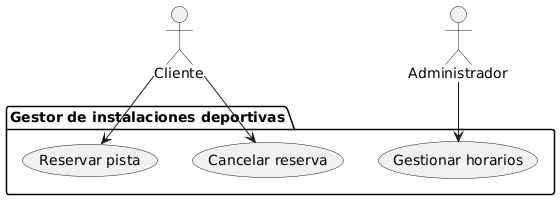
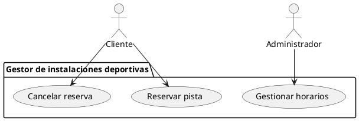
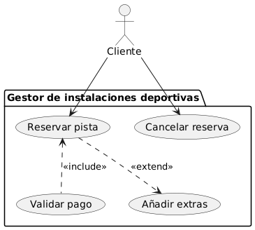
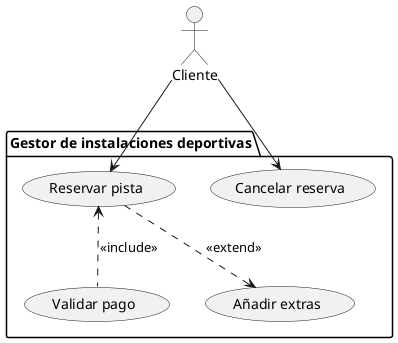
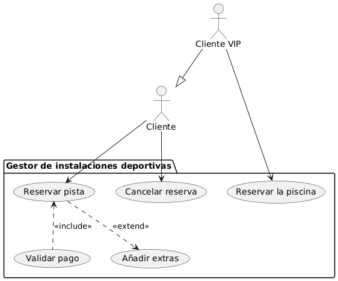
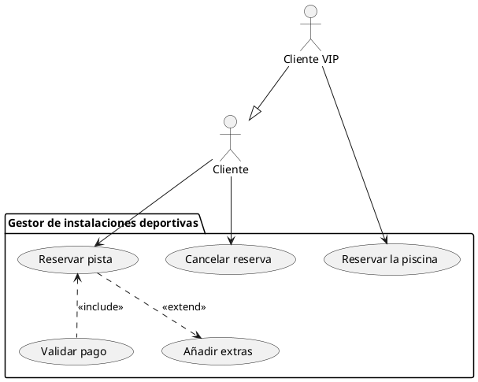
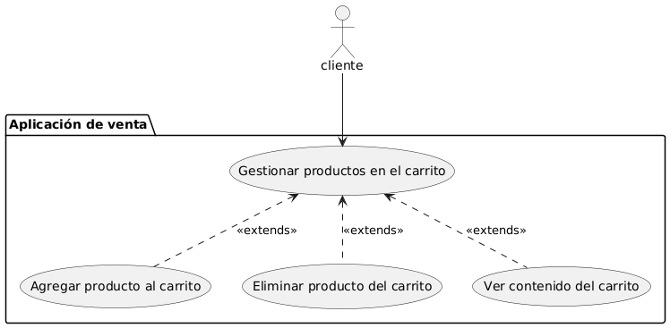
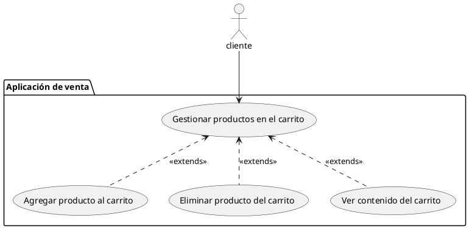

# Diagramas de casos de uso

> **Notas sobre los diagramas**
>
>Los diagramas de esta unidad y la siguiente están hechos usando plantuml, que es un lenguaje de marcado con una sintaxis similar a un lenguaje de programación. Extensiones de VS Code como Markdown Enhanced Preview permiten ver el código como diagramas directamente, pero github no, por lo que las imágenes están compiladas en el [servidor oficial de plantum.](lhttps://www.plantuml.com/plantuml/uml/SyfFKj2rKt3CoKnELR1Io4ZDoSa70000) y [el futuro editor.](https://editor.plantuml.com/uml/LOyn3i8m34NtdCBgtYkWeWvbHBs1bLXWaIQHdNP1t1qJkYIRdVV_zv-qejHzYmvzpG9pP4gLpkaQDawiLJ1aSGNz2ny4mqBw-mq4d4mVqNDEfBOeMIeVgCFRWRrToQEQOYKbEL2Wc1iEW0hhlKTcJ9wY8TBOFpIl7TIIBSkePnOKpjgmvUO-xZmTnl5YvjreDbsLjZJHH2bOzoy0)
>
>Algunos diagramas están hechos en mermaid.js, que sí se renderiza en github y no incluyen ejemplos de código de forma explícita, aunque puedes copiarlo directamente de la página usando el botón arriba a la derecha y copia en formato código.

<!-- @import "[TOC]" {cmd="toc" depthFrom=1 depthTo=6 orderedList=false} -->

<!-- code_chunk_output -->

- [Diagramas de casos de uso](#diagramas-de-casos-de-uso)
  - [Diagramas UML de Casos de Uso](#diagramas-uml-de-casos-de-uso)
    - [Pasos para crear un diagrama de casos de uso](#pasos-para-crear-un-diagrama-de-casos-de-uso)
  - [Relaciones avanzadas](#relaciones-avanzadas)
    - [Relaciones `<<extend>>` y `<<include>>`](#relaciones-extend-y-include)
    - [Generalización](#generalización)
  - [Historias de Usuario (Scrum) y Casos de Uso](#historias-de-usuario-scrum-y-casos-de-uso)

<!-- /code_chunk_output -->

## Diagramas UML de Casos de Uso

Un diagrama de casos de uso especifica cómo funciona un sistema. Más concretamente, qué puede hacer cada usuario que interactúe con el sistema. Para ello, se requieren cuatro elementos principales: Los casos de uso, los actores, las relaciones y el sistema.

- El **sistema** es el programa que vamos a desarrollar, y engloba todos los casos de uso. Se representa con un recuadro con una etiqueta.
- Un **actor** es un usuario o un sistema externo que interactúa con el sistema.
- Un **caso de uso** describe cómo un actor interactúa con el sistema para lograr un objetivo. Es una forma de **especificar requisitos funcionales** de manera visual y comprensible.
- Por último, una **relación** es una conexión que se establece dentre un actor y un caso de uso. También se pueden establecer relaciones especiales entre casos de uso.

En general, un diagrama de casos de uso describe qué hace nuestro sistema y quién hace las acciones del mismo, pero no cómo las hace. Gran parte de la información necesaria la podemos extraer del documento de Especificación de Requerimientos Funcionales (ERS, IEEE 830). Como norma general, cada requerimiento funcional del sistema puede traducirse como un caso de uso.

Los diagramas de casos de uso son prácticos, además, para la **planificación de las pruebas de software**, apartado que trabajaremos en la Unidad de Programación 5.

> **Actividad**
> En los siguientes enunciados, determina qué son actores, qué son sistemas y qué son casos de uso:
> 1. Se nos pide desarrollar una aplicación para que los fruteros puedan indicar qué fruta necesitan comprar a los agricultores y estos puedan actualizar su inventario en función de su cosecha.
> 2. Para poder evaluar el retraso de los vuelos de una compañía, se nos pide desarrollar un programa donde almacenar información sobre estos, para que los directivos de la empresa puedan tener una estadística de la puntualidad.
> 3. Un estudiante quiere desarrollar una aplicación que le ayude a resolver los problemas de la asignatura de Entornos de Desarrollo con Inteligencia Artificial, de tal forma que le pueda indicar un enunciado y seleccionar qué tipo de información desea extraer, si la quiere visualizar en plantuml o mermaid.js y cómo de precisa es la respuesta que le ha dado la Inteligencia Artificial, para poder saber cuánto tiene que repasar los ejercicios. Se tarda más en desarrollar esto que en hacer directamente los ejercicios, pero le parecía entretenido. 

### Pasos para crear un diagrama de casos de uso

Para crear un diagrama de casos de uso, nos basamos en los requisitos funcionales del SRS. De ellos, determinamos los siguientes aspectos:

**1. Actores**:

- Determinamos quién interactuará con el sistema.
- Ejemplo: En un sistema de reservas de pistas deportivas:
    - **Cliente:** Hace reservas.
    - **Administrador:** Gestiona horarios.

**2. Casos de uso**:

- Pensamos en las acciones principales que los actores quieren realizar.
- Ejemplo:
    - "Reservar pista."
    - "Cancelar reserva."
    - "Gestionar horarios."

Con esta información, podemos finalmente crear su representación visual en forma de diagrama de casos de uso:

<strong>Ver el código en plantuml</strong>

> **Actividad**
> Dados los tres enunciados anteriores, crea un diagrama de casos de uso cada uno de ellos.

## Relaciones avanzadas

### Relaciones `<<extend>>` y `<<include>>`

Además de las relaciones básicas, los diagramas de casos de uso cuentan con relaciones avanzadas que se dan entre diferentes casos de uso. Nos sirven para dividir un comportamiento del sistema en distintos casos de uso, lo que ayuda a la modularidad y planificación del desarrollo.

La relación de tipo `<<extend>>` sirve para añadir una funcionalidad **opcional** que se puede lanzar después de un caso de uso. Por ejemplo, después del caso de uso `reservar pista` podríamos añadir una extensión que fuera `añadir extras` (como el alquiler de un balón). Este caso de uso podría darse o no, dependiendo de las elecciones del usuario.

La relación de tipo `<<include>>` sirve para añadir una funcionalidad **obligatoria** que se lanzará siempre después de un caso de uso. Por ejemplo, después del caso de uso `reservar pista` podríamos añadir una extensión que fuera `validar pago`. Esta validación se tendría que dar siempre después de cada reserva para que esta se realizara con éxito.

Las relaciones `<<extend>>` y `<<include>>` se representan así:

<strong>Ver el código en plantuml</strong>

> **Actividad**
> En un restaurante, tenemos clientes que pueden acceder a una aplicación de reservas. Un cliente normal puede hacer una reserva y, si es necesario, indicar posibles alergias. Cuando se hace una reserva, se procesa un método de pago para disuadir a los clientes de no ir a las reservas. Por otro lado, un cliente puede cancelar su reserva siempre y cuando lo haga con una antelación de al menos 6 horas. Al cancelar la reserva, puede añadir si quiere los motivos.

> **Actividad**
> Un funcionario de administración de hospitales necesita una aplicación para que los médicos indiquen en qué habitaciones tienen pacientes. En caso de tener un paciente, deben indicar el tratamiento y también pueden indicar si hace falta alguna medida especial. Por otro lado, los enferemeros usan la aplicación para indicar si han entrado en una habitación y, en ese caso, indican a qué enfermo han atendido y cómo lo han hecho.

> **Actividad**
> Un desarrollador de videojuegos quiere hacer un diagrama de casos de uso para organizar las acciones que pueden realizar los personajes de su juego. Los personajes pueden saltar, andar, correr, usar objetos y atacar. Si atacan y golpean algo, pueden rebotar. Por otro lado, los personajes también pueden morir. Un personaje, siempre que salta, cae, pero también puede tirarse por un borde y caer.

> **Actividad**
> Desarrolla un diagrama de casos de uso que represente, de forma aproximada, lo que puedes hacer en una aplicación como Dropbox, según el tipo de usuario que tienes contratado. Métete en los planes de empresa y compara los tipos de usuario.

### Generalización

Aparte de las relaciones `extend` y `include` contamos con relaciones de generalización entre actores, que funcionan de manera similar a lo ya visto en los diagramas de clases. Si unimos un actor **A** a un actor **B** mediante una flecha de generalización que apunta de A a B, lo que estamos diciendo es que el actor A es una especificación del actor B, es decir, cuenta con todos los casos de uso del actor B más los suyos propios.

Continuando con el ejemplo de las pistas deportivas, vamos a añadir un subtipo de cliente, el cliente VIP que, además de los casos de uso del cliente, también puede reservar la piscina.

<strong>Ver el código en plantuml</strong>

> **Actividad**
> En la aplicación anterior del **restaurante**, se quiere añadir un tipo de clientes especiales que pueda hacer lo mismo que el cliente normal, pero que además pueda reservar en la zona VIP un menú especial.

> **Actividad** 
> En la aplicación anterior del **videojuego**, se quiere añadir también a los enemigos. Los enemigos son como los personajes, pero no pueden saltar. En cambio, un enemigo puede dejar llamar a otros enemigos y también puede escapar del personaje.

## Historias de Usuario (Scrum) y Casos de Uso

Las **historias de usuario (Scrum)** y los **casos de uso (UML)** se pueden relacionar, y hacerlo es una forma de integrar enfoques ágiles con técnicas de modelado más formales y tradicionales. 

Para ello, hay que tener en cuenta que una **historia de usuario** es una descripción breve y general de una funcionalidad desde la perspectiva del usuario final. Suelen seguir el formato `Como \[tipo de usuario], quiero \[acción o funcionalidad], para \[objetivo o beneficio]`. Por ejemplo:

> Como cliente, quiero agregar productos a un carrito de compras, para comprarlos después.

Por otro lado, un caso de uso describe cómo un usuario interactúa con un sistema para lograr un objetivo específico. Es decir, es más general ya que puede, o no integrar más de una función a través de extensiones o inclusiones, mientras que una historia de usuario necesita ser breve y concisa. Por lo tanto, conviene tener en cuenta lo siguiente:

1. **Una historia de usuario puede corresponder a un caso de uso completo.**
     * Historia: *"Como usuario, quiero iniciar sesión para acceder a mi perfil."*
     * Caso de uso: *"Iniciar sesión"* (con actor: usuario; flujo básico: ingresar usuario/contraseña, verificación, redirección).

2. **Varias historias de usuario pueden derivarse de un caso de uso complejo.**

<strong>Ver el código en plantuml</strong>

* Historias:
    * Como usuario, quiero agregar productos al carrito
    * Como usuario, quiero eliminar productos del carrito
    * Como usuario, quiero ver el contenido del carrito

> **Actividad**
> Vuelve a la aplicación del **restaurante** y transforma los casos de uso en historias de usuario.

> **Actividad**
> Crea un diagrama de casos de uso a partir de la siguiente definición:
>
> Una máquina de café automática gestiona la preparación y entrega de bebidas calientes. En su funcionamiento, la máquina puede encontrarse en varios estados. Al inicio, la máquina está a la espera de que un usuario realice una selección. Cuando el usuario elige una bebida (como café, té o chocolate caliente), la máquina pasa a un proceso de preparación específico según la bebida seleccionada. Si el proceso de preparación concluye sin problemas, la máquina entrega el producto al usuario y regresa al estado inicial para una nueva solicitud.  
>
>Sin embargo, si durante la preparación ocurre un error, como falta de ingredientes o una avería técnica, la máquina debe entrar en un estado de error que bloquea nuevas solicitudes hasta que un técnico de mantenimiento intervenga. El técnico podrá reiniciar el sistema y devolver la máquina a su estado inicial. Además, el proceso de **preparación** debe incluir detalles específicos dependiendo del tipo de bebida elegida: preparar café, preparar té o preparar chocolate caliente. 

