# Diagramas de Transición de Estados

<!-- @import "[TOC]" {cmd="toc" depthFrom=1 depthTo=6 orderedList=false} -->

<!-- code_chunk_output -->

- [Diagramas de Transición de Estados](#diagramas-de-transición-de-estados)
  - [Introducción a los Diagramas de Estados](#introducción-a-los-diagramas-de-estados)
  - [Partes de un Diagrama de Estados](#partes-de-un-diagrama-de-estados)
    - [Estado](#estado)
      - [Transición](#transición)
      - [Evento](#evento)
      - [Estado Inicial y Estado Final](#estado-inicial-y-estado-final)
      - [Diagrama 1: Ciclo de vida de una tarea](#diagrama-1-ciclo-de-vida-de-una-tarea)
      - [Diagrama 2: Sistema de un semáforo](#diagrama-2-sistema-de-un-semáforo)
      - [Diagrama 3: Proceso de pago en línea](#diagrama-3-proceso-de-pago-en-línea)
      - [Diagrama 4: Gestión de una cuenta de usuario](#diagrama-4-gestión-de-una-cuenta-de-usuario)
  - [Máquinas de Estados Simples y Compuestas](#máquinas-de-estados-simples-y-compuestas)
    - [Máquina de estados simple](#máquina-de-estados-simple)
    - [Máquinas de estados compuestas](#máquinas-de-estados-compuestas)

<!-- /code_chunk_output -->

## Introducción a los Diagramas de Estados

Un diagrama de estados es una representación gráfica del **comportamiento dinámico** de un objeto o sistema, mostrando los **estados** en los que puede encontrarse y las **transiciones** entre ellos debido a eventos. Se trata de la representación visual de una Máquina de Estados Finita (FSM por sus siglas en inglés).

Una máquina finita de estados cuenta con un conjunto finito de estados posibles, así como eventos o entradas que provocan transiciones entre estados. Siempre se tiene que definir un solo estado inicial y cero o muchos estados finales.

Un diagrama de estados facilita el modelado de sistemas en los que un objeto cambia de estado a medida que ocurren **eventos**. Por lo tanto, es útil en sistemas secuenciales como **máquinas expendedoras, procesos de pedidos, autenticación de usuarios, etc.**.

Imagina que un semáforo es como un sistema que cambia de estado (verde, amarillo, rojo) en función de eventos (el tiempo transcurrido o la llegada de un coche). Así funcionan las máquinas de estados.

Los diagramas de transición de estados se usan en multitud de circunstancias, y se emplean para describir el ciclo de vida de un objeto en un sistema orientado a objetos, aunque son más antiguos que el propio lenguaje UML.

>**Actividad** 
> Señala tres ejemplos de la vida cotidiana, como el del semáforo, donde se pudiera aplicar un diagrama de estados.

## Partes de un Diagrama de Estados

### Estado

Un **estado** representa una condición en la que se encuentra un objeto.

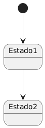

<strong>Ver el código en plantuml</strong>

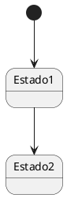

- El punto negro (*) representa el **estado inicial**.
- `Estado1` y `Estado2` son ejemplos de **estados**.

#### Transición

Una **transición** conecta dos estados y ocurre cuando se dispara un **evento**. Las transiciones tienen un solo sentido.

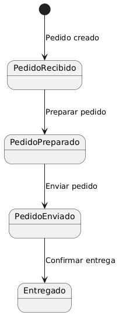

<strong>Ver el código en plantuml</strong>

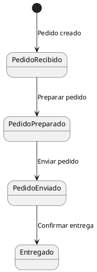

- **Eventos**: "Pedido creado", "Preparar pedido", "Enviar pedido", etc.
- Cada flecha entre estados representa una **transición**. Una transición cambia desde el estado de donde nace la flecha hasta el estado donde apunta la flecha y ocurre cuando se dispara el evento.

#### Evento

El **evento** es la acción que provoca una transición. Puede escribirse como texto en las flechas.

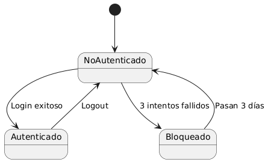

<strong>Ver el código en plantuml</strong>

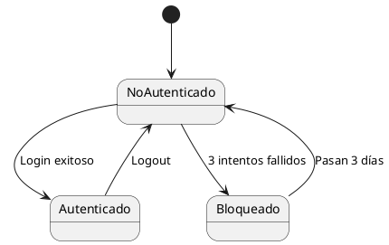

- Estados: *NoAutenticado*, *Autenticado*, *Bloqueado*.
- Eventos: *Login exitoso*, *3 intentos fallidos*, *Logout*.

#### Estado Inicial y Estado Final

- **Estado inicial**: Punto de partida del sistema (círculo relleno).
- **Estado final**: Punto donde el proceso termina (círculo doble). El proceso puede ser cíclico y no terminar.

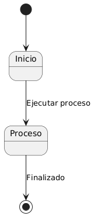

<strong>Ver el código en plantuml</strong>

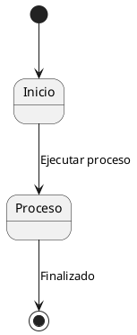

En el siguiente ejemplo, se muestra cómo un pedido pasa por varios estados durante su procesamiento.

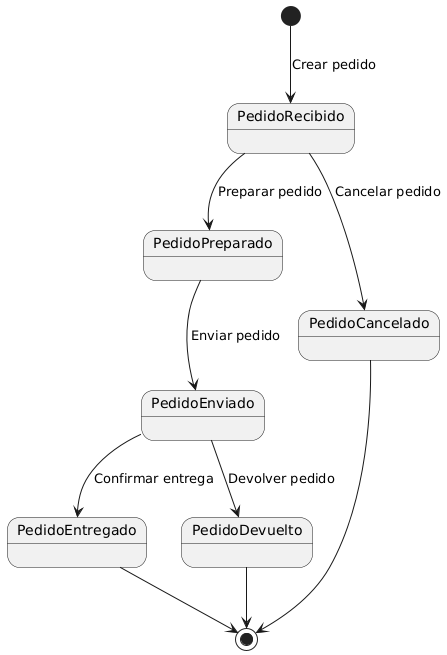

<strong>Ver el código en plantuml</strong>

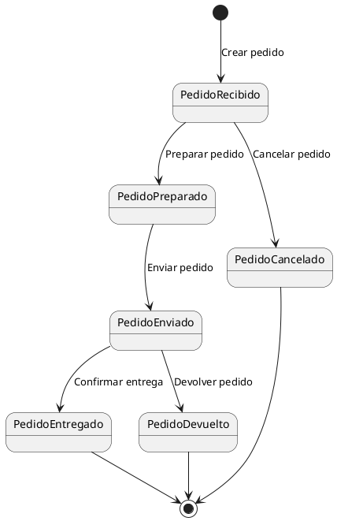

En este diagrama podemos observar lo siguiente:

1. **Estados**: PedidoRecibido, PedidoPreparado, PedidoEnviado, PedidoEntregado, PedidoCancelado, PedidoDevuelto.
2. **Transiciones**:
    - *Crear pedido*: De `[ * ]` a `PedidoRecibido`.
    - *Preparar pedido*: De `PedidoRecibido` a `PedidoPreparado`.
    - *Enviar pedido*: De `PedidoPreparado` a `PedidoEnviado`.
    - *Cancelar pedido*: Transición directa a `PedidoCancelado`.

> **Actividad**
> Crea diagramas de estados de los siguientes objetos:
> 1. Una puerta que se puede abrir o cerrar, y puede estar cerrada, abierta o en proceso de apertura o cierre. Las puertas empiezan cerradas.
> 2. El ciclo de vida de una mariposa, que comienza como un huevo, eclosiona y se transforma en una larva, cuando se ha alimentado lo suficiente crea un capullo de seda y comienza una metamorfosis, cuando termina se transforma en mariposa, se aparea, pone huevos y muere.
> 3. Las animaciones de un personaje de un videojuego, donde el personaje puede andar, estar en reposo, saltar, caer y morir. 

> **Actividad**
> Interpreta los siguientes diagramas:

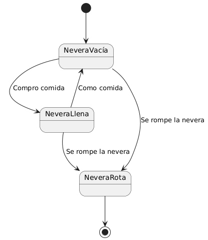

<strong>Ver el código en plantuml</strong>

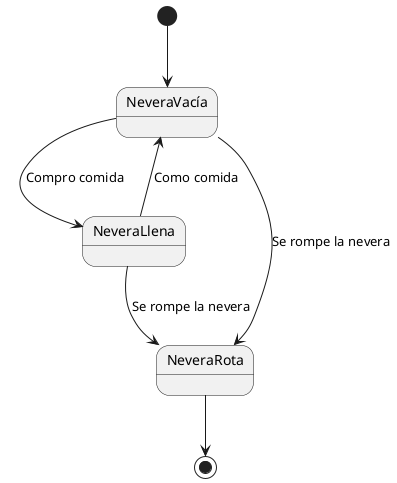

<strong>Ver el código en plantuml</strong>

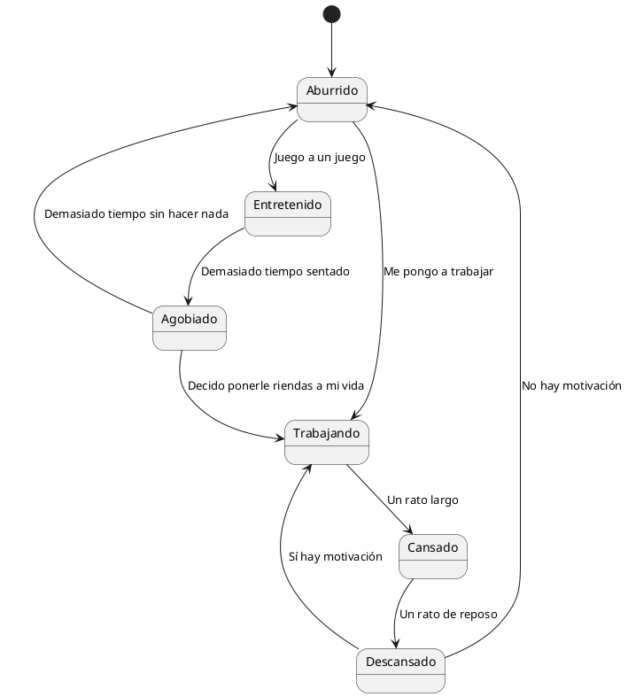

**Identifica el significado de los siguientes diagramas de estados.** Para ello, sigue los siguientes pasos:

- ¿Qué representa cada estado?  
- ¿Qué significado tienen las transiciones?  
- ¿Qué proceso o sistema modela el diagrama?  

Finalmente, escribe una descripción breve (de 3-5 líneas) para cada diagrama, explicando su **función y aplicación en el mundo real**.

#### Diagrama 1: Ciclo de vida de una tarea

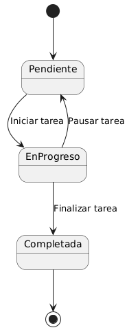

<strong>Ver el código en plantuml</strong>

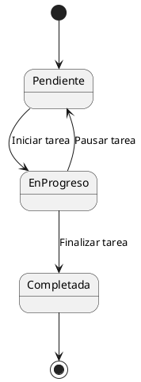

#### Diagrama 2: Sistema de un semáforo

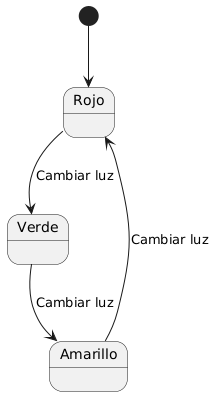

<strong>Ver el código en plantuml</strong>

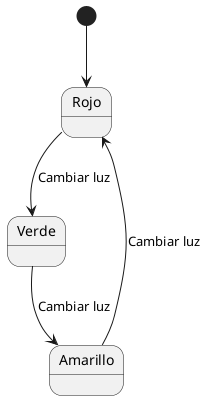

#### Diagrama 3: Proceso de pago en línea

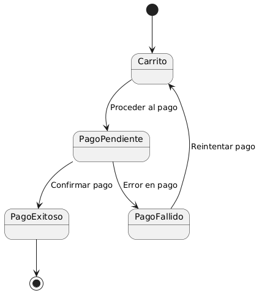

<strong>Ver el código en plantuml</strong>

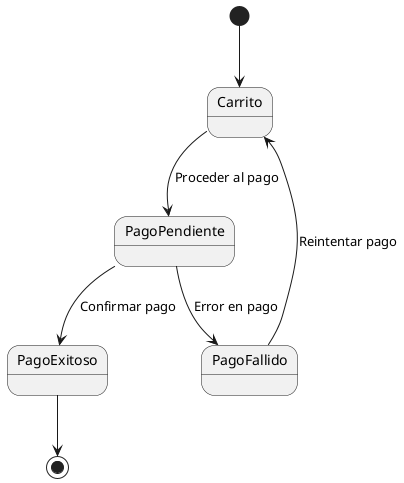

#### Diagrama 4: Gestión de una cuenta de usuario

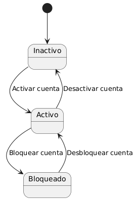

<strong>Ver el código en plantuml</strong>

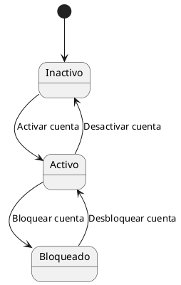

## Máquinas de Estados Simples y Compuestas

### Máquina de estados simple

Una máquina de estados simple representa de forma lineal los estados y las transiciones.

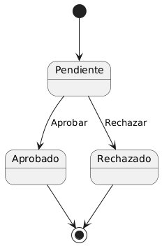

<strong>Ver el código en plantuml</strong>

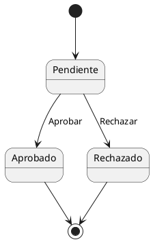

### Máquinas de estados compuestas

Una máquina de estados compuesta representa estados que pueden contener **subestados**.

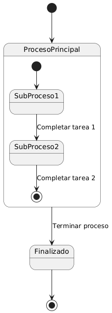

<strong>Ver el código en plantuml</strong>

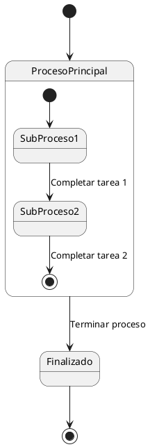

> **Actividad**
> Añade al diagrama del personaje del videojuego el estado correr, que a su vez se compone de los estados de arrancada, carrera y parada. De la parada se vuelve al estado de reposo, pero al estado salto solo se puede llegar desde el estado carrera (o desde el estado reposo).

> **Actividad**
> Crea un diagrama de transición de estados a partir de la siguiente definición:
>
> Una máquina de café automática gestiona la preparación y entrega de bebidas calientes. En su funcionamiento, la máquina puede encontrarse en varios estados. Al inicio, la máquina está a la espera de que un usuario realice una selección. Cuando el usuario elige una bebida (como café, té o chocolate caliente), la máquina pasa a un proceso de preparación específico según la bebida seleccionada. Si el proceso de preparación concluye sin problemas, la máquina entrega el producto al usuario y regresa al estado inicial para una nueva solicitud.  
>
>Sin embargo, si durante la preparación ocurre un error, como falta de ingredientes o una avería técnica, la máquina debe entrar en un estado de error que bloquea nuevas solicitudes hasta que un técnico de mantenimiento intervenga. El técnico podrá reiniciar el sistema y devolver la máquina a su estado inicial. Además, el proceso de **preparación** debe incluir detalles específicos dependiendo del tipo de bebida elegida: preparar café, preparar té o preparar chocolate caliente. 

