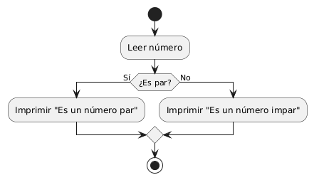
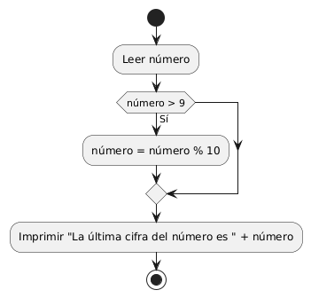
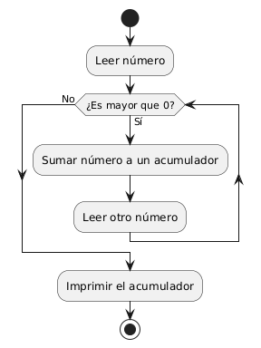
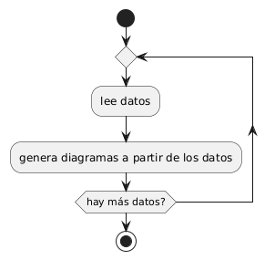
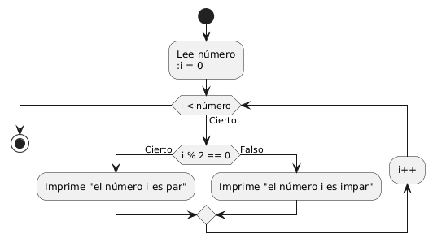
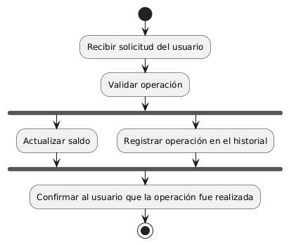
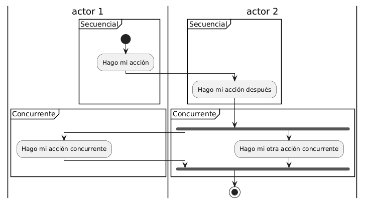

# Diagramas de actividad

<!-- @import "[TOC]" {cmd="toc" depthFrom=1 depthTo=6 orderedList=false} -->

<!-- code_chunk_output -->

- [Diagramas de actividad](#diagramas-de-actividad)
  - [Diagramas actividad](#diagramas-actividad)
    - [Componentes básicos de un diagrama de actividad](#componentes-básicos-de-un-diagrama-de-actividad)
  - [Estructuras comunes](#estructuras-comunes)
    - [Estructuras if-else, if y switch](#estructuras-if-else-if-y-switch)
    - [Estructuras while, do-while y for](#estructuras-while-do-while-y-for)
    - [Programación modular](#programación-modular)
  - [Concurrencia en diagramas de actividad](#concurrencia-en-diagramas-de-actividad)
    - [Representación de los hilos](#representación-de-los-hilos)
    - [Uso de carriles en los diagramas de actividad](#uso-de-carriles-en-los-diagramas-de-actividad)

<!-- /code_chunk_output -->

## Diagramas actividad

Los diagramas de actividad son representaciones gráficas de algoritmos o procesos, en las que se usan símbolos específicos para mostrar los pasos y decisiones. Son una herramienta esencial en la planificación, análisis y comunicación de sistemas.

Los diagramas de actividad son equivalentes a los diagramas de flujo que se emplean fuera de UML.

### Componentes básicos de un diagrama de actividad

1. **Flechas**: Conectan los diferentes símbolos y muestran el flujo del proceso.

2. **Círculo**: Representa el inicio (simple) o fin del proceso (doble).

<strong>Ver el código en plantuml</strong>

```plantuml
@startuml
start
stop
@enduml
```

3. **Rectángulo**: Indica una acción o proceso.

<strong>Ver el código en plantuml</strong>

```plantuml
@startuml
:acción;
@enduml
```

4. **Rombo o hexágono**: Representa una decisión, como una bifurcación. Se usan siempre dos: una para abrir y otra para cerrar.

<strong>Ver el código en plantuml</strong>

```plantuml
@startuml
if (¿decisión?) then (se cumple)
else (no se cumple)
@enduml
```

## Estructuras comunes

### Estructuras if-else, if y switch

Estas estructuras se utilizan para representar decisiones lógicas.  
**Ejemplo de if-else:**

<strong>Ver el código en plantuml</strong>

```plantuml
@startuml
start
:Leer número;
if (¿Es par?) then (Sí)
  :Imprimir "Es un número par";
else (No)
  :Imprimir "Es un número impar";
endif
stop
@enduml
```

**Ejemplo de if:**

<strong>Ver el código en plantuml</strong>

```plantuml
@startuml
start
:Leer número;
if (número > 9) then (Sí)
  :número = número % 10;
endif
:Imprimir "La última cifra del número es " + número;
stop
@enduml
```

**Ejemplo de Switch-case**

<strong>Ver el código en plantuml</strong>

```plantuml
@startuml
start
:leer mes;
switch(mes?)
case (mes es 1, 3, 5, 7, 8, 10 o 12)
  :Imprimir "Tiene 31 días";
case (mes es 4, 6, 9 o 11)
  :Imprimir "Tiene 30 días";
case (mes es 2)
  :Imprimir "Tiene 28 días, 29 si el año es bisiesto";
case (caso por defecto - mes es otro número -)
  :Imprimir "No es un mes válido";
endswitch
stop
@enduml
```

### Estructuras while, do-while y for

Los bucles permiten repetir una acción varias veces.  
>**Ejemplo de bucle while que pide suma números hasta que introduces 0:**

<strong>Ver el código en plantuml</strong>

```plantuml
@startuml
start
:Leer número;
while (¿Es mayor que 0?) is (Sí)
  :Sumar número a un acumulador;
  :Leer otro número;
endwhile (No)
:Imprimir el acumulador;
stop
@enduml
```

>**Ejemplo de bucle do-while para hacer diagramas:**

<strong>Ver el código en plantuml</strong>

```plantuml
@startuml

start
repeat
  :lee datos;
  :genera diagramas a partir de los datos;
repeat while (hay más datos?)

stop

@enduml
```

>**Ejemplo de bucle for para separar los números pares e impares desde 0 hasta una entrada dada por el usuario:**

<strong>Ver el código en plantuml</strong>

```plantuml
@startuml

start
:Lee número
:i = 0;
while (i < número) is (Cierto)
  if(i % 2 == 0) then (Cierto)
    :Imprime "el número i es par";
  else (Falso)
    :Imprime "el número i es impar"; 
  endif
  backward:i++;
endwhile

stop

@enduml
```

### Programación modular

Dentro del diseño de programas, existe un paradigma que es el de la programación modular. En él, se adopta un enfoque de diseño descendente en el cual un problema grande se divide en subproblemas más pequeños que permiten simplificar el problema general.

Estos subproblemas se conocen como módulos y tienen la ventaja de ser más fáciles de probar, mantener y corregir, además de poder ser reutilizados en diferentes partes del problema principal o incluso en otros problemas distintos. Los módulos se pueden invocar desde cualquier otro módulo. Un módulo tiene un grado de entrada igual al número de veces que es invocado y un grado de salida igual al número de módulos que invoca.

La dependencia entre módulos se llama **acoplamiento**, y puede ser peligrosa si va más allá de que un módulo emplee el resultado de otro. Por ello, es conveniente diseñar los módulos como si fueran **cajas negras**, es decir, de tal forma que solo nos importe los parámetros que le pasamos como entrada y el resultado que nos devuelve.

Podemos representar la invocación a módulos en los diagramas de actividad como una instrucción o condición cualquiera, indicando entre paréntesis los parámetros que le pasamos.

<strong>Ver el código en plantuml</strong>

```plantuml
@startuml
start
:Introduce un número n;
:resultado = procesar(n);
note right
  Aquí se llamaría al subproceso "procesar" con el parámetro de entrada n, que en este caso nos devolvería un resultado
end note
:Imprimir resultado;
stop
@enduml
```

## Concurrencia en diagramas de actividad

Aunque no se trabaja programación concurrente en el primer curso del ciclo, es apropiado conocer cómo representar flujos paralelos (hilos) en un diagrama de actividad. Esta técnica es útil cuando se modelan procesos que pueden ejecutarse simultáneamente, algo común en sistemas donde las operaciones independientes pueden ocurrir al mismo tiempo (como cuando se consulta una base de datos externa o se trabaja con interfaces gráficas).

### Representación de los hilos

En un diagrama de actividad, los hilos (o actividades concurrentes) se representan mediante **ramificaciones paralelas**, utilizando nodos de bifurcación (*fork*) y unión (*join*):

- **Fork (Bifurcación):** Representado por una línea horizontal o vertical gruesa. Indica que el flujo se divide en varios caminos paralelos que se ejecutan simultáneamente.
- **Join (Unión):** También representado por una línea gruesa, marca el punto donde los flujos paralelos se sincronizan para continuar con un único flujo.

Por ejemplo, Supongamos un sistema de cajero automático que debe realizar dos tareas en paralelo:

1. **Actualizar el saldo de la cuenta.**
2. **Registrar la operación en un historial de transacciones.**

Ambas tareas pueden ejecutarse de forma concurrente, ya que no dependen entre sí, pero deben completarse antes de que el sistema pueda finalizar la operación.

**Representación en un diagrama de actividad:**

<strong>Ver el código en plantuml</strong>

```plantuml
@startuml
start
:Recibir solicitud del usuario;
:Validar operación;

fork
  :Actualizar saldo;
fork again
  :Registrar operación en el historial;
endfork

:Confirmar al usuario que la operación fue realizada;
stop
@enduml
```

En este caso, se puede observar que el diagrama representa las siguientes acciones:

1. **Inicio del flujo:** El sistema recibe la solicitud del usuario y valida que la operación sea posible.
2. **Bifurcación:** El flujo se divide en dos hilos: uno para actualizar el saldo y otro para registrar la operación en el historial.
3. **Unión:** Ambos hilos se sincronizan para continuar con el flujo principal.
4. **Fin del flujo:** El sistema confirma al usuario que la operación fue realizada.

Es importante no confundir los hilos con las diferentes opciones que nos proporciona un `if-else` o un `switch`. En el caso de los hilos, **todas** las acciones desde el **fork** se llevan a cabo de manera simultánea y el programa espera en el punto de encuentro, el **join**. Como curiosidad, el nombre de **fork** viene de tenedor (**fork** en inglés es tenedor), pues su representación se asemeja a un tenedor (en realidad no, viene de bifurcación, que es el otro significado de fork, pero sirve como regla mnemotécnica).

Aunque no vayamos a hacer programación concurrente este curso, la división en hilos sí que nos permite representar las siguientes cosas:

- Visualizar procesos que pueden ejecutarse en paralelo, optimizando tiempos.
- Detectar posibles dependencias entre actividades que podrían causar errores.
- Representar sistemas más complejos con mayor precisión.
- Planificar los sprints de un equipo de desarrollo.

### Uso de carriles en los diagramas de actividad

Para representar la intervención de varios actores dentro de una misma actividad, se puede dividir el diagrama de actividad en carriles, reservando cada carril para cada actor.

Aunque los carriles son especialmente prácticos para describir las actividades concurrentes, se pueden emplear en cualquier momento. Asimismo, también podemos agrupar diferentes bloques de acciones para facilitar la interpretación del diagrama.

<strong>Ver el código en plantuml</strong>

```plantuml
@startuml
|actor 1|

partition Secuencial {
    
    start
    :Hago mi acción;
    |actor 2|
    :Hago mi acción después;
}

partition Concurrente {
    fork
    |actor 1|
    :Hago mi acción concurrente;
    fork again
    |actor 2|
    :Hago mi otra acción concurrente;
endfork
}
stop

@enduml
```

***Nota**: En Plantuml, los carriles dividen las particiones por la mitad. Sin embargo, al diseñarlos con otros editores, como Visual Paradigm o en papel y lápiz, puedes agruparlos como te resulte más conveniente*

> **Actividad**
> Crea un diagrama de actividad a partir de la siguiente definición:
>
> Una máquina de café automática gestiona la preparación y entrega de bebidas calientes. En su funcionamiento, la máquina puede encontrarse en varios estados. Al inicio, la máquina está a la espera de que un usuario realice una selección. Cuando el usuario elige una bebida (como café, té o chocolate caliente), la máquina pasa a un proceso de preparación específico según la bebida seleccionada. Si el proceso de preparación concluye sin problemas, la máquina entrega el producto al usuario y regresa al estado inicial para una nueva solicitud.  
>
>Sin embargo, si durante la preparación ocurre un error, como falta de ingredientes o una avería técnica, la máquina debe entrar en un estado de error que bloquea nuevas solicitudes hasta que un técnico de mantenimiento intervenga. El técnico podrá reiniciar el sistema y devolver la máquina a su estado inicial. Además, el proceso de **preparación** debe incluir detalles específicos dependiendo del tipo de bebida elegida: preparar café, preparar té o preparar chocolate caliente. 

