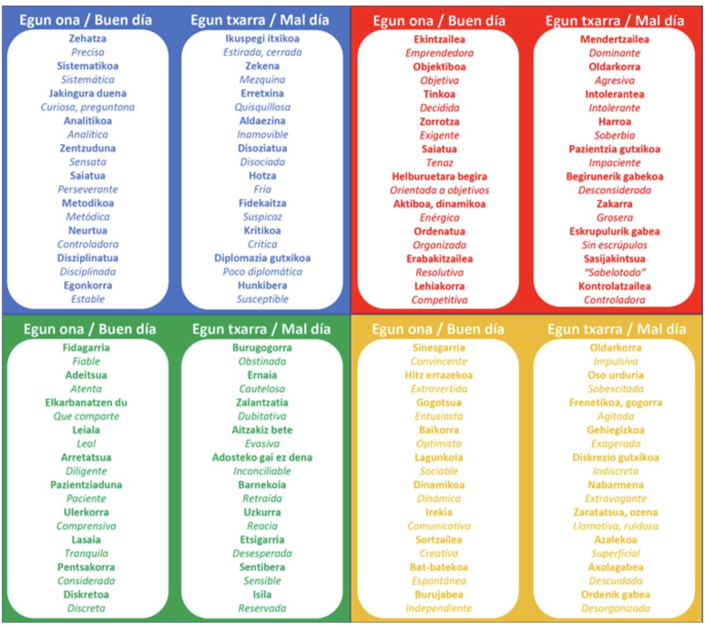

# Reto cooperativo de la Unidad de Programación 02

## Análisis de sistemas y diagramas de comportamiento

### Formación del equipo

Para esta unidad de programación, la formación de los equipos se hará a través del método [*Dinámica de los colores*](https://drive.google.com/file/d/19V9e3BR_IXAjEKVoDU1BxUgsK0heF0S2/view). Observa la tabla:

¿Con qué colores te identificas más? Escoge en la encuesta en FORMS tu primera y tu segunda opción. En base a ella, se crearán los equipos de la clase intentando tener representados todos los colores.

### Tarea

Lee el enunciado que tu equipo tiene asignado y, según los criterios del IEEE 830, establece los requisitos funcionales de cada aplicación. A continuación, basándote en dicha información, realiza los siguientes diagramas:

- Diagrama de casos de uso
- Diagrama/s de transición de estados
- Diagrama/s de actividad
- Diagrama/s de interacción