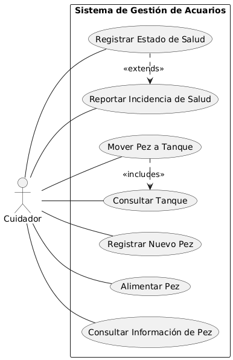
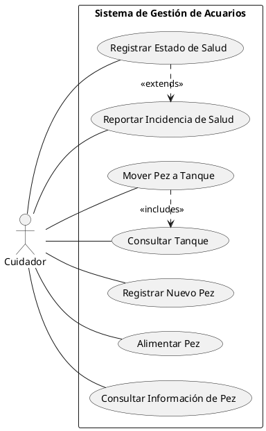
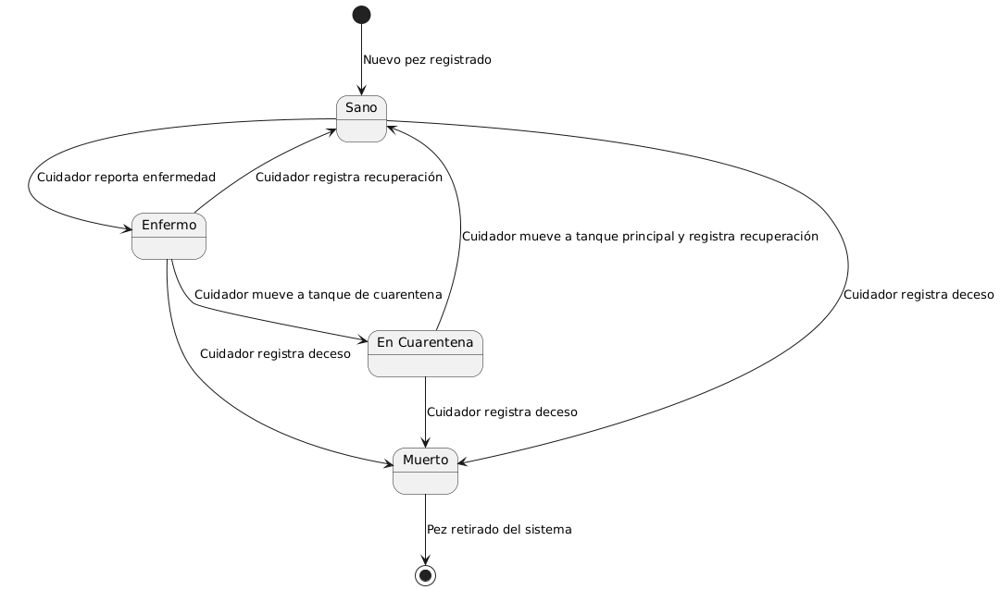
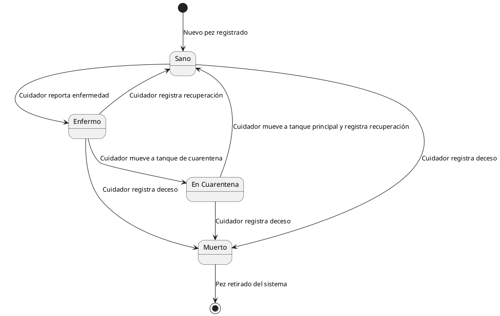
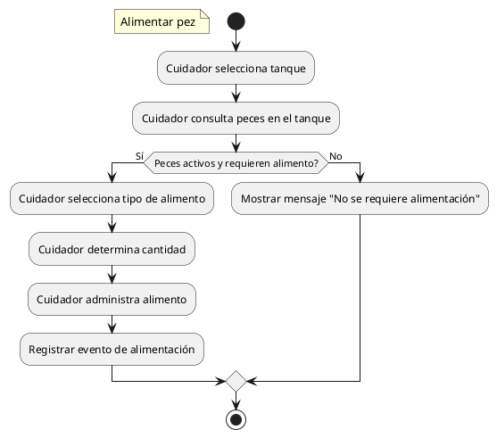
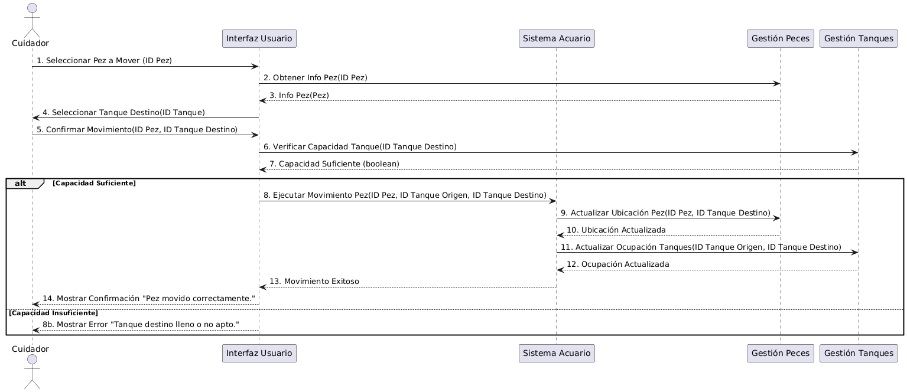
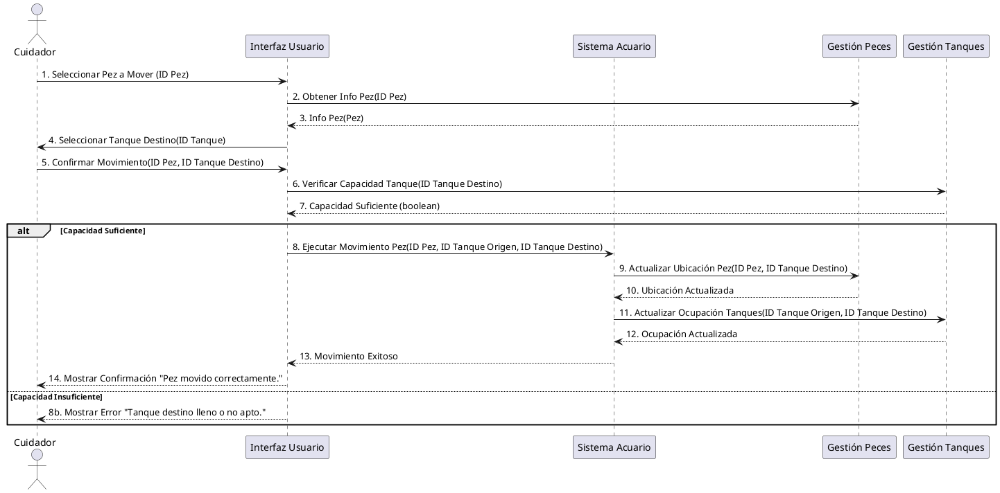
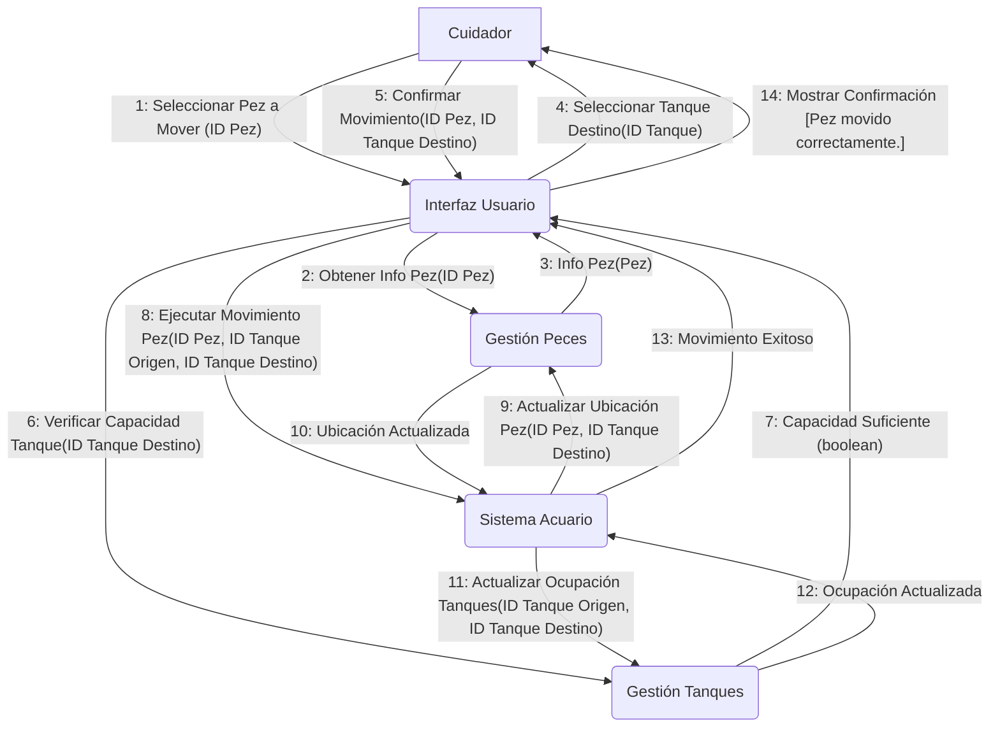

# Reto individual

## Crea los diagramas de comportamiento necesarios según la especificación

Lee el enunciado de esta problemática y establece, según los criterios del IEEE 830, los requisitos funcionales la aplicación que se te pide desarrollar. A continuación, basándote en dicha información, realiza los siguientes diagramas:

- Diagrama de casos de uso
- Diagrama/s de transición de estados
- Diagrama/s de actividad
- Diagrama/s de interacción

Se requiere diseñar un sistema para **gestionar el control de equipaje** en un aeropuerto. En el aeropuerto interactúan **tres tipos de usuarios**: **guardias**, **personal del aeropuerto** y **pasajeros**. Los datos de identificación de cada usuario son los siguientes:

- Los **guardias** y el **personal del aeropuerto** se identifican por su **nombre** y **DNI**.
- Los **pasajeros** se identifican por su **nombre**, **DNI** y el **número de vuelo** al que pertenecen.

El sistema debe controlar el flujo de equipaje bajo las siguientes **condiciones**:

1. Todo **equipaje** pasa por **áreas de control**. Estas áreas pueden estar en alguno de los siguientes estados: **operativas**, **bloqueadas** o **en mantenimiento**.
2. Los **guardias** pueden acceder a todas las áreas de control, independientemente de su estado.
3. El **personal del aeropuerto** puede **bloquear** áreas de control (por mantenimiento, seguridad, etc.), y mientras estén bloqueadas, no se puede procesar ningún equipaje.
4. Los **pasajeros** solo pueden acceder a áreas de control **operativas** y **asignadas a su vuelo**.
5. Un equipaje solo puede ser procesado si el área de control está **operativa** y **no bloqueada**.
6. Algunas áreas de control son **prioritarias** y permiten el procesamiento de equipaje **especial**. Dichas áreas deben ser autorizadas por un **guardia** o **personal del aeropuerto**.

Procesar un equipaje significa pasarlo por el control. En caso de que salte la alarma, el guardia debe revisar de forma manual el equipaje para detectar qué elemento hacía saltar el control y volver a poner el equipaje para pasarlo de nuevo, hasta que no salte la alarma o el pasajero desista. Por su parte, mientras se está procesando el equipaje, el pasajero debe pasar por el control de metales. Si salta la alarma, debe quitarse la ropa que hacía saltar la alarma, ponerla en el control como si fuera equipaje y volver a comenzar el proceso hasta que todo sea correcto o desista.

## Interpreta los siguientes diagramas y define el sistema representado por los mismos

### Diagrama de casos de uso

<b>Haz click aquí para ver el código</b>

### Diagrama de transición de estados

<b>Haz click aquí para ver el código plantuml </b>

### Diagrama de actividad

<b>Haz click aquí para ver el código plantuml</b>

### Diagrama de secuencia

<b>Haz click aquí para ver el código plantuml</b>

### Diagrama de comunicación

