# Cuaderno de ejercicios 02

<!-- @import "[TOC]" {cmd="toc" depthFrom=1 depthTo=6 orderedList=false} -->

<!-- code_chunk_output -->

- [Cuaderno de ejercicios 02](#cuaderno-de-ejercicios-02)
  - [Diagramas de casos de uso](#diagramas-de-casos-de-uso)
  - [Diagramas de transición de estados](#diagramas-de-transición-de-estados)
  - [Diagramas de actividad](#diagramas-de-actividad)
  - [Diagramas de interacción](#diagramas-de-interacción)
  - [Prompts de IA para practicar](#prompts-de-ia-para-practicar)
    - [Prompts de la IA para aprender un lenguaje de programación o de modelado como Plantuml](#prompts-de-la-ia-para-aprender-un-lenguaje-de-programación-o-de-modelado-como-plantuml)
    - [Prompts de la IA para practicar preguntas de tipo test](#prompts-de-la-ia-para-practicar-preguntas-de-tipo-test)
    - [Prompts para ejercicios](#prompts-para-ejercicios)

<!-- /code_chunk_output -->

## Diagramas de casos de uso

> **Actividad:** Describe el funcionamiento de los siguientes sistemas según su diagrama de casos de uso.
>
**Diagrama 1:**

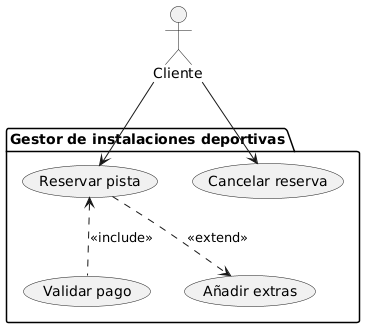

<strong>Ver el código en plantuml</strong>

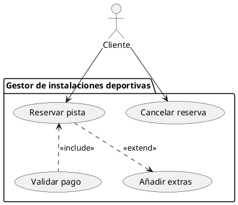

**Diagrama 2:**

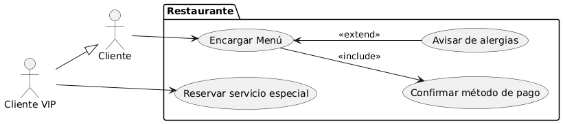

<strong>Ver el código en plantuml</strong>

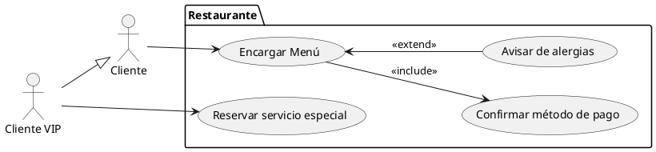

**Diagrama 3:**

<strong>Ver el código en plantuml</strong>

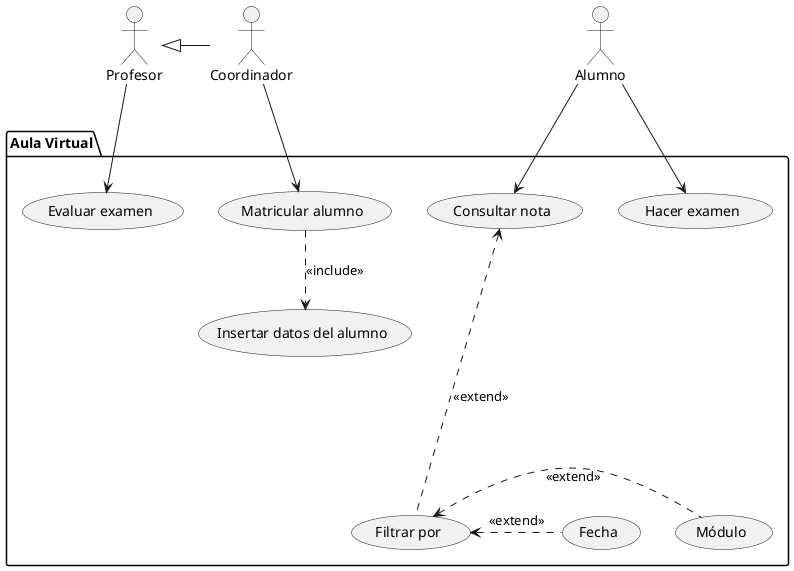

## Diagramas de transición de estados

>**Actividad:** Identifica el significado de los siguientes diagramas de estados. Para ello, sigue los siguientes pasos:
>
>- ¿Qué representa cada estado?
>- ¿Qué significado tienen las transiciones?
>- ¿Qué proceso o sistema modela el diagrama?
>
>Finalmente, describe brevemente cada diagrama, explicando su **función y aplicación en el mundo real**.

**Diagrama 1: Ciclo de vida de una tarea**

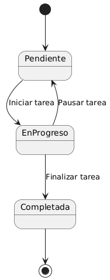

<strong>Ver el código en plantuml</strong>

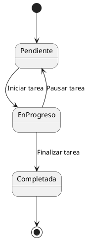

**Diagrama 2: Sistema de un semáforo**

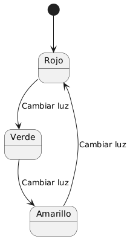

<strong>Ver el código en plantuml</strong>

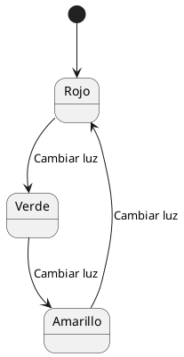

**Diagrama 3: Proceso de pago en línea**

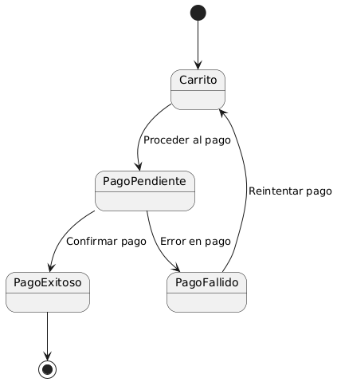

<strong>Ver el código en plantuml</strong>

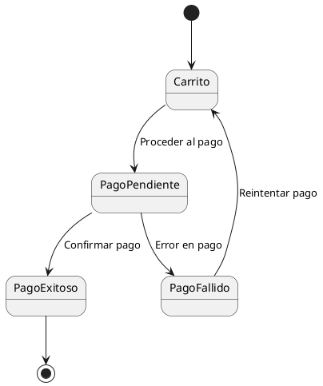

**Diagrama 4: Gestión de una cuenta de usuario**
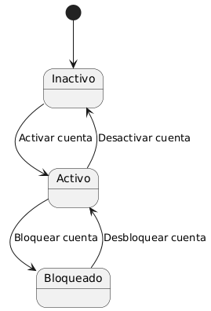

<strong>Ver el código en plantuml</strong>

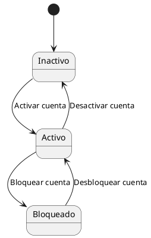

>**Actividad:** Describe los siguientes diagramas de estados siguiendo estas pautas:
>
>1. **Analiza cada diagrama compuesto**:
>    - Identifica los **estados principales** y los **subestados**.
>    - Describe el flujo general del sistema y qué proceso representa.
>
>2. **Escribe una breve explicación** para cada diagrama, enfocándote en:
>    - **Qué sistema modela** (por ejemplo: máquina expendedora, proceso de reserva de vuelo).
>    - **Cómo los subestados mejoran la comprensión del sistema**.
>

**Ciclo de vida de un teléfono móvil**

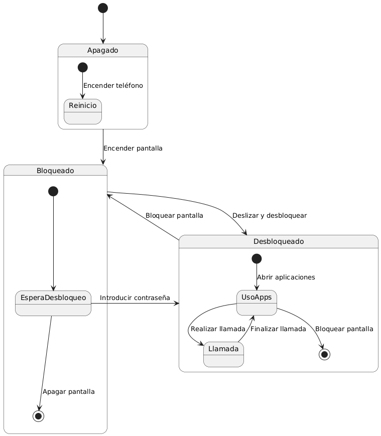

<strong>Ver el código en plantuml</strong>

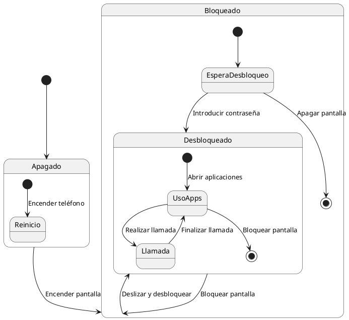

**Proceso de reserva de un vuelo**

<strong>Ver el código en plantuml</strong>

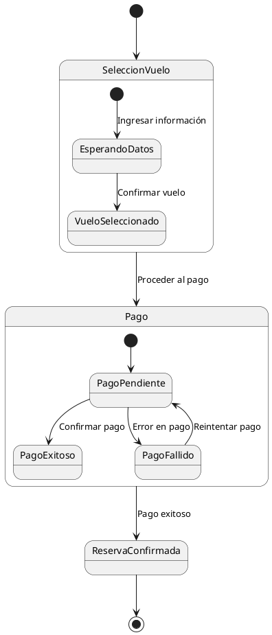

**Gestión de una máquina expendedora**

<strong>Ver el código en plantuml</strong>

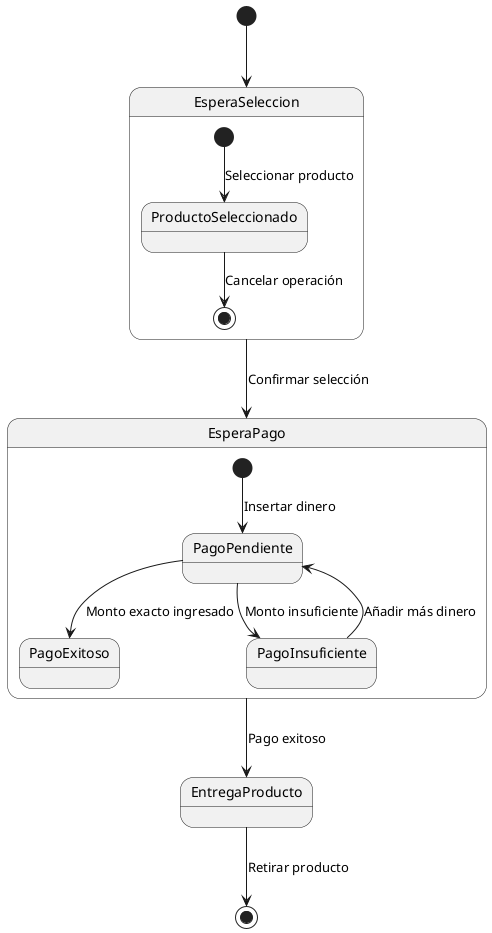

## Diagramas de actividad

>**Actividad:** Dibuja un diagrama de flujo que determine si un número es positivo, negativo o cero.

>**Actividad:** Crea un diagrama de flujo para sumar todos los números entre dos números entrados por el usuario en un bucle. Comprueba cuál de los dos números es mayor para establecer el orden de forma correcta. Si el resultado tiene una cifra, escribe "una cifra", si tiene dos escribe "dos cifras" y si tiene más escribe "Tres o más cifras".

>**Actividad:** Realiza un diagrama de actividad de cada una de las siguientes actividades:
>
>- Determinar la cantidad de días que tiene un mes en un año, ambos datos introducidos por el usuario. Los datos se imprimen por pantalla. El programa termina si el usuario introduce un número de mes incorrecto (menor que 1 o mayor que 12).
>- Un programa que calcule el factorial de un número entero y mayor o igual a 1 introducido por el usuario. La fórmula del factorial es Factorial(n) = n * Factorial(n-1) y Factorial(1) = 1. Hazlo de forma iterativa (sin recursividad).
>- Un programa que recorra las estanterías de una biblioteca y diga la siguiente información:
>   - Qué estantería tiene más libros (están numeradas del 1 al 10)
>   - Cuál es el título del libro que más páginas tiene y en qué estantería está
>   - Cuántas páginas hay en cada estantería

>**Actividad:** Dibuja un diagrama de flujo para calcular el área de varios triángulos introducidos por el usuario. Define un subproceso para calcular el área de un triángulo e invócalo en el momento adecuado.

>**Actividad:** Coordinación de Tareas en una Cocina
>
>En una cocina, varios trabajadores deben colaborar para preparar y entregar hamburguesas según los pedidos de los clientes. Cada trabajador tiene una tarea específica, y el pedido solo puede ser entregado cuando todos hayan terminado su parte. El flujo de trabajo se divide en las siguientes actividades:
>
>1. **Cocinero 1:** Cocina la carne de la hamburguesa.
>2. **Cocinero 2:** Prepara el pan (lo corta y lo coloca).
>3. **Cocinero 3:** Añade los condimentos (queso, salsas, etc.). Solo se puede hacer si el pan está preparado.
>4. **Cocinero 4:** Prepara la guarnición (patatas fritas, ensaladas, etc.).
>5. **Trabajador de entrega:** Ensambla el pedido y lo entrega al cliente, pero **solo puede hacerlo cuando todos los cocineros hayan terminado sus tareas**.
>
>Modela el sistema de preparación de pedidos de hamburguesas mediante un **diagrama de actividad**, representando los flujos paralelos de trabajo.

## Diagramas de interacción

>**Actividad:** Explica lo que ocurre en los siguientes diagramas de secuencia:

**Autenticación de un usuario**

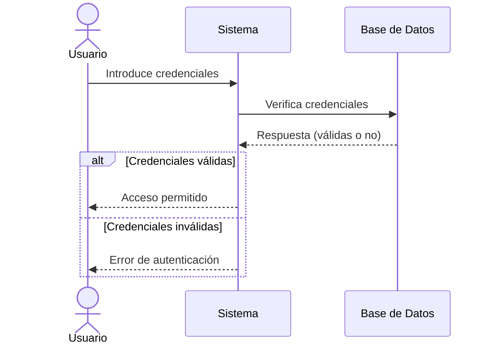

**Compra en línea**

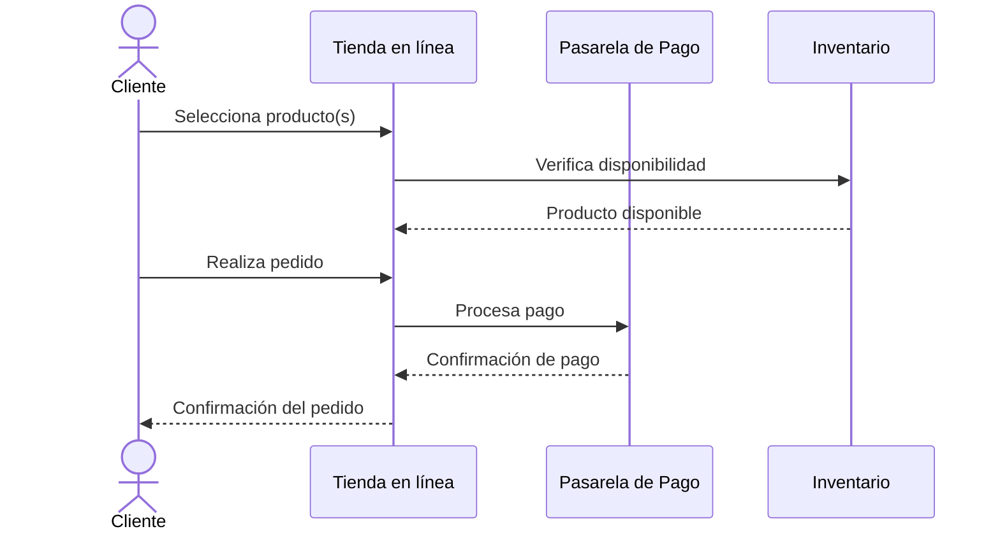

**Retiro de efectivo en un cajero automático**

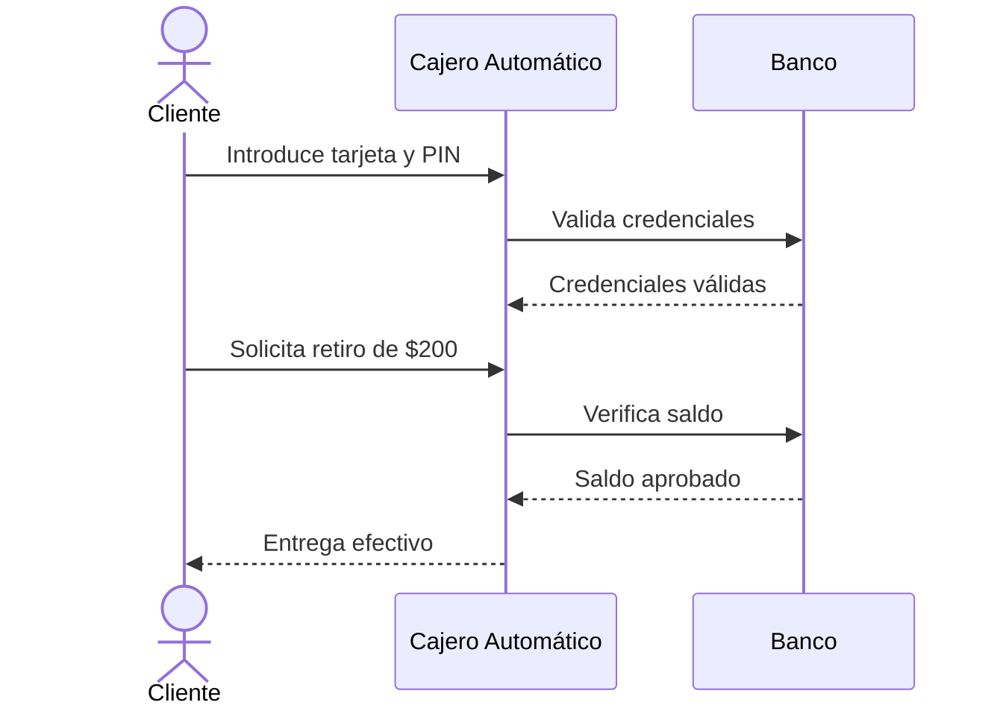

**Soporte técnico automatizado**

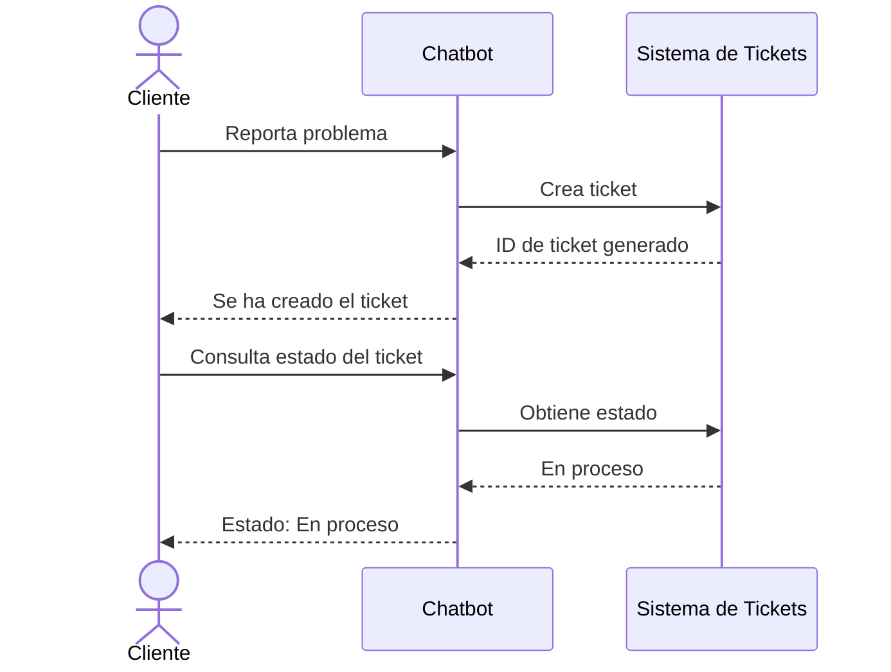

**Gestión de una máquina de café automática**

>
>Una máquina de café automática gestiona la preparación y entrega de bebidas calientes. En su funcionamiento, la máquina puede encontrarse en varios estados. Al inicio, la máquina está a la espera de que un usuario realice una selección. Cuando el usuario elige una bebida (como café, té o chocolate caliente), la máquina pasa a un proceso de preparación específico según la bebida seleccionada. Si el proceso de preparación concluye sin problemas, la máquina entrega el producto al usuario y regresa al estado inicial para una nueva solicitud.
>
>Sin embargo, si durante la preparación ocurre un error, como falta de ingredientes o una avería técnica, la máquina debe entrar en un estado de error que bloquea nuevas solicitudes hasta que un técnico de mantenimiento intervenga. El técnico podrá reiniciar el sistema y devolver la máquina a su estado inicial. Además, el proceso de **preparación** debe incluir detalles específicos dependiendo del tipo de bebida elegida: preparar café, preparar té o preparar chocolate caliente.

## Prompts de IA para practicar

### Prompts de la IA para aprender un lenguaje de programación o de modelado como Plantuml

La Inteligencia Artificial es una herramienta muy potente para aprender cualquier lenguaje de programación a nivel básico o básico-medio. Sin embargo, tiene una tendencia muy fuerte a darte soluciones sin permitirte discurrir. Para poder aprender bien un lenguaje de programación o marcado, como plantuml, debemos darle instrucciones precisas para que:
1) Vaya paso a paso
2) Ponga ejercicios después de cada paso
3) No te dé la solución de los ejercicios hasta que no le hayas presentado tú una propuesta.

Sabiendo esto, puedes convertir a la IA en una herramienta fundamental para aprender cualquier lenguaje, por ejemplo plantuml, para lo que podríamos escribir un prompt como el que sigue:

> Necesito aprender a hacer diagramas en plantuml, hazme un tutorial para poder aprender a usarlos para hacer diagramas de actividad. Ponme ejercicios intercalados para que vaya practicando. Ve poco a poco. No me des la solución de los ejercicios hasta que no los haya presentado yo.

Entonces, la inteligencia artificial nos presentaría un tutorial de inicio de plantuml enfocado a resolver

### Prompts de la IA para practicar preguntas de tipo test

A la hora de practicar preguntas tipo test, es importante decirle a la inteligencia artificial cómo va a ser el test (número de respuestas posibles, cuántas pueden ser verdaderas) y darle un material o una temática para que elabore las preguntas. Le podemos adjuntar un archivo para que extraiga contenido de ahí, o hablarle de un tema del que queramos aprender.

También es importante darle instrucciones para que no nos diga la respuesta correcta hasta que no hayamos hecho nuestro intento. A la hora de comenzar a practicar, es recomendable hacer las preguntas de una en una, para profundizar en cada una, y poco a poco hacer más preguntas de golpe, pero siempre sin que nos diga la solución hasta que lo hayamos intentado.

Para hacer una prueba, primero añade el documento sobre el que quieras practicar y ponle el siguiente *prompt*.

>Dado este documento, ¿me puedes crear preguntas tipo test para practicar? En estas preguntas, tiene que haber cuatro alternativas (a, b, c, d) de las cuales solo una puede ser correcta. Me haces primero la pregunta, yo te respondo con la letra que creo que es correcta y me respondes si he acertado o no.

Usando, por ejemplo, el archivo de transición de estados, podría contestar algo como esto:

> Perfecto. Vamos a comenzar con una pregunta tipo test basada en el contenido del documento sobre **diagramas de transición de estados**.
>
> ---
>
>
> **Pregunta 1:**
>
>¿Cuál de las siguientes afirmaciones describe **correctamente** un diagrama de estados?
>
>a) Representa únicamente los datos estáticos de un sistema orientado a objetos.
>b) Es una representación gráfica de los algoritmos empleados en la programación funcional.
>c) Representa visualmente los estados y transiciones que experimenta un objeto ante eventos.
>d) Se utiliza exclusivamente para modelar estructuras de base de datos relacionales.
>
>---
>
>¿Cuál crees que es la respuesta correcta? (a, b, c, d)
> 

La pregunta correcta es C, a lo que contestaría:

> ✅ ¡Correcto!
>
>La respuesta **c) Representa visualmente los estados y transiciones que experimenta un objeto ante eventos** es la acertada.
>
>Los diagramas de transición de estados son útiles para modelar el comportamiento dinámico de un sistema, mostrando cómo un objeto cambia de estado en respuesta a distintos eventos.
>
>---
>
>¿Listo para la siguiente pregunta?

Le decimos que sí.

>Genial, vamos con la siguiente:
>
>---
>
>**Pregunta 2**:
>
>En un diagrama de estados, ¿qué representa el **círculo negro relleno**?
>
>a) Un estado final
>b) Una transición obligatoria
>c) El estado inicial del sistema
>d) Una pausa en la ejecución del proceso
>
>---
>
>¿Cuál es tu respuesta? (a, b, c, d)

En este caso, fallamos y escribimos la letra b, para lo que nos responde:

> ❌ Incorrecto.

> La respuesta correcta es: **c) El estado inicial del sistema**.
> 
>En los diagramas de estados, el **círculo negro relleno** indica el **estado inicial**, es decir, el punto desde el cual comienza la ejecución del sistema o el ciclo de vida del objeto.
>
>---
>
>¿Quieres otra pregunta?

### Prompts para ejercicios

En este sentido, las inteligencias artificiales son menos eficientes a la hora de plantear ejercicios buenos, ya que tienen tendencia a decirte exactamente qué pasos tienes que hacer. Esto limita el aprendizaje y conviene afinar mucho para que no lo haga. Algo así:

> Dado el documento adjunto, hazme un enunciado para un ejercicio de desarrollo en el que tenga que poner en práctica los conocimientos del documento. Puedes basarte en alguno de los ejercicios que hay desarrollados en él. No me des la solución, la quiero hacer yo y después pasártela. 
>
> Sobre el ejercicio, no me des lo que tengo que hacer paso a paso, sino que quiero extraer la información de un enunciado. Haz que sea desafiante y un poco abierto.

A lo cual, responderá:

> Perfecto, aquí tienes un **enunciado de ejercicio de desarrollo** que pone a prueba tu comprensión de los diagramas de transición de estados. Es abierto, algo desafiante y te permite aplicar varios conceptos del documento:
>
>---
>
>🧩 **Enunciado del ejercicio: Sistema de gestión de viajes compartidos**
>
>Diseña un diagrama de transición de estados que represente el ciclo completo de un **viaje en una aplicación de transporte tipo Uber o Cabify**, desde el momento en que un usuario abre la app hasta que el viaje se completa o se cancela por algún motivo.
>
>Tu diagrama debe incluir al menos:
>
>* Estados relacionados con la solicitud del viaje, la asignación del conductor, la llegada del conductor, el desarrollo del viaje y su finalización.
>* Posibles eventos como cancelaciones por parte del conductor o del usuario, fallos en la asignación, esperas prolongadas, etc.
>* Considera la posibilidad de que el viaje no se complete y vuelva a un estado anterior, o que haya un estado de error.
>* Puedes utilizar **subestados** si consideras que hay procesos internos más detallados (por ejemplo, dentro del estado "Viaje en curso").
>
>**No se espera un diagrama perfecto, sino que elabores un modelo coherente que demuestre tu comprensión del concepto de estados, transiciones y eventos.**
>
>---
>
>Cuando tengas tu solución, compártela aquí (si usas PlantUML, perfecto). Estoy listo para revisarla y darte feedback.

