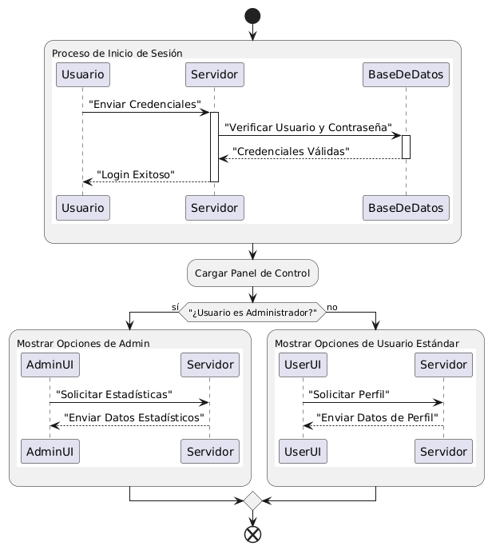
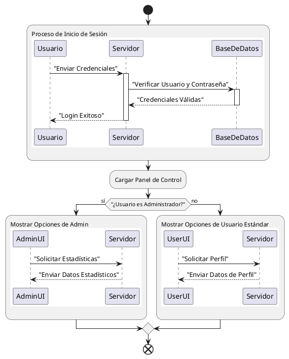
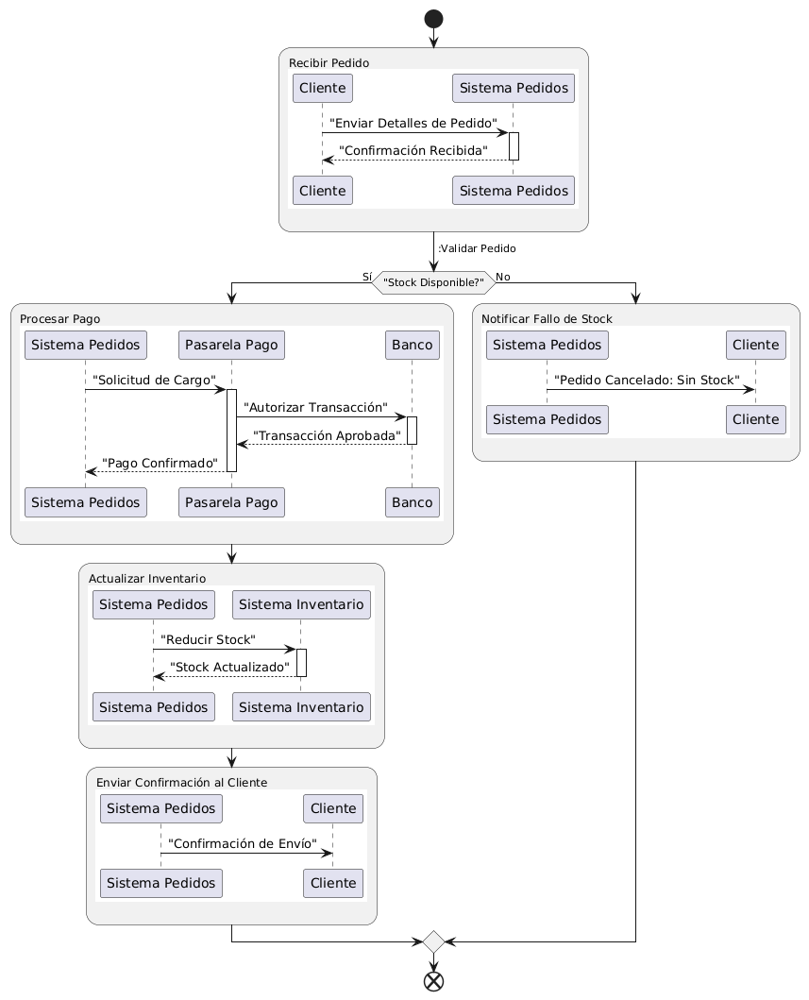
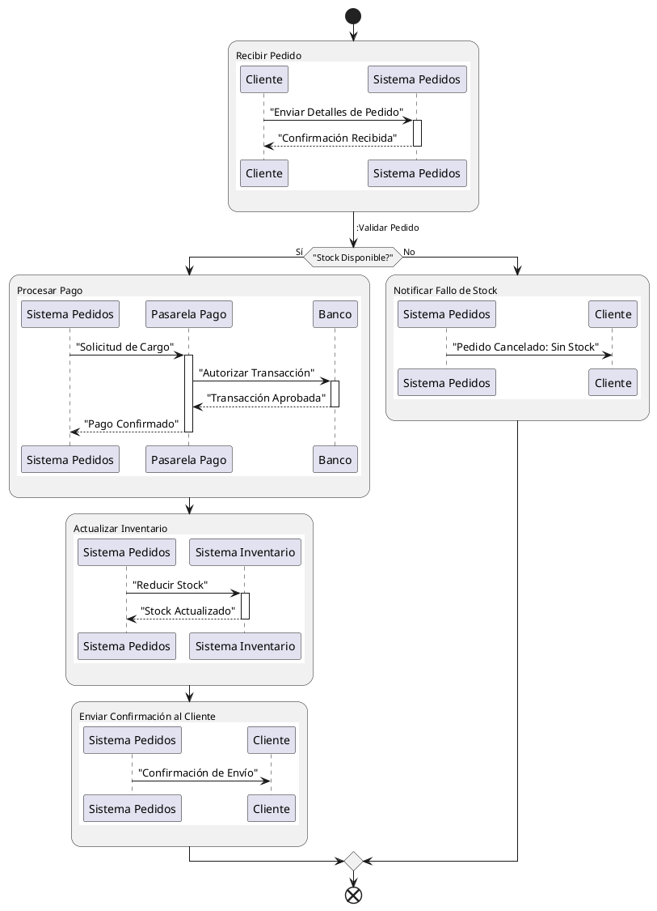

# Ampliación: Diagramas Globales de Interacciones

<!-- @import "[TOC]" {cmd="toc" depthFrom=1 depthTo=6 orderedList=false} -->

<!-- code_chunk_output -->

- [Ampliación: Diagramas Globales de Interacciones](#ampliación-diagramas-globales-de-interacciones)
  - [Diagramas Globales de Interacciones](#diagramas-globales-de-interacciones)
  - [Estructura de un Diagrama Global de Interacciones](#estructura-de-un-diagrama-global-de-interacciones)
  - [Entrega de la actividad de ampliación](#entrega-de-la-actividad-de-ampliación)

<!-- /code_chunk_output -->

## Diagramas Globales de Interacciones

Los diagramas globales de interacciones son una herramienta de modelado poderosa que te permite obtener una vista de alto nivel del flujo de control dentro de un sistema, mientras que, al mismo tiempo, te permite profundizar en los detalles de cómo los objetos interactúan en cada paso. Imagina un mapa de carreteras que, además de mostrarte las rutas principales, te permite hacer zoom en cada cruce para ver cómo se mueven los coches en detalle. Eso es un diagrama global de interacciones.

Estos diagramas **combinan la lógica de flujo de los diagramas de actividad con los detalles de interacción de los diagramas de secuencia o comunicación**. Esto los convierte en una opción ideal para describir escenarios complejos donde hay múltiples interacciones que ocurren en una secuencia lógica. 

Los diagramas globales de interacción poseen las siguientes características:

  * **Visión General y Detalle:** Permiten representar una secuencia de eventos o actividades de alto nivel, pero cada "actividad" puede ser, en realidad, una interacción compleja (como una secuencia de mensajes entre varios componentes).
  * **Claridad en Sistemas Complejos:** Son excelentes para descomponer un proceso grande en partes manejables, donde cada parte es una interacción específica entre objetos.
  * **Reuso:** Si tienes interacciones de secuencia o comunicación ya definidas, puedes reutilizarlas dentro de un flujo de actividades más amplio.
  * **Flujo de Control:** Muestran decisiones, bifurcaciones y uniones de flujos, lo que es característico de los diagramas de actividad.

## Estructura de un Diagrama Global de Interacciones

Fundamentalmente, un diagrama global de interacciones es un **diagrama de actividad** que, en lugar de contener acciones o actividades simples, incluye **fragmentos de interacción**. Estos fragmentos pueden ser:

  * **Referencias a Diagramas de Secuencia o Comunicación:** Un cuadro que representa una interacción completa definida en otro lugar.
  * **Fragmentos de Interacción en Línea:** Directamente dentro del flujo de actividades, se incrusta un pequeño diagrama de secuencia o comunicación.

    <strong>Haz click aquí para ver el código plantuml </strong>

Observa el diagrama de arriba, que representa un flujo de inicio de sesión con diferentes acciones basadas en el rol del usuario.

1.  **Inicio y Fin:** El diagrama comienza con un nodo de **inicio** (`Start`) y termina con un nodo de **fin** (`End`), igual que un diagrama de actividad.

2.  **Actividades (acciones):** Las rectángulos con texto como `:Proceso de Inicio de Sesión;` o `:Cargar Panel de Control;` representan pasos o acciones generales en el flujo.

3.  **Fragmentos de Interacción (los cuadros dentro de las actividades):**

      * Fíjate en el gran recuadro que aparece debajo de `:Proceso de Inicio de Sesión;`. Este es un **fragmento de interacción** incrustado.
      * Dentro de este fragmento, puedes ver **participantes** (Usuario, Servidor, BaseDeDatos) y **mensajes** que fluyen entre ellos (por ejemplo, "Usuario -\> Servidor : "Enviar Credenciales""). Esto muestra en detalle cómo ocurre el "Proceso de Inicio de Sesión": el Usuario envía credenciales al Servidor, el Servidor verifica con la Base de Datos, y luego el Servidor responde al Usuario. Las barras de activación (`activate`/`deactivate`) indican cuándo un participante está activo en el proceso.
      * De manera similar, los fragmentos debajo de "Mostrar Opciones de Admin" y "Mostrar Opciones de Usuario Estándar" son otras interacciones que detallan la comunicación entre la interfaz de usuario y el servidor para cada tipo de rol.

4.  **Flujo de Control (Flechas):** Las flechas conectan las actividades y los fragmentos de interacción, mostrando la secuencia en la que se ejecutan.

5.  **Puntos de Decisión (`If...then...else...Endif`):** El rombo con la pregunta "Usuario es Administrador?" es un punto de decisión. El flujo se bifurca en dos caminos (`[Si]` o `[No]`) dependiendo de la condición. Cada camino lleva a una interacción diferente y, finalmente, ambos caminos convergen para terminar el flujo.

> **Actividad**
> Interpreta el siguiente diagrama de interacción global:

    <strong>Haz click aquí para ver el código plantuml</strong>

Usa un diagrama global de interacciones cuando:

  * Necesitas mostrar el **orden de ejecución** de varias interacciones.
  * El sistema tiene **puntos de decisión** o **bucles** que afectan qué interacciones se llevan a cabo.
  * Quieres proporcionar una **vista de alto nivel** de un proceso, pero con la capacidad de "hacer zoom" en cada paso para ver las interacciones detalladas entre objetos.
  * Estás documentando un **caso de uso complejo** que involucra múltiples pasos y subsistemas.

Este tipo de diagrama es una herramienta de modelado muy versátil que cierra la brecha entre la descripción del flujo de alto nivel y el detalle de la interacción entre objetos. Te permite comunicar la arquitectura y el comportamiento de sistemas de manera mucho más completa.

> **Actividad:**
> Crea un diagrama de tiempos a partir de la siguiente definición:
>
> Una máquina de café automática gestiona la preparación y entrega de bebidas calientes. En su funcionamiento, la máquina puede encontrarse en varios estados. Al inicio, la máquina está a la espera de que un usuario realice una selección. Cuando el usuario elige una bebida (como café, té o chocolate caliente), la máquina pasa a un proceso de preparación específico según la bebida seleccionada. Si el proceso de preparación concluye sin problemas, la máquina entrega el producto al usuario y regresa al estado inicial para una nueva solicitud.  
>
>Sin embargo, si durante la preparación ocurre un error, como falta de ingredientes o una avería técnica, la máquina debe entrar en un estado de error que bloquea nuevas solicitudes hasta que un técnico de mantenimiento intervenga. El técnico podrá reiniciar el sistema y devolver la máquina a su estado inicial. Además, el proceso de **preparación** debe incluir detalles específicos dependiendo del tipo de bebida elegida: preparar café, preparar té o preparar chocolate caliente. 

## Entrega de la actividad de ampliación

Entrega una memoria en la que se incluyan los ejercicios de este apartado y **un diagrama de tiempos correspondiente al reto individual**.