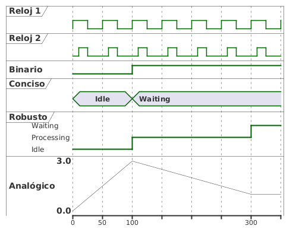

# Ampliación: Diagramas de tiempos

<!-- @import "[TOC]" {cmd="toc" depthFrom=1 depthTo=6 orderedList=false} -->

<!-- code_chunk_output -->

- [Ampliación: Diagramas de tiempos](#ampliación-diagramas-de-tiempos)
  - [Definición y uso de los Diagramas de Tiempos](#definición-y-uso-de-los-diagramas-de-tiempos)
  - [Elementos Clave de un Diagrama de Tiempos](#elementos-clave-de-un-diagrama-de-tiempos)
  - [Entrega de la actividad de ampliación](#entrega-de-la-actividad-de-ampliación)

<!-- /code_chunk_output -->

## Definición y uso de los Diagramas de Tiempos

Los diagramas de tiempos son una herramienta de modelado visual que te permite representar cómo el estado de uno o varios elementos (como componentes de software, hardware o procesos) cambia a lo largo del tiempo, y cómo interactúan entre sí en una secuencia temporal. Son excepcionalmente útiles para entender el comportamiento de sistemas en tiempo real, protocolos de comunicación o cualquier escenario donde la cronología precisa de los eventos es crucial.

Imagina que necesitas ver la secuencia de acciones y cambios de estado de un procesador y la memoria en un periodo de tiempo. Un diagrama de tiempos te ofrece una vista detallada de esto.

Usa un diagrama de tiempos cuando:

  * Necesitas mostrar los **cambios de estado** de un elemento a medida que el tiempo avanza.
  * Quieres visualizar **interacciones temporales** y la sincronización entre varios elementos.
  * Estás diseñando sistemas donde la **secuencia precisa y la duración** de los eventos son fundamentales, como en sistemas embebidos, redes o hardware.
  * Buscas identificar **cuellos de botella** o problemas de latencia en un proceso.

## Elementos Clave de un Diagrama de Tiempos

Un diagrama de tiempos se compone de los siguientes elementos principales:

1.  **Líneas de Vida:** Representan los elementos o componentes cuyo comportamiento estamos modelando. Cada línea de vida tiene su propia línea horizontal donde se muestran sus estados a lo largo del tiempo. La línea del tiempo se puede representar de varias maneras: analógica, binaria, reloj, concisa o robusta.
    a. La representación de reloj sirve para indicar pulsos.
    b. La representación binaria sirve para representar objetos que cambian entre dos estados
    c. Las representaciones concisa y robusta sirven para representar objetos que cambian de estado de forma discreta (tienen un número finito de estados).
    d. La representación analógica sirve para representar valores infinitos entre dos puntos (estados).
2.  **Eje del Tiempo:** Es el eje horizontal, que avanza de izquierda a derecha y representa progreso del tiempo. Puedes marcar puntos específicos en el tiempo o definir escalas.
3.  **Estados:** Indican el estado en el que se encuentra un elemento en un momento dado. Un elemento puede pasar de un estado a otro en distintos puntos del tiempo. En el modo robusto indicamos los estados en el eje vertical, mientras que en el modo conciso los representamos en un hexágono.

Observa el siguiente ejemplo:

    <strong>Haz click aquí para ver el código plantuml</strong>

4.  **Mensajes/Eventos:** Muestran interacciones o el envío de información entre elementos en un instante particular.

<strong>Haz click aquí para ver el código plantuml</strong>

5. **Restricciones, indefiniciones, anotaciones y subrayados**: Además, se pueden añadir restricciones en forma de flechas horizontales, estados indefinidos (en los objetos robustos), anotaciones y subrayados a algunas secciones de tiempo, como en el siguiente ejemplo:

    <strong>Haz click aquí para ver el código plantuml</strong>

> **Actividad**
> Interpreta el siguiente diagrama de tiempos.

<strong>Haz click aquí para ver el código plantuml </strong>

A la hora de diseñar un Diagrama de Tiempos, debes tener en consideración sobre todo los siguientes puntos:

  * **Claridad ante todo**: Usa nombres claros y concisos para tus elementos y sus estados. Si un estado tiene varias palabras, como "Processing Command", el diagrama lo mostrará correctamente.
  * **Lee el Tiempo de Izquierda a Derecha**: Siempre sigue el diagrama de izquierda a derecha para entender la secuencia cronológica de eventos.
  * **Enfócate en lo Importante**: No intentes modelar cada detalle minucioso. Resalta los cambios de estado y las interacciones clave que quieres comunicar para no sobrecargar el diagrama.
  * **Etiquetas Descriptivas**: Las etiquetas de los mensajes (como "Sensor Ready") deben ser lo suficientemente descriptivas como para entender el propósito de la interacción.

Puedes profundizar más en la página de [Plantuml dedicada a los diagramas de tiempos](https://plantuml.com/es/timing-diagram).

> **Actividad:**
> Crea un diagrama de tiempos a partir de la siguiente definición:
>
> Una máquina de café automática gestiona la preparación y entrega de bebidas calientes. En su funcionamiento, la máquina puede encontrarse en varios estados. Al inicio, la máquina está a la espera de que un usuario realice una selección. Cuando el usuario elige una bebida (como café, té o chocolate caliente), la máquina pasa a un proceso de preparación específico según la bebida seleccionada. Si el proceso de preparación concluye sin problemas, la máquina entrega el producto al usuario y regresa al estado inicial para una nueva solicitud.  
>
>Sin embargo, si durante la preparación ocurre un error, como falta de ingredientes o una avería técnica, la máquina debe entrar en un estado de error que bloquea nuevas solicitudes hasta que un técnico de mantenimiento intervenga. El técnico podrá reiniciar el sistema y devolver la máquina a su estado inicial. Además, el proceso de **preparación** debe incluir detalles específicos dependiendo del tipo de bebida elegida: preparar café, preparar té o preparar chocolate caliente. 

## Entrega de la actividad de ampliación

Entrega una memoria en la que se incluyan los ejercicios de este apartado y **un diagrama de tiempos correspondiente al reto individual**.
