# Diagramas de clase UML

<!-- @import "[TOC]" {cmd="toc" depthFrom=1 depthTo=6 orderedList=false} -->

<!-- code_chunk_output -->

- [Diagramas de clase UML](#diagramas-de-clase-uml)
  - [Construcción de un diagrama de clases](#construcción-de-un-diagrama-de-clases)
  - [Métodos y atributos](#métodos-y-atributos)
  - [Tipos de visibilidad](#tipos-de-visibilidad)
  - [Herramientas para la creación de Diagramas de clases UML](#herramientas-para-la-creación-de-diagramas-de-clases-uml)

<!-- /code_chunk_output -->

## Construcción de un diagrama de clases

Para representar una clase emplearemos diagramas de clases del estándar UML. Cada clase se representa con una caja que tiene tres apartados:

- **Superior**: Se coloca el nombre de la clase y su tipo. Puede ser una clase normal (C), una clase abstracta (A o el nombre en cursiva) o una interfaz (I o añadiendo `<<interface>>` al nombre de la clase). En Java, se emplea CamelCase para los nombres. Es decir, la primera letra de cada palabra en mayúscula y sin espacios. Se evitan caracteres especiales que no pertenezcan al ANSII (como tildes, ñ o ç).
- **Medio**: En este espacio se colocan los atributos de la clase, en CamelCase pero con la primera letra en minúscula (lowerCamelCase). El tipo se puede colocar antes, como en Java o C#, o después, como en TypeScript.
- **Inferior**: En este espacio se colocan los métodos. Se nombran como los atributos, pero al final tienen paréntesis. Dentro del paréntesis puede haber parámetros (con su tipo correspondiente) y, si el método devuelve algo, se coloca al lado el tipo de datos del retorno.

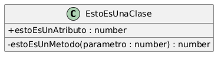

<b>Haz click aquí para ver el código plantuml</b>

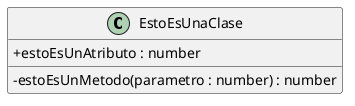

## Métodos y atributos

Podemos pensar en los atributos y métodos de una clase de la siguiente forma:

- **Atributos:** Conforman las propiedades del objeto.
- **Métodos:** Conforman el comportamiento del objeto.

## Tipos de visibilidad

Cuando definimos una clase, los diferentes componentes tienen una visibilidad determinada:

- Si un componente es **público**, es accesible por cualquier otro objeto. Lo representamos con un +:

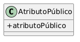

<b>Haz click aquí para ver el código plantuml</b>

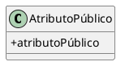

- Si un componente es **privado**, es accesible solo por el mismo objeto. Lo representamos con un -:

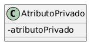

<b>Haz click aquí para ver el código plantuml</b>

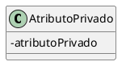

- Si un componente es **protegido**, funciona como privado excepto cuando el objeto que quiere acceder a él es de una clase derivada, que entonces funciona como público. Lo representamos con un #:

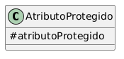

<b>Haz click aquí para ver el código plantuml </b>

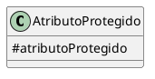

- Si un componente tiene visibilidad de **paquete**, funciona como público para todos los miembros del paquete y privado para todos los demás. Es una visibilidad característica del lenguaje de programación Java (es la visibilidad por defecto, de hecho). En UML se representa con el signo ~:

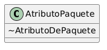

<b>Haz click aquí para ver el código plantuml</b>

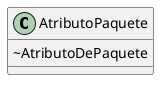

La visibilidad es una herramienta clave a la hora de determinar la **encapsulación** de la información. A las partes públicas (generalmente métodos) se las conoce como la API (application programming interface) del objeto.

## Herramientas para la creación de Diagramas de clases UML

Para estos diagramas se está usando [PlantUML](https://plantuml.com/es/class-diagram). Para que aparezcan los signos indicados se debe especificar antes de empezar a escribir el diagrama la línea `skinparam classAttributeIconSize 0`. Si no se hace, aparecen formas geométricas de diferentes colores según la visibilidad, y están rellenas o no según si son atributo o método:

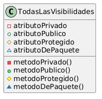

<b>Haz click aquí para ver el código
</b>

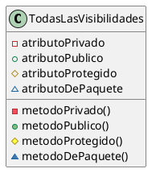

Además de Plantuml, puedes usar [Mermaidjs](https://mermaid.js.org/syntax/classDiagram.html). Tanto Plantuml como Mermaid utilizan un lenguaje que es muy similar a un lenguaje de programación orientado a objetos convencional.

Por otro lado, existen herramientas especializadas como [Visual Paradigm Online](https://online.visual-paradigm.com/drive/#proj=0&dashboard), [Lucidchart](https://www.lucidchart.com/pages/es) o [Miro](https://miro.com/es/) que sirven para crear diagramas de clases UML (y otros muchos diagramas). Técnicamente, puedes emplear cualquier herramienta de diseño para crear un diagrama de cualquier tipo.

> **Actividad** 
> Crea un diagrama de clase que se corresponda con cada una de estas definiciones:
>
> - Para representar un libro, necesitamos saber su autor, su editorial, su año de publicación, su ISBN y su número de páginas. Un libro se puede leer.
> - Para representar a un perro, necesitamos saber su nombre, su raza y su edad. Un perro puede ladrar y pasear.

> **Actividad**
>Explica los siguientes diagramas:

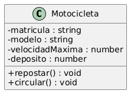

<b>
Haz click aquí para ver el código plantuml
</b>

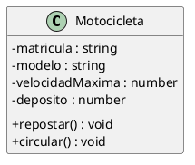

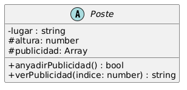

<b>Haz click aquí para ver el código plantuml</b>

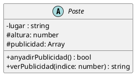

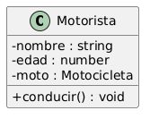

<b>Haz click aquí para ver el código plantuml</b>

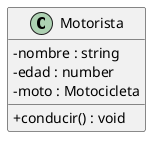

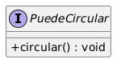

<b>Haz click aquí para ver el código plantuml
</b>

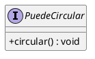

