# Relaciones entre clases

<!-- @import "[TOC]" {cmd="toc" depthFrom=1 depthTo=6 orderedList=false} -->

<!-- code_chunk_output -->

- [Relaciones entre clases](#relaciones-entre-clases)
  - [Relaciones de Herencia](#relaciones-de-herencia)
  - [Relaciones de componente](#relaciones-de-componente)
  - [Otras relaciones](#otras-relaciones)

<!-- /code_chunk_output -->

## Relaciones de Herencia

A través de los diagramas UML podemos expresar las relaciones entre las clases de múltiples maneras, mediante líneas que las unen. A su vez, también podemos especificar cardinalidades, como en los diagramas Entidad-Relación empleados en base de datos, para cuantificar los detalles de las relaciones, e incluso nombrar a dichas relaciones (generalmente con un verbo). Representamos las cardinalidades con 0, 1, muchos (representado a veces con `*` o una letra) o números fijos. Las clases se pueden relacionar entre ellas de las siguientes maneras:

- **Herencia:** "es un" (relación jerárquica). Una clase deriva de otra. La clase base se denomina a veces clase padre y la clase derivda clase hija. En algunos casos, la clase padre es una clase abstracta. Esto significa que la clase abstracta no puede ser instanciada, pero las derivadas (mientras no sean abstractas a su vez) sí. Las clases abstractas, a la hora de ser programadas, pueden tener métodos abstractos, que son métodos sin definir (se definen en las clases derivadas). Más adelante veremos que hay herencia simple y múltiple, así como otros tipos de herencia. 

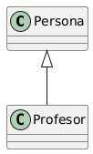

<b>Haz click aquí para ver el código plantuml</b>

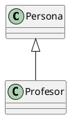

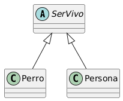

<b>Haz click aquí para ver el código plantuml</b>

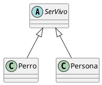

## Relaciones de componente

- **Componente:** "tiene un". Una clase contiene como atributo un objeto (o varios) de otra.
- **Composición:** De tipo *componente*. En este caso, el atributo es dependiente de la clase principal.

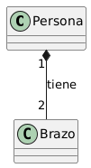

<b>Haz click aquí para ver el código plantuml</b>

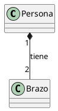

*Una persona tiene dos brazos. Los brazos no pueden existir sin la persona.*

- **Agregación:** De tipo *componente*. En este caso, el atributo no es dependiente de la clase principal y puede existir por separado.

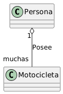

<b>Haz click aquí para ver el código plantuml</b>

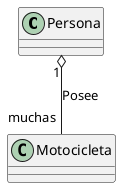

*Una persona posee muchas motocicletas. Cada motocicleta puede existir sin la persona.*

- **Asociación:** "colabora con". Dos clases pueden trabajar en colaboración. La colaboración puede ser simétrica o asimétrica (señalamos la dirección con una flecha). Aunque no es exactamente el mismo concepto, la asociación se puede usar de forma alternativa a la agregación y la composición. De hecho, muchas veces, el resultado al programarla será el mismo.

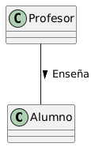

<b>Haz click aquí para ver el código plantuml</b>

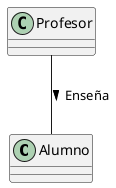

## Otras relaciones

Además de esas relaciones básicas, existen otras un poco más avanzadas.

- **Dependencia:** "usa". En este tipo de relación, se dice que una clase usa a otra. Este uso puede ser mediante clases que contengan otras clases o mediante la implementación de interfaces dentro de una clase. Se representa como la herencia, pero con línea discontinua. A efectos de programación, una interfaz y una clase abstracta son muy similares. En ambos casos, no permiten instancias de ellas, sino de clases derivadas o que las usen. En Java, las interfaces vienen a compensar las limitaciones que tiene el hecho de que no exista la herencia múltiple.

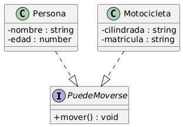

<b>Haz clik aquí para verl el código plantuml</b>

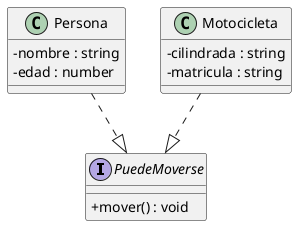

Un uso muy habitual de las interfaces es el de agrupar instancias que semánticamente son cosas distintas, pero que todas pueden realizar la misma acción. De esta forma, les podemos pedir a todas ellas con un mensaje que realicen dicha acción, aunque sean cosas tan dispares como una puerta o un plazo de entrega (en ambos casos, se podrían cerrar).

- **Pertenencia al mismo paquete:** En caso de que queramos especificar también los paquetes, podemos encapsular las clases en formas geométricas para verlo claro, de la siguiente manera:

<b>Haz click aquí para ver el código plantuml
</b>

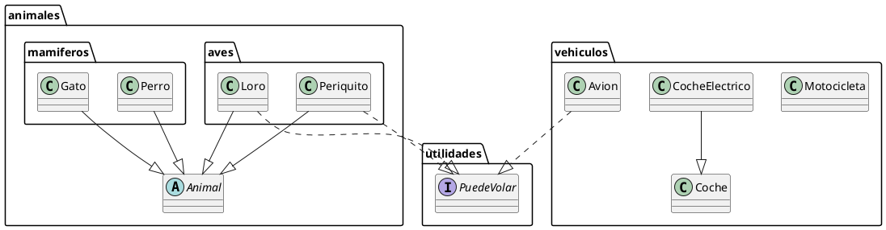

Como se puede observar, puede haber paquetes dentro de paquetes y las clases de un paquete pueden relacionarse con clases de otros paquetes. Los paquetes tienen una relación más de conveniencia a la hora de programar que semántica. 

> **Actividad**
> Explica el siguiente diagrama:

<b>Haz click aquí para ver el código plantuml
</b>

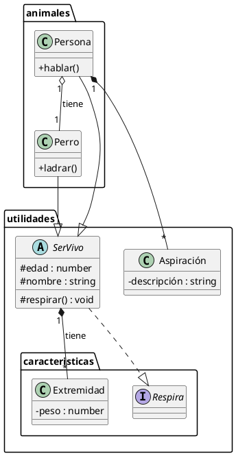

> **Actividad** 
>Crea un diagrama de la siguiente explicación
>
>La vida es dura, pero la vida de cada persona tiene un grado de dureza diferente, que clasificamos con un número. Las personas asismo tienen algo que las identifica, su propio nombre. Pueden elegir varias profesiones, como carpintero o influencer. Los carpinteros usan la madera para construir muebles. Los influencer usan las mesas, que son muebles, para poner sus ordenadores. Una persona puede tener varios muebles. Las sillas también son muebles.