# Técnicas de modelado

<!-- @import "[TOC]" {cmd="toc" depthFrom=1 depthTo=6 orderedList=false} -->

<!-- code_chunk_output -->

- [Técnicas de modelado](#técnicas-de-modelado)
  - [Modelizar las relaciones de Herencia y sus alternativas](#modelizar-las-relaciones-de-herencia-y-sus-alternativas)
    - [El Dominio del Problema](#el-dominio-del-problema)
    - [Tipos de Herencia](#tipos-de-herencia)
      - [Herencia Múltiple vs. Herencia Simple más Interfaces](#herencia-múltiple-vs-herencia-simple-más-interfaces)
      - [Herencia Privada o Herencia Pública (En C++)](#herencia-privada-o-herencia-pública-en-c)
      - [Herencia frente a Composición](#herencia-frente-a-composición)
      - [Lenguajes Orientados a Objetos sin Herencia de Clases (como Rust)](#lenguajes-orientados-a-objetos-sin-herencia-de-clases-como-rust)
      - [Lenguajes Orientados a Objetos usando Prototipos (como JavaScript)](#lenguajes-orientados-a-objetos-usando-prototipos-como-javascript)
  - [Técnicas de Modelado con Diagramas de Clases UML](#técnicas-de-modelado-con-diagramas-de-clases-uml)
    - [1. Identificación de Clases Candidatas](#1-identificación-de-clases-candidatas)
    - [2. Definición de Atributos y Comportamientos (Métodos)](#2-definición-de-atributos-y-comportamientos-métodos)
    - [3. Modelado de Relaciones entre Clases](#3-modelado-de-relaciones-entre-clases)
    - [4. Refinamiento y Verificación](#4-refinamiento-y-verificación)
  - [De Diagrama Entidad-Relación a Diagrama de Clases UML: Una Aproximación](#de-diagrama-entidad-relación-a-diagrama-de-clases-uml-una-aproximación)
    - [Reglas de Conversión Aproximadas](#reglas-de-conversión-aproximadas)
      - [1\. Entidades -> Clases](#1-entidades---clases)
      - [2\. Atributos de Entidades -> Atributos de Clases](#2-atributos-de-entidades---atributos-de-clases)
      - [3\. Relaciones -> Asociaciones](#3-relaciones---asociaciones)
      - [4\. Entidades Débiles -> Clases (con Composición/Agregación)](#4-entidades-débiles---clases-con-composiciónagregación)
      - [5\. Atributos Multivaluados -> Colecciones o Clases Separadas](#5-atributos-multivaluados---colecciones-o-clases-separadas)
    - [Consideraciones Adicionales](#consideraciones-adicionales)

<!-- /code_chunk_output -->

## Modelizar las relaciones de Herencia y sus alternativas

Entendido. Vamos a desarrollar la sección sobre el dominio del problema y los tipos de herencia, incluyendo las alternativas y cómo se gestiona en diferentes lenguajes.

### El Dominio del Problema

Antes de sumergirnos en las complejidades de la herencia y otras relaciones, es crucial comprender el **dominio del problema**. El dominio del problema se refiere al área de conocimiento o la realidad para la que estamos construyendo nuestro sistema. Modelar el dominio del problema implica entender las entidades, conceptos, reglas de negocio y procesos relevantes de ese mundo real. El dominio del problema lo solemos acotar en el documento de Especificación de Requerimientos del Sistema (ERS, IEEE 830).

**Una de las primeras cosas que tenemos que tener claras a la hora de modelar un dominio de problema es identificar cómo las entidades se relacionan entre sí**, especialmente en términos de generalización y especialización. Aquí es donde entra en juego el concepto de herencia, pero no es la única herramienta.

Al modelar, buscamos capturar las características y comportamientos esenciales de estas entidades, así como las interacciones entre ellas. Esto se traduce en la creación de **clases** que representan estas entidades, con sus **atributos** y **métodos**, y el establecimiento de **relaciones** entre ellas. Una vez que hemos identificado estas relaciones, podemos empezar a considerar cómo se expresarán en nuestro diseño.

### Tipos de Herencia

La **herencia** es un mecanismo fundamental de la POO que permite a una clase (subclase o clase hija) adquirir las propiedades (atributos) y comportamientos (métodos) de otra clase (superclase o clase padre). Esto modela una relación "es un tipo de" (por ejemplo, un `Perro` *es un tipo de* `Animal`). Sin embargo, la herencia no siempre es sencilla y presenta varias formas y consideraciones importantes.

#### Herencia Múltiple vs. Herencia Simple más Interfaces

Esta es una de las primeras y más importantes decisiones de diseño cuando se considera la herencia:

* **Herencia Simple:** Una clase solo puede heredar de **una única** superclase. Este enfoque es el más común en muchos lenguajes orientados a objetos (Java, C#, Smalltalk).
    * **Ventajas:** Simplifica la jerarquía de clases, reduce la complejidad del "diamante de la muerte" (problema de ambigüedad cuando una clase hereda el mismo método de dos ancestros distintos que a su vez heredan de un mismo ancestro común), y es más fácil de mantener.
    * **Desventajas:** Puede llevar a la duplicación de código si una clase necesita funcionalidades de múltiples fuentes.
* **Herencia Múltiple:** Una clase puede heredar de **múltiples** superclases, combinando sus características y comportamientos. Lenguajes como C++ y Python la soportan.
    * **Ventajas:** Permite reutilizar código de múltiples jerarquías, lo que puede resultar en un diseño más conciso.
    * **Desventajas:** Aumenta la complejidad, especialmente con el problema del "diamante de la muerte", donde puede haber ambigüedad sobre qué implementación de un método heredar si varias superclases lo tienen. Esto puede llevar a un código más difícil de entender y depurar.

* **Herencia Simple más Interfaces:** Muchos lenguajes (como Java y C#) optan por la herencia simple pero compensan sus limitaciones con el uso de **interfaces**. Una interfaz define un contrato de métodos que una clase debe implementar, sin proporcionar una implementación concreta. Una clase puede implementar **múltiples interfaces**.
    * **Ventajas:** Permite a una clase adoptar múltiples "roles" o comportamientos sin los problemas de ambigüedad de la herencia múltiple de clases. Promueve el polimorfismo y un diseño más flexible. Es una forma de lograr "herencia de comportamiento" sin "herencia de estado".
    * **Desventajas:** Las interfaces no pueden proporcionar implementaciones por defecto de atributos o métodos (aunque esto ha evolucionado con métodos por defecto en Java 8+ o propiedades en C#), lo que a veces requiere más código.

> **Actividad**
> Busca 3 ejemplos donde tenga sentido la herencia múltiple. Diseña una alternativa para cada uno de estos ejemplos usando Herencia simple más interfaces.

#### Herencia Privada o Herencia Pública (En C++)

Este concepto es específico de lenguajes como C++ y define cómo los miembros (atributos y métodos) de la superclase son accesibles desde la subclase y desde fuera de ella:

* **Herencia Pública (`public`):** Es el tipo de herencia más común y representa la relación "es un tipo de". Los miembros públicos de la superclase permanecen públicos en la subclase, y los miembros protegidos permanecen protegidos. Permite el polimorfismo y la sustitución de Liskov.
* **Herencia Protegida (`protected`):** Los miembros públicos y protegidos de la superclase se convierten en miembros protegidos en la subclase. Esto significa que los miembros heredados son accesibles dentro de la subclase y por sus propias subclases, pero no desde fuera de la jerarquía.
* **Herencia Privada (`private`):** Los miembros públicos y protegidos de la superclase se convierten en miembros privados en la subclase. Esto significa que la subclase puede usar esos miembros internamente, pero no son accesibles desde fuera de la subclase, ni siquiera por las subclases de esta. La herencia privada modela una relación "implementado en términos de" o "contiene una" más que "es un tipo de", funcionando casi como una composición interna.

#### Herencia frente a Composición

Esta es una de las decisiones de diseño más importantes y a menudo debatidas en la Programación Orientada a Objetos: ¿cuándo usar herencia y cuándo usar composición?

* **Herencia:** Modela una relación **"es un tipo de" (is-a)**. Una `Motocicleta` *es un tipo de* `Vehículo`. Implica una fuerte acoplamiento entre la superclase y la subclase, ya que la subclase hereda tanto la interfaz como la implementación de la superclase.
    * **Cuándo usarla:** Cuando la subclase es verdaderamente una especialización de la superclase y quieres reutilizar su implementación, a menudo junto con el polimorfismo.
* **Composición:** Modela una relación **"tiene un" (has-a)**. Una `Motocicleta` *tiene un* `Motor`. Implica que una clase contiene una instancia de otra clase (o varias) como uno de sus atributos. La funcionalidad se delega al objeto compuesto.
    * **Cuándo usarla:** Cuando la relación es de "todo-parte" o cuando una clase necesita la funcionalidad de otra pero no es un tipo de ella. Promueve un **acoplamiento bajo** y una mayor **flexibilidad**, ya que la implementación de la parte puede cambiarse sin afectar al todo (siempre que la interfaz de la parte se mantenga).
    * **Principio "Prefiere Composición sobre Herencia":** Es una regla de oro en el diseño de software. La composición suele ser más flexible y menos propensa a problemas de mantenimiento que la herencia profunda, ya que permite cambiar el comportamiento en tiempo de ejecución y reduce la fragilidad de las jerarquías.

Puedes ver el vídeo de CodeAesthetic sobre este tema en este [enlace](https://www.youtube.com/watch?v=hxGOiiR9ZKg).

> **Actividad**
> Convierte los tres ejemplos de la actividad anterior sobre herencias en sistemas que usen la composición.

> **Actividad**
> Busca qué es, en el contexto de la programación, el acoplamiento. Razona qué tiene que ver con la herencia y la composición. Esta información se puede extraer del vídeo anterior.

#### Lenguajes Orientados a Objetos sin Herencia de Clases (como Rust)

Algunos lenguajes modernos, si bien son orientados a objetos en el sentido de encapsulación de datos y comportamiento, han optado por **no incluir la herencia de clases tradicional** para evitar sus problemas de complejidad y fragilidad.

* **Rust:** Se centra en la seguridad de la memoria y la concurrencia. No tiene herencia de clases. En su lugar, fomenta el uso de:
    * **`Structs` (estructuras):** Para definir la estructura de los datos (atributos).
    * **`Impl` (implementaciones):** Para definir métodos asociados a los `structs`.
    * **`Traits` (rasgos):** Son similares a las interfaces o mixins. Un `trait` define un conjunto de métodos que un tipo debe implementar. Permiten el polimorfismo (un objeto puede ser tratado como un `trait` si implementa ese `trait`) y la reutilización de comportamiento a través de implementaciones por defecto en `traits` o al "mezclar" `traits` en `structs`. Esto es una forma de **polimorfismo de inclusión** sin la rigidez de la herencia de clases.

#### Lenguajes Orientados a Objetos usando Prototipos (como JavaScript)

A diferencia de los lenguajes basados en clases, que usan "planos" para crear objetos, los lenguajes basados en prototipos crean objetos directamente a partir de otros objetos existentes.

* **JavaScript:** Históricamente, JavaScript se basó en **prototipos** para la herencia. Cada objeto tiene una propiedad interna `[[Prototype]]` (o `__proto__`) que apunta a otro objeto. Cuando se accede a una propiedad o método de un objeto y no se encuentra en el propio objeto, JavaScript busca en su prototipo, y luego en el prototipo del prototipo, y así sucesivamente, formando una **cadena de prototipos**.
    * **Creación de objetos:** Se pueden crear objetos vacíos y añadirles propiedades, o usar la sintaxis `Object.create(otroObjeto)` para crear un objeto cuyo prototipo sea `otroObjeto`.
    * **"Herencia" basada en prototipos:** Un objeto "hereda" propiedades y métodos de su prototipo. No hay una distinción clara entre "clase" e "instancia" como en los lenguajes basados en clases.
    * **Sintaxis `class` en JavaScript (ES6+):** Aunque JavaScript introdujo la palabra clave `class` en ECMAScript 2015 (ES6), esto es principalmente **azúcar sintáctico** (syntactic sugar) sobre el modelo de herencia basado en prototipos existente. Por debajo, sigue funcionando con prototipos; la sintaxis `class` simplemente proporciona una forma más familiar para los programadores de lenguajes basados en clases de definir constructores y métodos.

Modelar la estructura de clases de un sistema requiere una comprensión profunda de estas opciones y sus implicaciones. La elección entre herencia, composición, y los diferentes mecanismos que ofrecen los lenguajes es crucial para construir sistemas robustos, flexibles y mantenibles.

## Técnicas de Modelado con Diagramas de Clases UML

Modelar un sistema con diagramas de clases UML no es solo dibujar cajas y flechas; es un proceso iterativo y reflexivo para entender y comunicar la estructura de un software. Implica identificar las entidades, sus características y cómo interactúan. 

### 1. Identificación de Clases Candidatas

El primer paso es reconocer las posibles clases en el sistema. Esto se puede hacer de varias maneras:

* **Análisis de Sustantivos:** Lee la descripción del problema o los requisitos del sistema y subraya todos los **sustantivos** (personas, lugares, cosas, conceptos, eventos). Cada sustantivo es un candidato potencial para una clase.
    * **Ejemplo:** En un "sistema de gestión de biblioteca", sustantivos como "libro", "miembro", "préstamo", "autor", "editorial" son posibles clases.
* **Análisis de Tarjetas CRC (Class, Responsibility, Collaboration):** Una técnica sencilla y colaborativa. Cada tarjeta representa una clase.
    * **Clase (C):** Nombre de la clase.
    * **Responsabilidad (R):** Qué sabe la clase y qué hace (sus atributos y métodos).
    * **Colaboración (C):** Con qué otras clases interactúa para cumplir sus responsabilidades.
    * Es útil para un brainstorming rápido y para asegurar que cada clase tiene una **responsabilidad única** (relacionado con el Principio de Responsabilidad Única de SOLID).
* **Identificación de Roles:** Las personas o sistemas externos que interactúan con tu sistema pueden ser clases (ej., `Administrador`, `Cliente`).
* **Identificación de Eventos y Transacciones:** Acciones significativas que ocurren en el sistema (ej., `Venta`, `Devolucion`, `Registro`).

### 2. Definición de Atributos y Comportamientos (Métodos)

Una vez que se tienen las clases candidatas, el siguiente paso es dotarlas de contenido:

* **Atributos:** Piensa en las **propiedades** que necesita conocer cada instancia de la clase para ser completamente descrita.
    * ¿Qué datos necesita almacenar este objeto?
    * ¿Qué características lo distinguen?
    * **Reflexión sobre el tipo de dato y visibilidad:** Decide el tipo de dato apropiado (string, int, Date, etc.) y la visibilidad (`+` público, `-` privado, `#` protegido). La mayoría de los atributos deberían ser **privados** para asegurar la **encapsulación**.
* **Métodos:** Identifica las **acciones** que la clase puede realizar o que se pueden realizar sobre ella.
    * ¿Qué puede hacer este objeto?
    * ¿Qué operaciones se necesitan para manipular sus atributos o interactuar con otras clases?
    * **Reflexión sobre el comportamiento y visibilidad:** Decide los parámetros que necesita el método, el tipo de retorno y su visibilidad. Los métodos que forman la API pública de la clase suelen ser **públicos**.

### 3. Modelado de Relaciones entre Clases

Las clases no existen en el vacío; interactúan. Modelar estas interacciones es crucial:

* **Asociaciones:** La relación más genérica entre dos clases. Indica que los objetos de una clase están conectados o utilizan objetos de otra.
    * **Identificación:** Busca verbos que conecten sustantivos (ej., "un cliente *realiza* un pedido").
    * **Cardinalidad:** Es fundamental especificar cuántas instancias de una clase están relacionadas con cuántas instancias de otra (1 a 1, 1 a muchos, muchos a muchos).
    * **Navegabilidad:** Indica la dirección en la que se puede acceder desde un objeto a otro. Por defecto, es bidireccional, pero a menudo es unidireccional en la implementación.
* **Agregación (o--):** Representa una relación "todo-parte" donde las partes pueden existir independientemente del todo.
    * **Identificación:** "Un coche *tiene* ruedas" (las ruedas existen aunque el coche se desguace).
* **Composición (*--):** Una forma fuerte de agregación donde las partes no pueden existir sin el todo. Si el todo es destruido, las partes también lo son.
    * **Identificación:** "Una casa *tiene* habitaciones" (las habitaciones no existen si la casa se derrumba).
* **Dependencia (..>):** La relación más débil. Una clase "usa" otra, generalmente porque un método de una clase recibe un objeto de la otra como parámetro, o lo crea localmente. No implica que un objeto sea parte de otro.
    * **Identificación:** "Un cliente *envía* un email" (la clase `Cliente` usa la clase `EmailSender` para su método `enviarEmail`).

### 4. Refinamiento y Verificación

El modelado es un proceso iterativo. Rara vez se acierta a la primera. Por ello, es importante ir refinándolas poco a poco.

* **Aplicación de Principios de Diseño (SOLID):**
    * **SRP (Responsabilidad Única):** ¿Cada clase tiene una única razón para cambiar? Si una clase tiene demasiados atributos o métodos no relacionados, considera dividirla.
    * **OCP (Abierto/Cerrado):** ¿Pueden mis clases extenderse sin modificación? Las interfaces y clases abstractas son clave aquí.
    * **LSP (Sustitución de Liskov):** (Aunque aún no hemos visto herencia, es bueno tenerlo en mente para el futuro).
    * **ISP (Segregación de Interfaces):** ¿Tus interfaces son lo suficientemente pequeñas y específicas para evitar forzar a los clientes a implementar métodos que no necesitan?
    * **DIP (Inversión de Dependencias):** ¿Las clases de alto nivel dependen de abstracciones en lugar de detalles concretos?
* **Revisión con Escenarios de Uso (Casos de Uso):** Recorre los casos de uso principales del sistema y simula cómo los objetos interactuarían en tu diagrama de clases.
    * ¿Se pueden realizar todas las acciones?
    * ¿Hay clases que tienen demasiadas responsabilidades?
    * ¿Faltan atributos o métodos?
    * ¿Las relaciones son lógicas y tienen la cardinalidad correcta?
* **Coherencia y Claridad:** Asegúrate de que el diagrama sea fácil de entender. Usa nombres claros para clases, atributos y métodos. Evita complejidades innecesarias.
* **Iteración:** El modelado es un ciclo: identifica, define, relaciona, revisa y repite.

> **Actividad** 
> Modela un diagrama de clases a partir del siguiente enunciado.
>
> *Sistema de Gestión de Alquiler de Coches*
> 
> Se te ha encargado desarrollar un sistema de gestión para una empresa de alquiler de coches. La empresa tiene un nombre y varias sucursales distribuidas en distintas ciudades. Cada sucursal está identificada por su ciudad y dirección.
>
>Cada sucursal cuenta con una flota de vehículos de diferentes tipos (por ejemplo, sedán, SUV, furgoneta). Cada vehículo está identificado por una matrícula, modelo, marca, año de fabricación, y el número de asientos. Además, cada coche puede estar disponible o alquilado.
>
>El sistema debe permitir:
>
>- Registrar la información de nuevos vehículos en una sucursal.
>- Alquilar un coche a un cliente. Para ello, se debe registrar el nombre del cliente, su identificación y el coche que ha alquilado.
>- Devolver coches alquilados.
>- Consultar la disponibilidad de vehículos en cada sucursal.
>- Filtrar los vehículos por tipo, marca o número de asientos.
>
>Además, el sistema debe llevar un control de la cantidad de vehículos disponibles y en uso por cada sucursal, y debe permitir acceder a la información de cada coche, sucursal y cliente.

## De Diagrama Entidad-Relación a Diagrama de Clases UML: Una Aproximación

La conversión de un **Diagrama Entidad-Relación (ER)** a un **Diagrama de Clases UML** es un paso común en el diseño de software, especialmente cuando se parte de un modelo de datos conceptual o lógico para desarrollar una aplicación orientada a objetos. Aunque no es una traducción 1:1 perfecta (ya que los Diagramas ER se centran en los datos y las bases de datos, mientras que los diagramas de clases modelan el comportamiento y la estructura del código), hay una serie de reglas de aproximación muy útiles.

El objetivo es transformar las entidades y relaciones del Diagrama ER en clases, atributos y asociaciones en el diagrama de clases, preparándonos para la implementación en un lenguaje orientado a objetos.

### Reglas de Conversión Aproximadas

A continuación, se describen las correspondencias más habituales:

#### 1\. Entidades -> Clases

  * **Cada entidad fuerte (o entidad normal) en el Diagramas ER se convierte en una clase en el diagrama de clases UML.**

  * El **nombre de la entidad** se convierte en el nombre de la clase. Se recomienda usar **UpperCamelCase** (PascalCase) para los nombres de las clases.

    **Ejemplo:**

      * Entidad: `CLIENTE` -> Clase: `Cliente`
      * Entidad: `PRODUCTO` -> Clase: `Producto`

<b>Haz click aquí para ver el código plantuml
</b>

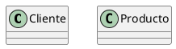

#### 2\. Atributos de Entidades -> Atributos de Clases

  * **Cada atributo de una entidad se convierte en un atributo de la clase correspondiente.**

  * El **nombre del atributo** se mantiene, pero se recomienda usar **lowerCamelCase**.

  * El **tipo de dato** del atributo (ej., `VARCHAR(50)`, `INT`, `DATE`) se traduce al tipo de dato más apropiado en el lenguaje de programación objetivo (ej., `string`, `int`/`number`, `Date`).

  * Los **atributos clave primaria (PK)** se suelen representar como atributos normales en la clase, a menudo con un estereotipo `<<PK>>` o simplemente identificados por contexto. Su unicidad y la imposibilidad de ser nulos se gestionarán a nivel de implementación (constructores, lógica de negocio).

  * Los **atributos clave foránea (FK)** que solo sirven para establecer una relación (es decir, no son datos intrínsecos de la entidad) **no se representan directamente como atributos** en la clase receptora en UML. En su lugar, la relación se modela como una **asociación** entre las clases. Si la FK representa un valor que es significativo para el objeto más allá de la relación (ej., `idPaisNacimiento` en una persona, cuando el `Pais` es otra clase), entonces sí podría mantenerse como atributo.

    **Ejemplo:**

Este diagrama ER:

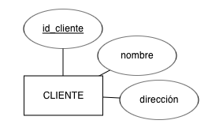

Se convierte en este diagrama de clases UML:
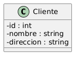

<b>Haz click aquí para ver el código plantuml</b>

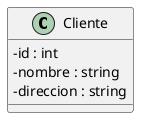

#### 3\. Relaciones -> Asociaciones

* **Cada relación entre entidades en el Diagramas ER se convierte en una asociación entre las clases correspondientes en UML.** 

* La **cardinalidad** de la relación en el Diagramas ER se traduce directamente a la cardinalidad de la asociación en UML.

    * `1:1` -> `1..1` o `1` en ambos extremos
    * `1:N` -> `1` en el lado "uno", `*` (o `0..*` o `1..*`) en el lado "muchos"
    * `N:M` -> `*` en ambos extremos

* **Nombres de Roles:** Si la relación en el Diagramas ER tiene roles, estos se pueden usar como nombres de rol en los extremos de la asociación en UML.

**Ejemplos:**

* **1:N (Uno a Muchos):** Un `Cliente` **realiza** `Pedidos`.

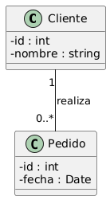

<b>Haz click aquí para ver el código plantuml</b>

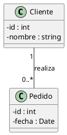

* **N:M (Muchos a Muchos):** Un `Estudiante` **se matricula en** `Cursos`.

    * En un Diagrama ER, una relación N:M a menudo se resuelve con una tabla intermedia. En UML, esto se modela como una **clase de asociación**.

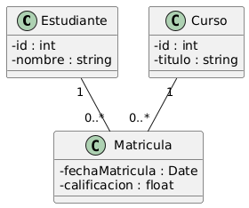

<b>
Haz click aquí para ver el código plantuml
</b>

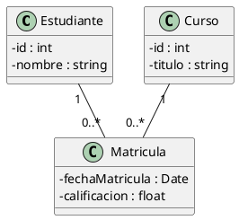

Aquí, `Matricula` es una clase que contiene atributos propios de la relación (fecha, calificación) y se asocia tanto con `Estudiante` como con `Curso`.

#### 4\. Entidades Débiles -> Clases (con Composición/Agregación)

  * Las **entidades débiles** (que dependen de la existencia de otra entidad fuerte) a menudo se modelan en UML utilizando **composición** (rombo relleno) o **agregación** (rombo vacío), dependiendo de si la entidad débil puede o no existir independientemente de la entidad fuerte "propietaria".

  * La **composición** es más común para entidades débiles, ya que su existencia está ligada a la del propietario.

    **Ejemplo:** Un `Pedido` tiene `LineasDeDetalle`. Si el pedido se elimina, sus líneas de detalle también.

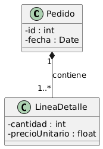

<b>Haz click aquí para ver el código plantuml
</b>

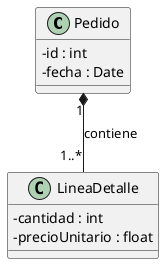

#### 5\. Atributos Multivaluados -> Colecciones o Clases Separadas

  * Si un atributo en el Diagrama ER puede tener múltiples valores (ej., `telefono` de una persona, que puede tener varios), en UML se modela como una **colección** (ej., `List<string>`, `Set<string>`) del atributo dentro de la clase, o, si los valores tienen atributos propios (ej., un teléfono con `tipo` y `numero`), como una **clase separada** relacionada por asociación o composición.

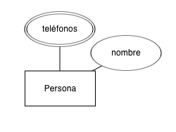

**Ejemplo (como colección):**
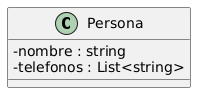

<b>Haz click aquí para ver el código plantuml</b>

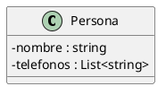

**Ejemplo (como clase separada si `Telefono` tiene más propiedades):**
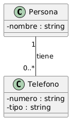

<b>Haz click aquí para ver el código plantuml
</b>

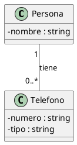

### Consideraciones Adicionales

  * **Métodos:** Los Diagramas ER se centran en datos, por lo que no representan comportamientos. Al convertir a UML, deberás **añadir los métodos** a las clases basándote en los requisitos funcionales del sistema (qué acciones se realizan con esos datos).
  * **Encapsulación:** En UML, se debe definir la visibilidad (`+`, `-`, `#`, `~`) para atributos y métodos, priorizando el encapsulamiento (atributos privados, métodos públicos para interactuar).
  * **Refinamiento:** La primera aproximación es solo eso, una aproximación. El diagrama de clases resultante debe ser **refinado** para incorporar principios de diseño de POO (como SOLID), patrones de diseño y las especificidades del lenguaje de programación y el dominio del problema.

Puedes usar [ERDPlus](https://erdplus.com/standalone) para crear diagramas entidad relación fácilmente.

> **Actividad**
> Convierte el enunciado del ejercicio anterior en un Diagrama Entidad Relación en la medida de lo posible.

> **Actividad**
> Dados los siguientes Diagramas Entidad Relación, modela los diagramas de clases correspondiente. Añade los métodos que creas oportunos según la semántica de la base de datos (por ejemplo, un pájaro "vuela", aunque en el diagrama Entidad Relación eso no se represente).

**Diagrama 1**

**Diagrama 2**

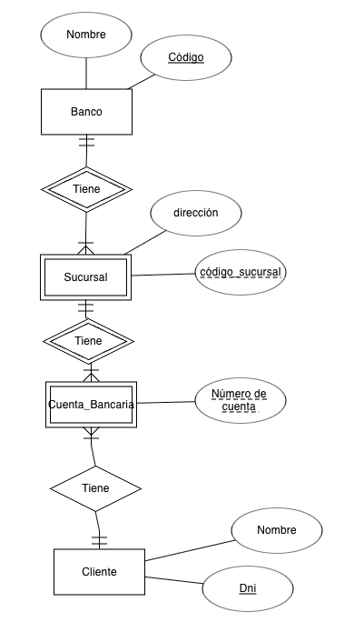