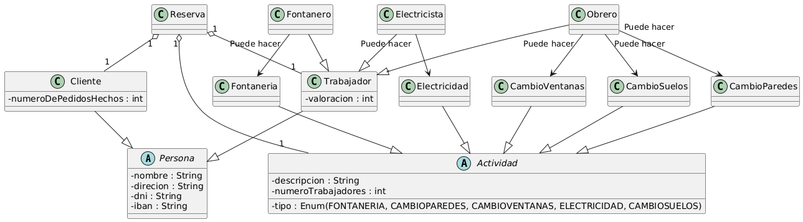
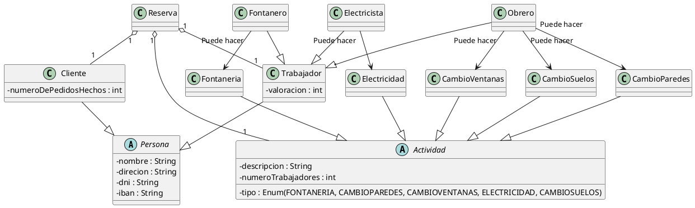

# Reto individual

## Explica detalladamente en qué consiste el sistema representado mediante el siguiente diagrama de clases

<b>Haz click aquí para ver el código plantuml</b>

## Crea un diagrama de clases acorde a la siguiente especificación

Una empresa de reparaciones informáticas ha decidido modernizar su gestión y presencia online mediante el desarrollo de una nueva página web. Esta plataforma será fundamental para optimizar sus operaciones y la interacción con sus clientes.

La empresa ofrece una amplia gama de servicios especializados, y es crucial que cada uno de ellos pueda ser identificado rápidamente mediante un **código único**. Entre los servicios que proporcionan se incluyen la recuperación de datos de discos duros dañados, el análisis de averías, reparaciones que se realizan "en el momento", la intermediación en reparaciones más complejas, asesoramiento para el montaje de ordenadores, y reparaciones tanto de dispositivos móviles como de videoconsolas.

En cuanto a su plantilla, la empresa cuenta con diversos tipos de **trabajadores**, cada uno de ellos identificado de forma unívoca por su **número de DNI**. De todos ellos se necesita registrar su información personal relevante, como sus **datos postales**, sus **datos bancarios** y su **salario**. Dentro de la organización, se distinguen principalmente dos roles: los **trabajadores gestores**, cuya función es la administración y coordinación general de los servicios de reparación, y los **trabajadores reparadores**, que son quienes llevan a cabo las reparaciones directamente en el taller. Es importante destacar que, entre los trabajadores reparadores, existen dos especializaciones claras: algunos son **expertos en ordenadores**, mientras que otros están específicamente capacitados como **expertos en móviles**.

La página web debe facilitar varias funcionalidades clave para el día a día de la empresa. Los trabajadores gestores necesitarán una herramienta que les permita **asignar los diferentes servicios de reparación** a los trabajadores reparadores más adecuados. Por su parte, los trabajadores reparadores deberán poder **consultar las reparaciones que tienen asignadas** y, fundamentalmente, **actualizar el estado** de cada una de ellas a medida que avanzan en el proceso. La interacción con los **clientes de la tienda** también es un pilar fundamental del nuevo sistema; de ellos se almacenará su **correo electrónico**, sus **datos postales** y sus **datos bancarios**, y se les debe proporcionar un medio para que puedan ponerse en contacto con la empresa a través de la web. Los correos recibidos por esta vía serán respondidos por los trabajadores gestores.

Finalmente, el sistema debe contemplar la creación de un **usuario especial**. Este usuario tendrá **acceso total a todas las acciones** que pueden realizar los trabajadores, lo que le permitirá una supervisión completa del sistema. Adicionalmente, y con un propósito de depuración y verificación, este usuario especial podrá **simular la interacción de un cliente de la tienda** para comprobar el correcto funcionamiento de las funcionalidades orientadas al usuario final.

## Rubrica

| Ejercicio | ÍTEM | Criterio Evaluación | PESO |
|---|---|---|---
|1 | Identifica los componentes de las clases | 5a | 1
|1 | Identifica las relaciones| 5a | 1
|1 | Calidad en la explicación| 5c | 1
|
|2 | Adecuación al problema | 5c | 1
|2 | Sintaxis adecuada | 5b | 1
|2 | Formación correcta de las clases | 5b,5d | 2
|2 | Formación correcta de las relaciones |5b,5d | 2
|2 | Calidad de la presentación | 5b | 1

