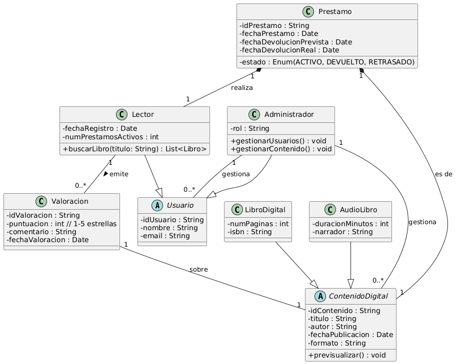
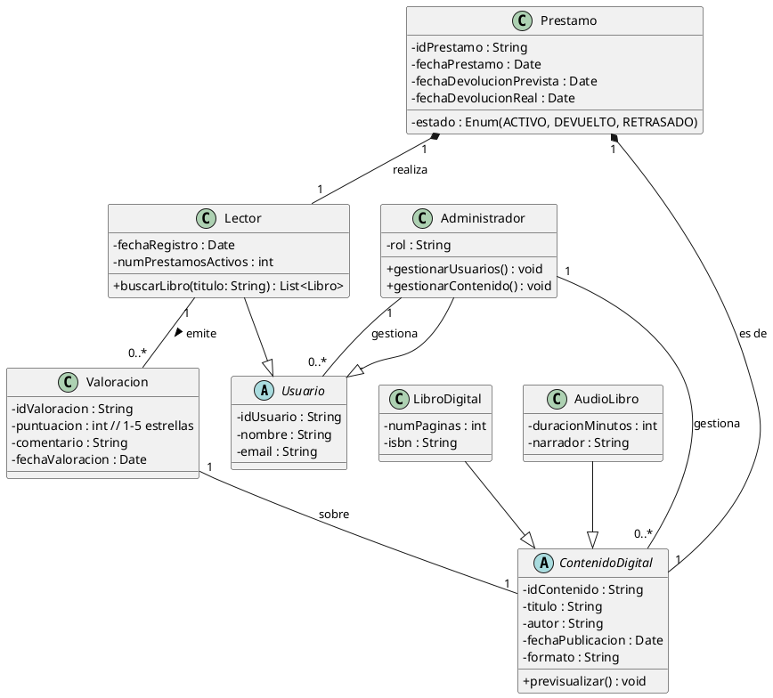

# Examen

## EJERCICIO 1: Explica detalladamente en qué consiste el sistema representado mediante el siguiente diagrama de clases

<b>Haz click aquí para ver el código Plantuml</b>

## EJERCICIO 2: Crea un diagrama de clases acorde a la siguiente especificación

Una cadena de gimnasios, "Fitness Global", planea un ambicioso proyecto para desarrollar una **aplicación móvil** que digitalice y mejore la experiencia de sus usuarios y la gestión interna. El objetivo es crear una herramienta integral que abarque desde la administración de membresías hasta la programación de clases y el seguimiento personalizado del progreso.

En primer lugar, la aplicación deberá gestionar a los **socios** del gimnasio. De cada socio se registrará su **nombre completo**, **fecha de nacimiento**, **dirección de correo electrónico** y un **número de teléfono** de contacto. Es fundamental controlar el estado de su **membresía**, incluyendo su **tipo** (por ejemplo, mensual, trimestral, anual) y su **fecha de vencimiento**, ya que esto determinará su acceso a las instalaciones y servicios. Además, cada socio tendrá la posibilidad de establecer **objetivos de entrenamiento** personalizados, como "perder peso", "ganar masa muscular" o "mejorar resistencia", los cuales podrán ser consultados por los entrenadores.

La oferta de "Fitness Global" se centra en **clases grupales** variadas, como yoga, spinning, zumba, etc. Cada clase se identificará por un **nombre único** y tendrá una **duración** específica. Es importante registrar el **horario** en que se imparte, el **instructor** que la dirige y la **capacidad máxima** de participantes. Los socios deberán poder **reservar su plaza** en las clases, y la aplicación debe asegurar que no se exceda la capacidad. Si una clase está llena, se deberá poder **apuntarse a una lista de espera**. Si una plaza queda libre, el primer socio de la lista de espera será notificado y se le asignará la plaza.

El equipo de "Fitness Global" está compuesto por **empleados** con diferentes roles. Todos los empleados se identificarán por un **código de empleado** interno y tendrán registrados su **nombre**, **apellidos**, **DNI** y **salario**. Dentro de la plantilla, se distinguen principalmente dos categorías: los **recepcionistas** y los **entrenadores**. Los recepcionistas serán los encargados de la **gestión de altas y bajas de socios**, así como de la **modificación de los datos de las membresías**. Los entrenadores, por su parte, tendrán la capacidad de **crear nuevas clases**, **modificar las existentes** y **consultar los objetivos de entrenamiento** de los socios para ofrecer un seguimiento más personalizado. Cada entrenador tendrá una o varias **especialidades** (por ejemplo, "yoga", "musculación", "pilates"), las cuales son relevantes para la asignación de clases.

La aplicación también debe permitir a los socios consultar su **historial de clases asistidas** y su **progreso** en relación con sus objetivos de entrenamiento (por ejemplo, un registro de su peso o de las repeticiones en ciertos ejercicios, si deciden introducirlo). Los recepcionistas deberán poder generar **informes sobre el número de membresías activas** y la **ocupación de las clases**.

Finalmente, se requiere un **administrador del sistema**. Este usuario especial tendrá **control total sobre todas las funcionalidades de la aplicación**, lo que significa que podrá realizar cualquier acción que puedan hacer tanto los recepcionistas como los entrenadores. Además, el administrador podrá **gestionar las cuentas de los empleados** (alta, baja y modificación de roles), y tendrá acceso a **estadísticas globales de uso** de la aplicación, como el número total de reservas o las clases más populares.

## Rubrica

| Ejercicio | ÍTEM | Criterio Evaluación | PESO |
|---|---|---|---
|1 | Identifica los componentes de las clases | 5a | 1
|1 | Identifica las relaciones| 5a | 1
|1 | Calidad en la explicación| 5c | 1
|
|2 | Adecuación al problema | 5c | 1
|2 | Sintaxis adecuada | 5b | 1
|2 | Formación correcta de las clases | 5b,5d | 2
|2 | Formación correcta de las relaciones |5b,5d | 2
|2 | Calidad de la presentación | 5b | 1
