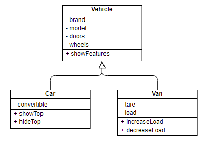
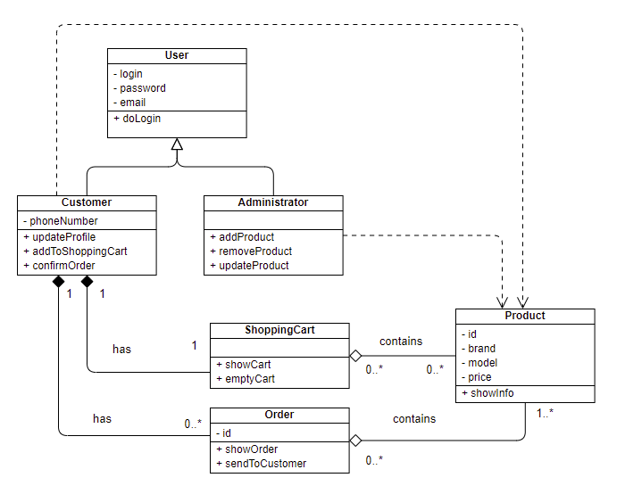
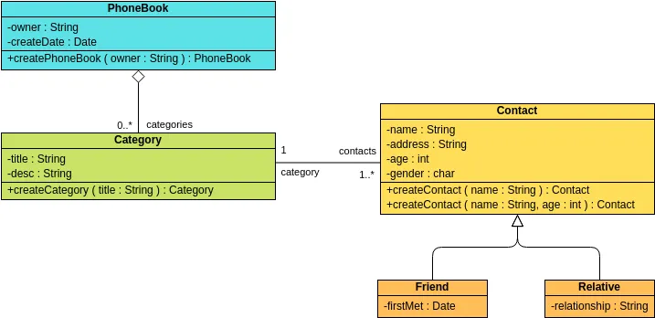
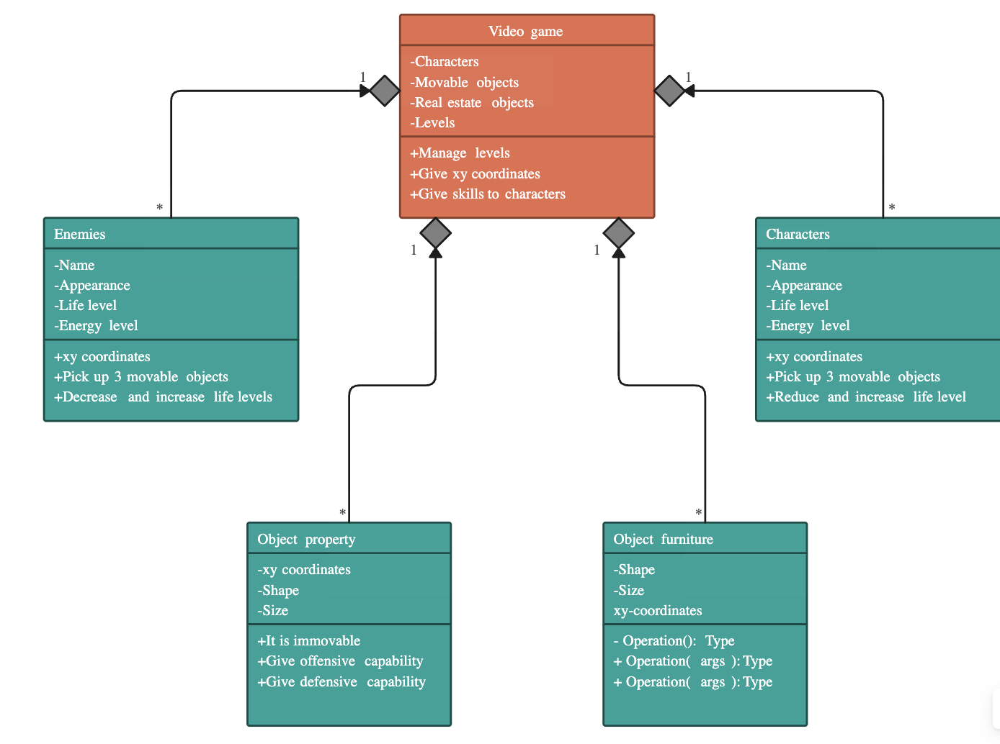

# Cuaderno de ejercicios 03

<!-- @import "[TOC]" {cmd="toc" depthFrom=1 depthTo=6 orderedList=false} -->

<!-- code_chunk_output -->

- [Cuaderno de ejercicios 03](#cuaderno-de-ejercicios-03)
  - [Ejercicios de diagramas](#ejercicios-de-diagramas)
  - [Ejercicios de modelización](#ejercicios-de-modelización)
    - [Ejercicio 1: Gestor de Liga de Fútbol](#ejercicio-1-gestor-de-liga-de-fútbol)
    - [Ejercicio 2: Gestor de Aeropuertos](#ejercicio-2-gestor-de-aeropuertos)
    - [Ejercicio 3: Sistema de Gestión de Turnos en un Hospital](#ejercicio-3-sistema-de-gestión-de-turnos-en-un-hospital)

<!-- /code_chunk_output -->

## Ejercicios de diagramas
> **Actividad**
> 1. Explica los siguientes diagramas UML extraídos de diversas fuentes
> 2. Crea una versión equivalente (en la medida de lo posible) en Diagrama Entidad Relación

**1**

**2**

**3**

**4**

## Ejercicios de modelización

### Ejercicio 1: Gestor de Liga de Fútbol

Se ha encargado desarrollar un gestor para una liga de fútbol. La liga debe estar identificada por un nombre y una temporada, definida por el año de inicio y el de finalización. La liga estará compuesta por un máximo de 22 equipos.

Cada equipo debe incluir información como su nombre, el número de partidos ganados, empatados y perdidos. A partir de estos datos, se podrá calcular la puntuación total de cada equipo según el sistema estándar de puntos (3 puntos por victoria, 1 por empate, 0 por derrota). Además, cada equipo debe tener entre 18 y 24 futbolistas.

Cada futbolista debe tener datos que lo identifiquen: nombre, nacionalidad, un número de identificación único, su posición en el campo (portero, defensa, centrocampista o delantero), el número de goles marcados y el número de partidos jugados.

Se requiere que solo exista una instancia de la liga (patrón singleton). Debes implementar la funcionalidad para añadir y eliminar equipos, así como para añadir y eliminar futbolistas de los equipos. Además, se debe poder acceder a la información completa de cada jugador, equipo o la liga misma.

El sistema debe proporcionar las siguientes funcionalidades:

- Mostrar los equipos en posiciones de descenso (los 4 últimos).
- Mostrar los equipos en posiciones de clasificación para competiciones europeas (los 4 primeros).
- Calcular los goles a favor de cada equipo.
- Identificar al máximo goleador ("pichichi") de la liga.

### Ejercicio 2: Gestor de Aeropuertos

Se te ha pedido desarrollar un sistema para gestionar la operativa de un aeropuerto internacional. El aeropuerto debe estar identificado por un nombre, un código IATA de tres letras, y la ciudad donde se encuentra.

Cada aeropuerto gestiona varios vuelos. Un vuelo está identificado por un número único, la aerolínea operadora, el destino y el origen. También debe incluir la hora de salida, la hora de llegada estimada y el estado del vuelo (en hora, retrasado, cancelado).

Cada vuelo tiene una tripulación asignada, formada por al menos un piloto y dos auxiliares de vuelo. Los tripulantes deben incluir información como su nombre, nacionalidad, y su número de identificación único.

Se debe poder:

- Añadir y eliminar vuelos.
- Asignar o eliminar tripulantes de los vuelos.
- Consultar el estado de cualquier vuelo en cualquier momento.
- Filtrar los vuelos por su destino, origen o estado.
- Calcular el tiempo estimado de llegada para los vuelos en base a su hora de salida.

El sistema debe permitir acceder a la información completa de cada vuelo y cada tripulante.

### Ejercicio 3: Sistema de Gestión de Turnos en un Hospital

Un hospital te ha solicitado desarrollar un sistema para gestionar los turnos de trabajo de su personal. El hospital está compuesto por diferentes departamentos (p. ej., Urgencias, Pediatría, Cardiología), y cada uno tiene un nombre que lo identifica.

El personal del hospital incluye doctores, enfermeros y auxiliares. Cada empleado está identificado por su nombre, número de identificación, su cargo, y su especialidad (en el caso de los doctores). Cada empleado está asignado a un departamento específico.

El sistema debe gestionar los turnos de trabajo de cada empleado. Un turno tiene una fecha, una hora de inicio y una hora de fin. Cada empleado puede estar asignado a múltiples turnos, pero no puede tener más de un turno asignado en el mismo horario.

El sistema debe permitir:

- Asignar turnos a empleados y eliminarlos si es necesario.
- Consultar los turnos asignados a un empleado o a un departamento completo.
- Filtrar turnos por fecha o por departamento.
- Identificar empleados con exceso de horas de trabajo (más de 40 horas semanales).
- Consultar la disponibilidad de un empleado en un horario determinado.

Se debe acceder fácilmente a la información completa de cada empleado, sus turnos y los departamentos del hospital.

