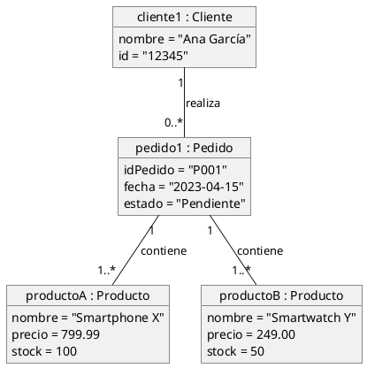
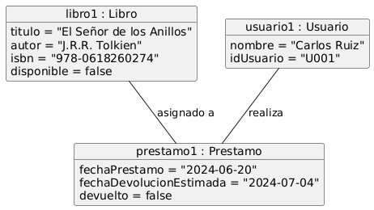
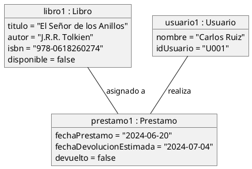

# Ampliación: Diagramas de Objetos

## Diagramas de Objetos

Los diagramas de objetos son una instantánea en el tiempo de tu sistema. A diferencia de los diagramas de clases, que muestran la estructura abstracta y las relaciones entre las clases, los **diagramas de objetos muestran las instancias concretas de esas clases (los objetos) en un momento específico de la ejecución**. Imagina que un diagrama de clases es como el plano de una casa, mientras que un diagrama de objetos es una fotografía de esa casa amueblada y con la gente dentro en un instante dado.

Estos diagramas son ideales para:

  * **Ilustrar ejemplos concretos:** Muestran cómo un sistema se ve y se comporta con datos reales.
  * **Validar el modelo de clases:** Ayudan a verificar si las clases y sus relaciones son capaces de representar los objetos y sus enlaces en escenarios específicos.
  * **Comprender la configuración de un sistema:** Permiten visualizar el estado de los objetos y sus atributos en un momento determinado.

### Estructura de un Diagrama de Objetos

Un diagrama de objetos se compone de:

  * **Objetos:** Representados como rectángulos con el nombre del objeto subrayado, seguido de dos puntos y el nombre de la clase a la que pertenece (por ejemplo, `miCoche: Coche`). Opcionalmente, pueden incluir una lista de atributos con sus valores actuales.
  * **Enlaces:** Líneas que conectan los objetos, representando las relaciones de asociación entre las instancias de las clases.

<strong>Haz click aquí para ver el código plantuml </strong>

Observa el diagrama de arriba, que representa una configuración específica de un sistema de pedidos:

1.  **Objetos Instanciados:** Vemos `cliente1` como una instancia de `Cliente`, `pedido1` como una instancia de `Pedido`, y `productoA` y `productoB` como instancias de `Producto`. Cada objeto muestra sus atributos con valores específicos en este momento.
2.  **Enlaces entre Objetos:**
      * La línea entre `cliente1` y `pedido1` con la etiqueta "realiza" indica que `cliente1` ha realizado el `pedido1`.
      * Las líneas entre `pedido1` y `productoA`, y `pedido1` y `productoB`, con la etiqueta "contiene", muestran que `pedido1` incluye `productoA` y `productoB`.
3.  **Cardinalidad (Opcional):** Aunque los diagramas de objetos se centran en instancias, puedes ver la cardinalidad de los enlaces, heredada del diagrama de clases subyacente.

> **Actividad**
> Interpreta el siguiente diagrama de objetos que representa una configuración de un sistema de biblioteca en un momento dado:

<strong>Haz click aquí para ver el código plantuml</strong>

Utiliza un diagrama de objetos cuando:

  * Necesitas mostrar un **ejemplo concreto del estado** de un sistema.
  * Estás **verificando la estructura** de tu modelo de clases con datos de ejemplo.
  * Quieres ilustrar **escenarios de prueba** o configuraciones específicas.
  * Deseas comunicar una **instantánea del sistema** en un momento particular.

> **Actividad**
> Realiza un diagrama de objetos a partir de la información recabada en el diagrama del primer ejercicio del reto individual.