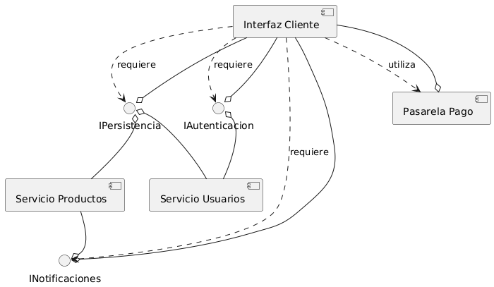
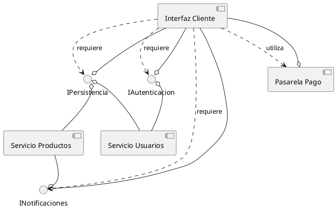
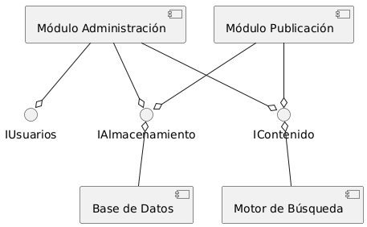
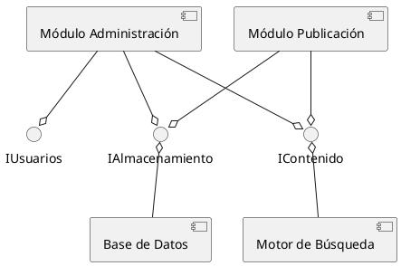

# Ampliación: Diagramas de Componentes

## Diagramas de Componentes

Los diagramas de componentes te permiten visualizar la **estructura modular de tu sistema**, mostrando cómo los componentes de software (módulos, bibliotecas, ejecutables, servicios) están organizados y cómo interactúan entre sí. Piensa en ellos como un mapa de las piezas de software construibles y reutilizables de tu aplicación, y cómo encajan para formar el sistema completo. No muestran la implementación interna de un componente, sino sus interfaces y sus relaciones con otros componentes.

Estos diagramas son especialmente útiles para:

  * **Diseño de alto nivel de la arquitectura:** Muestran la división lógica del sistema en unidades funcionales.
  * **Gestión de dependencias:** Ayudan a comprender cómo los cambios en un componente pueden afectar a otros.
  * **Reusabilidad y modularidad:** Fomentan el diseño de componentes con interfaces bien definidas para facilitar su reutilización.
  * **Documentación de la arquitectura:** Proporcionan una vista clara de la estructura del sistema para desarrolladores y stakeholders.

### Estructura de un Diagrama de Componentes

Un diagrama de componentes se compone de:

  * **Componentes:** Representados como un rectángulo con dos pequeños rectángulos a un lado (tipo "caja") o simplemente un rectángulo con la palabra `<<component>>` en su interior.
  * **Interfaces:** Muestran cómo un componente expone sus funcionalidades a otros (interfaces provistas, representadas con una "bola" o círculo) y cómo depende de funcionalidades ofrecidas por otros (interfaces requeridas, representadas con un "socket" o media luna).
  * **Dependencias:** Líneas punteadas con una flecha que indican que un componente depende de otro.
  * **Conectores (ensamblajes):** La combinación de una interfaz provista con una interfaz requerida, mostrando que un componente utiliza la funcionalidad de otro.

<strong>Haz click aquí para ver el código plantuml </strong>

Observa el diagrama de arriba, que representa la estructura de un sistema de comercio electrónico:

1.  **Componentes:** Tenemos `Servicio Usuarios`, `Servicio Productos`, `Pasarela Pago` e `Interfaz Cliente`.
2.  **Interfaces:**
      * `IAutenticacion` es una interfaz que el `Servicio Usuarios` **provee** (la "bola"). La `Interfaz Cliente` la **requiere** (el "socket"). La conexión entre la bola y el socket muestra que la `Interfaz Cliente` utiliza la funcionalidad de autenticación del `Servicio Usuarios`.
      * Similarmente, `IPersistencia` es provista por `Servicio Usuarios` y `Servicio Productos`, y requerida por `Interfaz Cliente`.
      * `INotificaciones` es provista por `Servicio Productos` y requerida por `Interfaz Cliente`.
3.  **Dependencias (opcionales en PlantUML si hay ensamblaje directo):** Aunque no se muestran explícitamente como líneas punteadas de dependencia en este ejemplo gracias a los ensamblajes, la conexión visual de las interfaces ya implica una dependencia.
4.  **Ensamblajes:** Las líneas que conectan la "bola" (interfaz provista) con el "socket" (interfaz requerida) muestran las conexiones directas entre los componentes.

> **Actividad**
> Interpreta el siguiente diagrama de componentes que describe un sistema de gestión de contenidos (CMS):

<strong>Haz click aquí para ver el código plantuml</strong>

Utiliza un diagrama de componentes cuando:

  * Estás diseñando la **arquitectura modular** de tu sistema.
  * Necesitas visualizar las **dependencias entre módulos** y subsistemas.
  * Quieres comunicar las **interfaces públicas** de tus componentes.
  * Estás planeando la **reutilización de código** o el desarrollo de un sistema basado en servicios.

> **Actividad**
> Realiza un diagrama de componentes que refleje la organización de un instituto, con aulas, despachos, talleres, pizarras, etc.