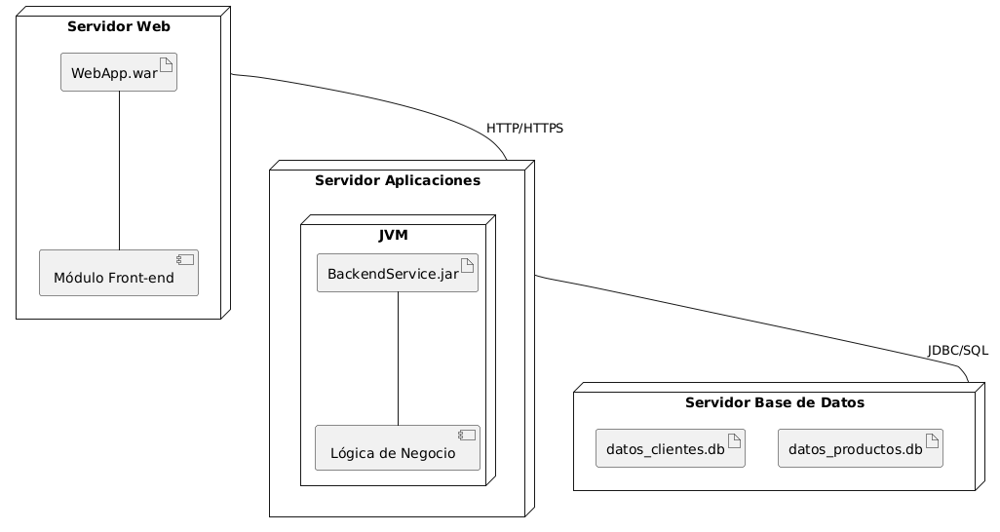
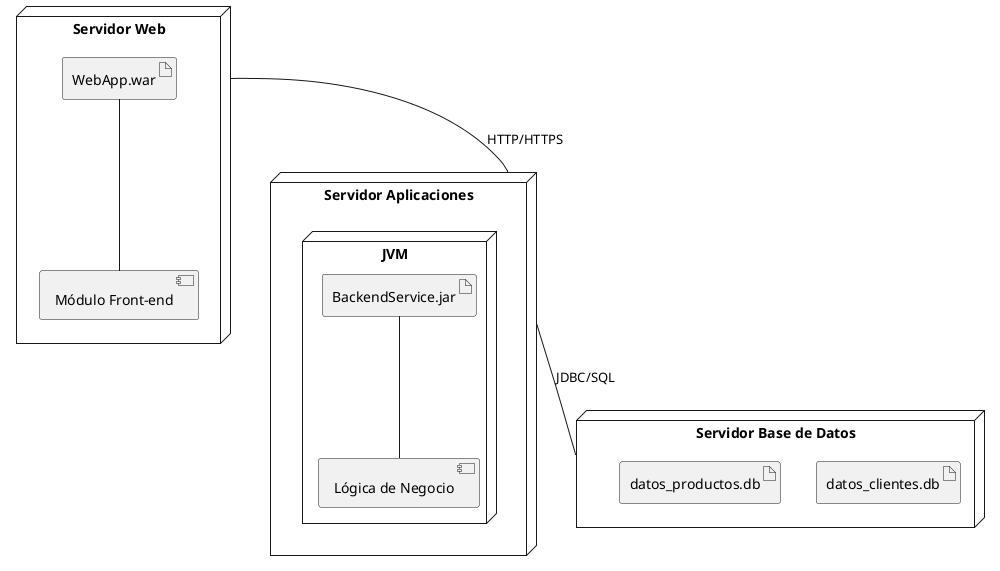
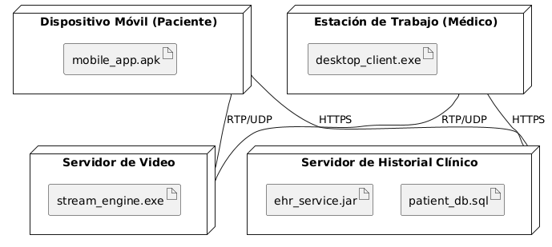
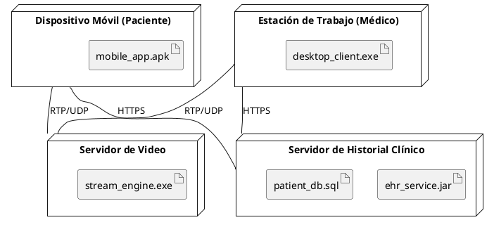

# Ampliación: Diagramas de Despliegue

## Diagramas de Despliegue

Los **Diagramas de Despliegue** (Deployment Diagrams) son fundamentales en UML para **visualizar la configuración física del hardware y el software de tu sistema**. Muestran cómo se distribuyen los componentes y artefactos de software (ejecutables, bibliotecas, bases de datos) en los nodos físicos (servidores, dispositivos, etc.) en un entorno de producción o desarrollo.

Imagina un diagrama de despliegue como un plano de tu infraestructura de TI, donde cada elemento físico es una "caja" y dentro de esas cajas se encuentran los programas, archivos y datos que conforman tu aplicación.

Estos diagramas son muy útiles para:

  * **Planificación de la infraestructura:** Ayudan a definir la arquitectura física del sistema.
  * **Identificación de cuellos de botella:** Permiten visualizar dónde se pueden concentrar las cargas de trabajo.
  * **Gestión de la configuración:** Muestran qué software reside en qué hardware.
  * **Documentación del entorno de producción:** Proporcionan una vista clara de cómo se despliega el sistema.

### Estructura de un Diagrama de Despliegue

Un diagrama de despliegue se compone de:

  * **Nodos:** Representados como cubos 3D, representan recursos computacionales físicos (servidores, estaciones de trabajo, dispositivos móviles, etc.) o lógicos (entornos de ejecución como JVMs o contenedores). Pueden contener otros nodos.
  * **Artefactos:** Representados como un documento con una esquina doblada, son las unidades físicas del software (archivos ejecutables, librerías, archivos de configuración, scripts, bases de datos). Residen en los nodos.
  * **Asociaciones:** Líneas que conectan los nodos, mostrando las relaciones de comunicación entre ellos (por ejemplo, una conexión de red). Pueden llevar estereotipos para indicar el tipo de conexión (TCP/IP, HTTP, etc.).
  * **Componentes (opcional pero común):** A menudo se incluyen componentes dentro de los artefactos o nodos para mostrar qué componentes lógicos están siendo desplegados.

<strong>Haz click aquí para ver el código plantuml </strong>

Observa el diagrama de arriba, que representa el despliegue de una aplicación web:

1.  **Nodos Físicos:** Tenemos `Servidor Web`, `Servidor Aplicaciones` y `Servidor Base de Datos`, representados como cubos.
2.  **Nodo Anidado:** Dentro del `Servidor Aplicaciones`, hay un nodo anidado `JVM`, que representa un entorno de ejecución.
3.  **Artefactos:**
      * En `Servidor Web`, está `WebApp.war` (el archivo de la aplicación web).
      * En `JVM` (dentro de `Servidor Aplicaciones`), está `BackendService.jar` (el archivo del servicio backend).
      * En `Servidor Base de Datos`, tenemos `datos_clientes.db` y `datos_productos.db` (archivos de base de datos).
4.  **Componentes (opcionales):** Se han incluido componentes como `Módulo Front-end` y `Lógica de Negocio` para mostrar qué lógica de software está contenida dentro de los artefactos.
5.  **Asociaciones (Conexiones):**
      * `WebServer` se conecta a `AppServer` usando "HTTP/HTTPS".
      * `AppServer` se conecta a `DBServer` usando "JDBC/SQL".

> **Actividad**
> Interpreta el siguiente diagrama de despliegue que muestra la infraestructura de un sistema de telemedicina:

<strong>Haz click aquí para ver el código plantuml</strong>

Utiliza un diagrama de despliegue cuando:

  * Necesitas mostrar la **arquitectura física** de tu sistema.
  * Estás planificando la **distribución de software** en diferentes servidores o dispositivos.
  * Deseas documentar el **entorno de producción** o de prueba.
  * Quieres visualizar las **conexiones y protocolos de red** entre los nodos.

> **Actividad**
> Crea un diagrama de despliegue a partir de la información recabada en el ejercicio 1 del reto individual.