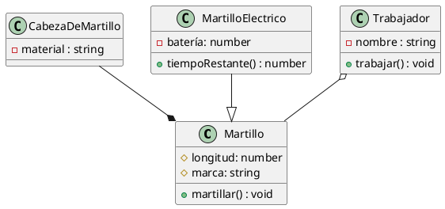

# Java. Del diagrama al código e Ingeniería inversa. Métodos y atributos estáticos


<!-- @import "[TOC]" {cmd="toc" depthFrom=1 depthTo=6 orderedList=false} -->

<!-- code_chunk_output -->

- [Java. Del diagrama al código e Ingeniería inversa. Métodos y atributos estáticos](#java-del-diagrama-al-código-e-ingeniería-inversa-métodos-y-atributos-estáticos)
  - [Del UML al Código Java: Un Ejemplo Práctico](#del-uml-al-código-java-un-ejemplo-práctico)
    - [Adaptación de los tipos de Relaciones en Java](#adaptación-de-los-tipos-de-relaciones-en-java)
    - [Herencia (`extends`)](#herencia-extends)
    - [Relaciones de Pertenencia (Asociación, Agregación y Composición)](#relaciones-de-pertenencia-asociación-agregación-y-composición)
  - [Constructores y Convenciones de Nomenclatura](#constructores-y-convenciones-de-nomenclatura)
    - [Constructores](#constructores)
    - [Convenciones de Nomenclatura en Java](#convenciones-de-nomenclatura-en-java)
    - [Archivos y Visibilidad](#archivos-y-visibilidad)
  - [Ingeniería Inversa: Del código a los diagramas de clases](#ingeniería-inversa-del-código-a-los-diagramas-de-clases)
  - [Métodos y atributos estáticos](#métodos-y-atributos-estáticos)

<!-- /code_chunk_output -->


## Del UML al Código Java: Un Ejemplo Práctico

En Java, como en cualquier otro lenguaje de programación, podemos trasladar cualquier diagrama UML de clases a programación. Tomemos como ejemplo el siguiente diagrama UML y su implementación en Java:



```java
// Martillo.java
public class Martillo {
    protected float longitud;
    protected String marca;
    protected CabezaDeMartillo cabeza; // Composición: Martillo "tiene" una CabezaDeMartillo

    public Martillo() {
        this.cabeza = new CabezaDeMartillo(); // La CabezaDeMartillo se crea con el Martillo
    }

    public void martillar() {
        // Implementación del método martillar
    }
}

// MartilloElectrico.java
public class MartilloElectrico extends Martillo { // Herencia: MartilloElectrico "es un" Martillo
    private float bateria;

    public float getBateria() {
        return bateria;
    }

    public void setBateria(float bateria) {
        this.bateria = bateria;
    }

    public int tiempoRestante() {
        // Cálculo y retorno del tiempo restante de la batería
        return 0; // Placeholder
    }
}

// Trabajador.java
public class Trabajador {
    private String nombre;
    private Martillo martillo; // Agregación: Trabajador "usa un" Martillo

    public Trabajador(String nombre, Martillo martillo) { // El Martillo se pasa al constructor
        this.nombre = nombre;
        this.martillo = martillo;
    }

    public String getNombre() {
        return nombre;
    }

    public void setNombre(String nombre) {
        this.nombre = nombre;
    }

    public Martillo getMartillo() {
        return martillo;
    }

    public void setMartillo(Martillo martillo) {
        this.martillo = martillo;
    }

    public void trabajar() {
        // Implementación del método trabajar
    }
}

// CabezaDeMartillo.java
public class CabezaDeMartillo {
    private String material;

    public CabezaDeMartillo() {
        // Constructor por defecto
    }

    public CabezaDeMartillo(String material) {
        this.material = material;
    }

    public String getMaterial() {
        return material;
    }

    public void setMaterial(String material) {
        this.material = material;
    }
}
```

### Adaptación de los tipos de Relaciones en Java

### Herencia (`extends`)

La **herencia** se expresa explícitamente usando la palabra reservada `extends`. Por ejemplo, `class MartilloElectrico extends Martillo` indica que `MartilloElectrico` hereda todas las características y comportamientos de `Martillo`, además de tener los suyos propios. En un diagrama UML, esto se representa con una flecha con punta triangular que va de la subclase a la superclase. En el caso de usar interfaces, se emplearía `implements`. En Java, la herencia es simple, pero se pueden usar múltiples interfaces.

### Relaciones de Pertenencia (Asociación, Agregación y Composición)

Las relaciones donde una clase "contiene" o "usa" objetos de otra clase se representan como **atributos** dentro de la clase contenedora. La clave está en cómo se maneja la vida útil de los objetos relacionados:

  * **Agregación** (representada por un rombo vacío en UML, `o--` en PlantUML): En una agregación, la "parte" (el objeto contenido) puede existir independientemente del "todo" (el objeto que lo contiene). En Java, esto se traduce en pasar la instancia de la "parte" como **parámetro al constructor** de la clase "todo", o asignarla a través de un *setter*. Observa cómo el `Trabajador` recibe un `Martillo` en su constructor, lo que implica que el `Martillo` puede existir y ser usado por otros `Trabajador`es o fuera de cualquier `Trabajador`.

  * **Composición** (representada por un rombo relleno en UML, `--*` en PlantUML): En una composición, la "parte" es una parte integral y dependiente del "todo". Si el "todo" deja de existir, la "parte" también deja de tener sentido o se destruye con él. En Java, la instancia de la "parte" se **crea directamente dentro del constructor** de la clase "todo". En nuestro ejemplo, la `CabezaDeMartillo` se instancia dentro del constructor de `Martillo`, lo que significa que un `Martillo` siempre "posee" y es responsable de la vida de su `CabezaDeMartillo`.


## Constructores y Convenciones de Nomenclatura

### Constructores

Un **constructor** es un método especial que se invoca automáticamente cuando se crea un nuevo objeto de una clase. Su objetivo principal es inicializar el estado del objeto. Si no defines uno, Java proporciona un **constructor por defecto** sin parámetros.

Para definir un constructor, simplemente creas un método con el mismo nombre que la clase. Puedes pasarle parámetros para inicializar los atributos del objeto, lo cual es común en las relaciones de asociación y agregación, como vimos con `Trabajador`. Para la composición, el objeto "parte" se suele crear directamente dentro del constructor del "todo".

### Convenciones de Nomenclatura en Java

  * **Clases**: Se escriben con la primera letra en mayúscula y utilizando **CamelCase** (por ejemplo, `MartilloElectrico`).
  * **Variables y Métodos**: La primera letra es minúscula y se usa CamelCase para las palabras siguientes (por ejemplo, `longitud`, `tiempoRestante`).

### Archivos y Visibilidad

En Java, generalmente, cada **clase pública** reside en un archivo `.java` que lleva el mismo nombre de la clase. Aunque es posible tener múltiples clases no públicas en un solo archivo, no es una práctica común para proyectos grandes.

Si no especificas un modificador de acceso (como `public`, `private`, `protected`), la visibilidad por defecto es de **paquete**. Esto significa que los miembros (atributos y métodos) son accesibles desde cualquier otra clase dentro del mismo paquete, pero son privados para clases fuera de ese paquete. Es una visibilidad muy útil que explorarás más a fondo a medida que avances.

> **Actividad**
>
> Crea un proyecto nuevo en IntelliJ. Añade un archivo, Libro.java, y crea en él la clase Libro, cuyo diagrama creaste en la actividad 1.
> 
>Después, crea un diagrama en uml para representar una estantería de libros. Crea el archivo Estanteria.java (no uses tildes) y codifica la clase.
>
>Haz un programa `main` de la siguiente forma:

```java
public class Main{
    public static void main(String [] args){
        Libro libro = new Libro();
        Estanteria estanteria = new Estanteria();
    }
}
```
## Ingeniería Inversa: Del código a los diagramas de clases

La ingeniería inversa o retroingeniería es el proceso llevado a cabo con el objetivo de obtener información o un diseño a partir de un producto, con el fin de determinar cuáles son sus componentes y de qué manera interactúan entre sí y cuál fue el proceso de fabricación. En nuestro caso, nos vamos a centrar en el código como producto y vamos a tratar de elaborar el diagrama de clases correspondiente.

Si somos capaces de traducir un diagrama de clases a código, también somos capaces de realizar ingeniería inversa y transferir un código a un diagrama de clases, para su posterior refinamiento o su estudio.

> **Actividad**
> Crea un diagrama de clases a partir de los siguientes códigos en Java
```java
// Archivo: Persona.java
package com.universidad;

public abstract class Persona {
    protected String nombre;
    protected String id;

    public Persona(String nombre, String id) {
        this.nombre = nombre;
        this.id = id;
    }

    public String getNombre() {
        return nombre;
    }

    public String getId() {
        return id;
    }

    public abstract void realizarActividadPrincipal();
    public void mostrarInformacionBasica() {
        // Método sin implementar
    }
}

// Archivo: Estudiante.java
package com.universidad;

import java.util.List;
import java.util.ArrayList;

public class Estudiante extends Persona { // Herencia
    private String carrera;
    private List<Curso> cursosInscritos; // Asociación (muchos a muchos implícita)

    public Estudiante(String nombre, String id, String carrera) {
        super(nombre, id);
        this.carrera = carrera;
        this.cursosInscritos = new ArrayList<>();
    }

    public String getCarrera() {
        return carrera;
    }

    public List<Curso> getCursosInscritos() {
        return cursosInscritos;
    }

    public void inscribirCurso(Curso curso) {
        // Método sin implementar
    }

    @Override
    public void realizarActividadPrincipal() {
        // Método sin implementar
    }
}

// Archivo: Profesor.java
package com.universidad;

import java.util.List;
import java.util.ArrayList;

public class Profesor extends Persona { // Herencia
    private String departamento;
    private List<Curso> cursosImpartidos; // Agregación (Profesor tiene Cursos, pero Curso puede existir sin Profesor)

    public Profesor(String nombre, String id, String departamento) {
        super(nombre, id);
        this.departamento = departamento;
        this.cursosImpartidos = new ArrayList<>();
    }

    public String getDepartamento() {
        return departamento;
    }

    public List<Curso> getCursosImpartidos() {
        return cursosImpartidos;
    }

    public void asignarCurso(Curso curso) {
        // Método sin implementar
    }

    @Override
    public void realizarActividadPrincipal() {
        // Método sin implementar
    }
}

// Archivo: Curso.java
package com.universidad;

import java.util.List;
import java.util.ArrayList;

public class Curso {
    private String nombre;
    private String codigo;
    private int creditos;
    private Profesor profesorAsignado; 
    private Departamento departamento; 

    public Curso(String nombre, String codigo, int creditos) {
        this.nombre = nombre;
        this.codigo = codigo;
        this.creditos = creditos;
    }

    public String getNombre() {
        return nombre;
    }

    public String getCodigo() {
        return codigo;
    }

    public int getCreditos() {
        return creditos;
    }

    public Profesor getProfesorAsignado() {
        return profesorAsignado;
    }

    public void setProfesorAsignado(Profesor profesorAsignado) {
        // Método sin implementar
    }

    public Departamento getDepartamento() {
        return departamento;
    }

    public void setDepartamento(Departamento departamento) {
        // Método sin implementar
    }

    public void añadirEstudiante(Estudiante estudiante) {
        // Método sin implementar
    }
}

// Archivo: Departamento.java
package com.universidad;

import java.util.List;
import java.util.ArrayList;

public class Departamento {
    private String nombre;
    private String codigo;
    private List<Profesor> profesores; 
    private Direccion direccion; 

    public Departamento(String nombre, String codigo, String calle, String ciudad) {
        this.nombre = nombre;
        this.codigo = codigo;
        this.profesores = new ArrayList<>();
        this.direccion = new Direccion(calle, ciudad); 
    }

    public String getNombre() {
        return nombre;
    }

    public String getCodigo() {
        return codigo;
    }

    public List<Profesor> getProfesores() {
        return profesores;
    }

    public Direccion getDireccion() {
        return direccion;
    }

    public void añadirProfesor(Profesor profesor) {
        // Método sin implementar
    }

    public void mostrarInformacionDepartamento() {
        // Método sin implementar
    }
}

// Archivo: Direccion.java
package com.universidad;

public class Direccion { // Clase parte para Composición
    private String calle;
    private String ciudad;

    public Direccion(String calle, String ciudad) {
        this.calle = calle;
        this.ciudad = ciudad;
    }

    public String getCalle() {
        return calle;
    }

    public String getCiudad() {
        return ciudad;
    }

    public String obtenerDireccionCompleta() {
        // Método sin implementar
        return null;
    }
}
```

## Métodos y atributos estáticos

Existe una palabra reservada que hemos estado utilizando hasta ahora sin saber muy bien qué era: `static`. Los métodos y atributos estáticos son aquellos que no pertenecen al objeto, sino a la clase.

Esto quiere decir que una vez que el programa es ejecutado, son siempre accesibles independientemente de si hay o no instancias de la clase que los contiene.

En las primeras etapas del curso hemos usado los elementos estáticos para simular el paradigma de programación procedural en Java, es decir, la resolución de problemas mediante funciones/procedimientos y no mediante objetos.

Si declaramos una atributo como estático, se convierte en una especie de variable con ámbito dentro de toda la clase y a la cual podemos acceder desde fuera dependiendo de su visibilidad. Lo mismo sucede con los métodos.

Una cosa que hay que tener en cuenta es que no se pueden usar atributos de la clase dentro de métodos estáticos (porque, en realidad, no tiene sentido ya que no hay instancia de la clase), pero sí podemos usar atributos estáticos dentro de métodos del objeto.

En cierto modo, podemos usar las clases como contenedores de métodos estáticos, que se comportan como librerías de funciones. Tal es el caso de la clase `Math`, que incluye métodos estáticos para operaciones matemáticas complejas.

De esta manera, podemos emplear los atributos y métodos estáticos como herramientas útiles para emplear dentro o fuera de la clase.

> **Actividad**: 
> Uso de métodos y atributos estáticos
>
> Crea una variable estática dentro de la clase libro que sirva para contar el número de libros (instancias) que hay. Empléala para darles a cada libro un identificador único. Para ello, añade un atributo privado `id` de tipo entero. El `id` no debe pasarse como atributo al constructor ni debe poder ser modificado con un setter.
>
> Después, crea un método estático dentro de la clase Estantería que reciba como parámetro una estantería y devuelva un array de string. El contenido del array de string es cada uno de los parámetros, incluido el `id`, separado por el caracter `;`. Puedes rodear cada parámetro entre \` \` si dentro de alguno de los campos hubiera un `;`. Cada libro ocupa un espacio distinto del array. A este formato de texto se le conoce como CSV (Comma Separated Values) y es muy empleado en la codificación de datos.