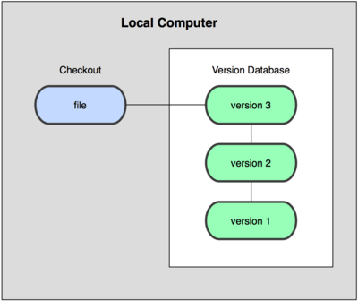
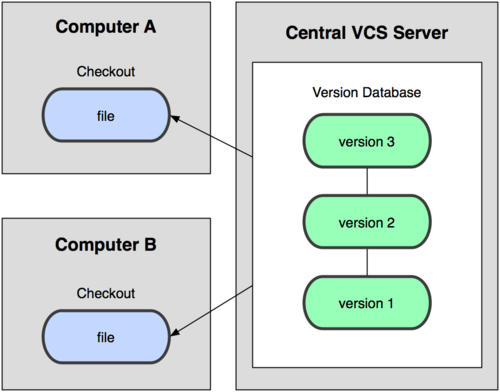
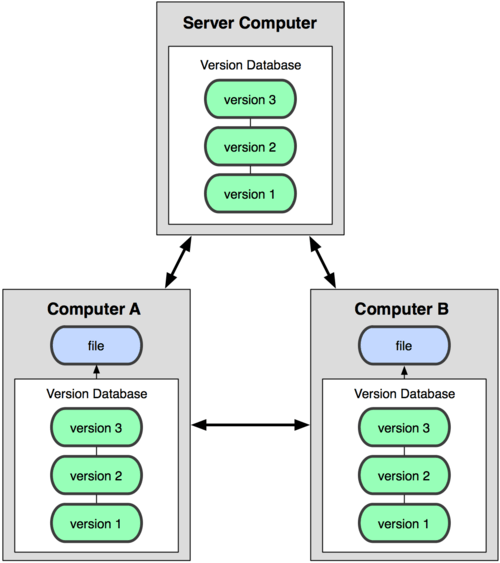
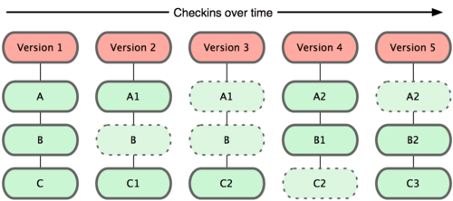
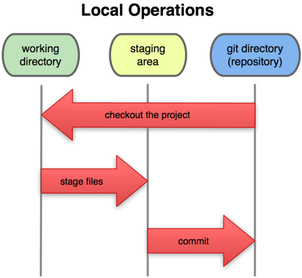

# Control de versiones

<!-- @import "[TOC]" {cmd="toc" depthFrom=1 depthTo=6 orderedList=false} -->

<!-- code_chunk_output -->

- [Control de versiones](#control-de-versiones)
  - [**Sistemas de control de versiones**](#sistemas-de-control-de-versiones)
  - [1. Tipos de VCS](#1-tipos-de-vcs)
    - [**1.1 VCS Local**](#11-vcs-local)
    - [**1.2 VCS Centralizado**](#12-vcs-centralizado)
    - [**1.3 VCS Distribuido**](#13-vcs-distribuido)
  - [2. Git](#2-git)
    - [2.1. Fundamentos de Git](#21-fundamentos-de-git)

<!-- /code_chunk_output -->

## **Sistemas de control de versiones**

Los sistemas de control de versiones (VCS) son herramientas que pueden registrar cualquier cambio en cualquier archivo o conjunto de archivos a lo largo del tiempo, de manera que podamos recuperar fácilmente cualquier versión anterior. Pueden ser utilizados no solo con archivos fuente, sino también con cualquier otro tipo de archivo.

Un VCS nos permite revertir el estado de cualquier archivo o incluso de un proyecto completo, comparar archivos a lo largo del tiempo, determinar quién cambió un archivo en un momento determinado y mucho más. Además, si algún archivo se daña o se pierde, podemos volver a una versión anterior en la historia y recuperarlo.

## 1. Tipos de VCS

### **1.1 VCS Local**

Los VCS pueden utilizarse tanto en línea como en modo local. Este último modo es particularmente útil porque podemos crear fácilmente una copia de seguridad de un proyecto y almacenarla localmente, de modo que podamos restaurarla más tarde si la necesitamos (en caso de un error, por ejemplo) y volver a una versión estable.

La principal ventaja de esto es su simplicidad, y el principal inconveniente es que debemos gestionar el control de versiones manualmente, por lo que podemos cometer errores en el proceso. Por ejemplo, podemos olvidarnos de que estamos en la carpeta equivocada y luego modificar el archivo de copia de seguridad en lugar del archivo actual.

Para hacer frente a estos problemas, existen algunas herramientas interesantes que nos ayudan a gestionar los archivos y los cambios. Una de las más populares es un sistema llamado *rcs*, que aún se encuentra en muchos ordenadores. Esta herramienta básicamente almacena un conjunto de parches o diferencias entre archivos de una versión a otra. Estos cambios se almacenan en un tipo especial de archivo, y luego el sistema puede recuperar cualquier estado anterior de cualquier archivo, añadiendo o quitando los parches correspondientes.

### **1.2 VCS Centralizado**

Los VCS locales no son adecuados cuando necesitamos colaborar con otros miembros del equipo. Para resolver este problema, también existen los VCS centralizados (CVCS). Estos sistemas se instalan en un solo servidor que contiene todos los archivos y sus diferentes versiones. Entonces, muchos clientes pueden conectarse a este servidor y descargar/subir cambios a estos archivos. Esta segunda manera de controlar versiones fue un estándar durante muchos años, ya que tenía grandes ventajas sobre los sistemas CVS locales, pero su principal inconveniente es que, si el servidor falla, podríamos perder todo el proyecto.

### **1.3 VCS Distribuido**

Los VCS distribuidos (DVCS) surgieron para resolver el principal inconveniente del CVCS. En un DVCS (como Git, Mercurial, Bazaar o Darcs), los clientes no solo se conectan al servidor, sino que también descargan todo el repositorio. Así, si un servidor falla, cualquiera de los repositorios locales de los clientes puede copiarse de nuevo al servidor, y el proyecto puede ser restaurado. Cada vez que descargamos cualquier cosa del repositorio, estamos haciendo una copia de seguridad completa de los datos.

## 2. Git

Git fue desarrollado por el equipo de Linux una vez que rompieron su relación con BitKeeper, la herramienta que usaban para el control de versiones antes. A partir de las carencias observadas en esta herramienta, decidieron algunos de los objetivos principales del nuevo sistema a desarrollar:

* Velocidad
* Diseño sencillo
* Fuerte soporte para el desarrollo no lineal (miles de ramas paralelas)
* Completamente distribuido
* Adecuado para grandes proyectos (como el núcleo de Linux)
* Eficiencia (en términos de velocidad y tamaño de los datos)

Desde su nacimiento en 2005, Git ha evolucionado y se ha vuelto cada vez más fácil de usar. Es realmente rápido y eficiente con proyectos grandes, y tiene un sistema de ramificación excepcional.

### 2.1. Fundamentos de Git

Veamos algunos de los conceptos básicos relacionados con el sistema de control de versiones Git.

**Modelado de datos**

Git almacena una especie de conjunto de "instantáneas" de su sistema de archivos, en lugar de almacenar una lista de cambios. Cada vez que subimos un nuevo cambio, básicamente toma una foto de cada archivo en ese momento y almacena una referencia a esta instantánea. Si el archivo no ha sido modificado, entonces Git no guarda una copia del mismo, solo un enlace a la versión anterior idéntica.

Esta es una diferencia importante entre Git y casi cualquier otro VCS, y hace que Git reconsidere estos aspectos de las generaciones anteriores de VCS. Por lo tanto, se parece más a un pequeño sistema de archivos con algunas herramientas útiles, que a un VCS.

**Trabajo local**

La mayoría de las funciones de Git solo necesitan archivos y recursos locales para funcionar. Como el historial del proyecto se almacena localmente, muchas operaciones son inmediatas y nos permite trabajar en un proyecto incluso si no estamos conectados a Internet. Los cambios se almacenan localmente y, tan pronto como tenemos una conexión, el repositorio externo puede actualizarse.

**Integridad**

Git utiliza el algoritmo hash SHA-1 para almacenar la información, por lo que los datos siempre se verifican y, en caso de que se modifiquen, Git lo notificaría.

**Solo añade información**

Cada operación de Git consiste en añadir información, por lo que todo se puede deshacer fácilmente (la información no se borra). Después de confirmar una instantánea, la información se almacena de forma segura.

**Estados del proyecto**

Git tiene tres estados principales en los que puede encontrarse cada archivo de un proyecto:

* **Modificado:** los datos se han cambiado localmente, pero aún no se han confirmado.
* **Preparado (Staged):** los datos se han etiquetado para ser enviados en la próxima confirmación (commit).
* **Confirmado (Committed):** los datos se almacenan de forma segura en un almacenamiento local.

Por lo tanto, hay tres secciones en Git:

* **Directorio Git:** donde Git almacena los metadatos y la base de datos de los elementos del proyecto. Esta parte es lo que copiamos cuando clonamos el repositorio desde otra computadora.
* **Directorio de trabajo:** es una copia de una versión del proyecto. Estos archivos se extraen de la base de datos de Git y se colocan en una carpeta, listos para ser utilizados.
* **Área de preparación (Staging area):** es un archivo simple almacenado en el directorio Git que contiene información sobre los archivos que se enviarán en la próxima confirmación. También se le llama *índice*.

[**Fuente**](https://nachoiborraies.github.io/entornos/md/en/05a)