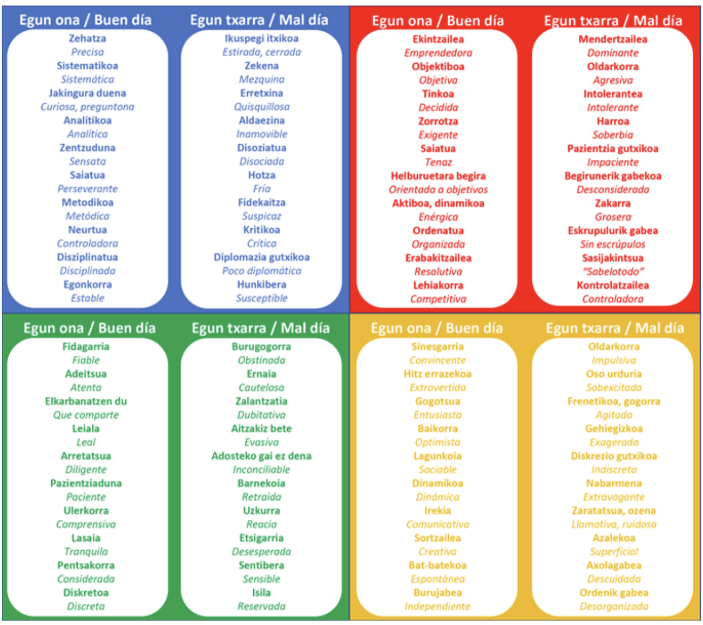

# Reto cooperativo de la Unidad de Programación 04

## Herramientas para el desarrollo de software

### Formación del equipo

Para esta unidad de programación, la formación de los equipos se hará a través del método [*Dinámica de los colores*](https://drive.google.com/file/d/19V9e3BR_IXAjEKVoDU1BxUgsK0heF0S2/view). Observa la tabla:

¿Con qué colores te identificas más? Escoge en la encuesta en FORMS tu primera y tu segunda opción. En base a ella, se crearán los equipos de la clase intentando tener representados todos los colores.

### Tarea

Continúa el proyecto que se te ha asignado. Este proyecto fue comenzado por otros equipos, que se encargaron del **Diseño de los diagramas de comportamiento** y del **Diseño de los diagramas de clases y propuesta de traducción a entidad relación**. Tu labor es:

- Corregir posibles errores del producto entregado por el equipo anterior antendiendo a la especificación dada
- Traducir las clases a Java, sin implementar los métodos. Usa Maven para construir el proyecto.
- Traducir las clases a Python o Javascript o Typescript, sin implementar los métodos
- Subir el proyecto a un repositorio de github. Usa un repositorio diferente para cada versión del proyecto.
- Realizar una memoria de cómo configurar el IDE (IntelliJ, VS Code o Pycharm) para el proyecto.