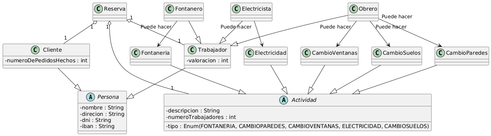

# Reto individual

> **Actividad**
> Dado el siguiente diagrama de clases (trabajado en la unidad anterior), realiza las siguientes tareas.
- Crea un proyecto en IntelliJ IDEA usando Maven (puedes elegir community edition o Ultimate). Usa Java 21 LTS.
- Traduce las clases a código Java. Añade los atributos y métodos que consideres oportunos (no es necesario implementar los métodos).
- Genera constructores, getters y setters usando las herramientas incluidas en IntelliJ IDEA
- Crea una versión mejorada del diagrama con el código nuevo que has generado.
- Crea un repositorio en Github
- Conecta tu proyecto con el repositorio de Github
- Repite lo mismo, pero usando Python, Javascript o Typescript

## Rubrica

| | ÍTEM | Criterio Evaluación | PESO |
|---|---|---|---
| | Creación del proyecto en Maven | 2a, 2b, 2c, 2d | 1
| | Adecuación del proyecto| 2a, 2b, 2c, 2d | 1
| | Traducción del diagrama al código JAVA| 5e | 2
| | Generación correcta de métodos | 2e | 1
| | Traducción del código al diagrama | 5f | 1
| | Repositorio de Github | 4f | 1
| | Traducción del proyecto a otro lenguaje |2e, 2f, 2g | 2
| | Presentación de la memoria | TODOS | 1 |

Se debe entregar un enlace al repositorio y una memoria explicando el proceso punto por punto
