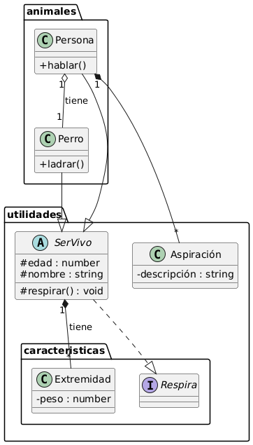

# EXAMEN 

## TEST

1.	¿Qué es un compilador?
o	A) Un programa que convierte código fuente en lenguaje máquina
o	B) Un editor de texto especializado en programación
o	C) Un entorno gráfico para depuración de errores
o	D) Una herramienta para documentar proyectos de software
2.	¿Qué sistema utiliza el lenguaje de programación Java para ejecutarse?
o	A) Intérprete
o	B) Máquina virtual
o	C) Compilador
o	D) Ensamblador
3.	¿Cuál es la diferencia entre un IDE (Entorno de desarrollo integrado) y un editor de código como Visual Studio Code?
o	A) Un IDE incluye herramientas adicionales para la depuración, compilación y administración de proyectos, mientras que un editor de código es más simple
o	B) Un IDE es un editor de texto sin formato, mientras que un editor de código tiene herramientas avanzadas
o	C) No hay ninguna diferencia entre un IDE y un editor de código
o	D) Un editor de código solo permite escribir código en lenguajes específicos
4.	¿Qué es un sistema de control de versiones?
o	A) Un sistema que almacena archivos en la nube
o	B) Un sistema que facilita la creación de bases de datos
o	C) Un sistema que registra y gestiona los cambios realizados en el código fuente de un proyecto
o	D) Un sistema para detectar errores en el código fuente
5.	¿Cuál de estas características de GIT no es cierta?
o	A) Es un sistema de control de versiones
o	B) Solo funciona con una cuenta de Github
o	C) Solo crea versiones de archivos modificados, para el resto usa enlaces
o	D) Trabaja asignado estados a los diferentes archivos del repositorio
6.	¿Qué es un pull en GitHub?
o	A) Una solicitud para eliminar un repositorio
o	B) Una operación para descargar y fusionar cambios de un repositorio remoto
o	C) Una función para crear un backup de los archivos
o	D) Una herramienta para analizar la calidad del código
7.	¿Qué operaciones se pueden hacer con un repositorio en Git?
o	A) Solo se pueden leer archivos
o	B) Solo se pueden añadir archivos nuevos
o	C) Se pueden añadir, modificar y eliminar archivos, además de gestionar el historial de versiones
o	D) Solo se pueden compartir archivos con otros usuarios
8.	¿Qué es un intérprete?
o	A) Un programa que convierte código fuente en código máquina de una vez
o	B) Un programa que convierte el código fuente línea por línea durante su ejecución
o	C) Un programa que optimiza el rendimiento del sistema operativo
o	D) Un programa que analiza errores de sintaxis en el código fuente
9. ¿Qué es un scriptlet?
o   A) La parte del código en HTML de un archivo JSP
o   B) La parte del código en Python de un archivo JSP
o   C) La parte del código en Java de un archivo JSP
o   D) Otro nombre para los archivos JSP
10. ¿Qué es DENO?
o   A) Un runtime para Javascript
o   B) Un runtine para RUST
o   C) Un runtine solo para Typescript
o   D) El antecesor de NODE.js
11. ¿Cuál de estos IDE es adecuado para código en C# sin necesidad de extensiones?
o   A) Rider
o   B) VS CODE
o   C) IntelliJ IDEA ULTIMATE
o   D) Netbeans
12. ¿Con qué lenguaje relacionamos principalmente al gestor Maven?
o   A) Con Rust
o   B) Con Java
o   C) Con HTML
o   D) Con Typescript

## EJERCICIO INGENIERÍA INVERSA

Crea el código en lenguaje Java (o cualquier otro que especifiques) correspondiente a este diagrama de clases:

