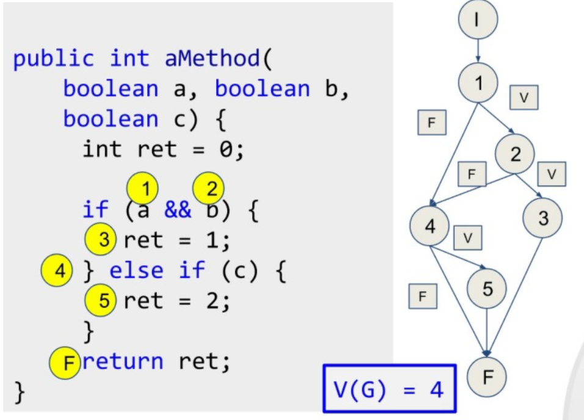

<style> body{
    text-align: justify;
    }
    p{
        text-indent: 2rem;
    } 
</style>
# La traza de un programa


<!-- @import "[TOC]" {cmd="toc" depthFrom=1 depthTo=6 orderedList=false} -->

<!-- code_chunk_output -->

- [La traza de un programa](#la-traza-de-un-programa)
  - [Definición de Traza de un programa](#definición-de-traza-de-un-programa)
    - [Tabla de seguimiento de variables](#tabla-de-seguimiento-de-variables)
  - [Ejemplo de aplicación](#ejemplo-de-aplicación)
  - [Pruebas de caja blanca](#pruebas-de-caja-blanca)
    - [Pruebas de camino básico](#pruebas-de-camino-básico)
    - [Pruebas condicionales](#pruebas-condicionales)
    - [Pruebas de comprobación de bucles](#pruebas-de-comprobación-de-bucles)

<!-- /code_chunk_output -->


## Definición de Traza de un programa

La traza de un programa es un registro detallado de la ejecución de un programa, que muestra los valores de las variables, los resultados de las operaciones y el flujo de control en cada paso. En ella implementamos las técnicas de depuración de caja blanca de manera holística.

Es una herramienta útil para depurar y entender cómo funciona un programa, especialmente cuando se busca identificar errores o comportamientos inesperados.

### Tabla de seguimiento de variables

Una de las técnicas más efectivas es crear una tabla donde se registren los valores de las variables en cada paso del algoritmo. Supongamos el siguiente algoritmo en lenguaje natural:

1. Iniciar con `a = 5` y `b = 3`.
2. Sumar `a` y `b`, guardar el resultado en `c`.
3. Multiplicar `c` por 2, guardar el resultado en `d`.
4. Mostrar el valor de `d`.

Dado el anterior algoritmo, realizamos la siguiente tabla donde hacemos un seguimiento del valor de las variables.

| Paso | Operación                     | a  | b  | c  | d  |
|------|-------------------------------|----|----|----|----|
| 1    | Iniciar `a = 5`, `b = 3`       | 5  | 3  | -  | -  |
| 2    | `c = a + b` (5 + 3)            | 5  | 3  | 8  | -  |
| 3    | `d = c * 2` (8 * 2)            | 5  | 3  | 8  | 16 |
| 4    | Mostrar `d`                    | 5  | 3  | 8  | 16 |

Usando Entornos de Desarrollo Integrado, esta información la podemos consultar a través del depurador (debugger). Podemos sustituir la tabla por anotaciones (con la misma información) si el problema es simple, para reducir la aparatosidad. Las anotaciones son otra forma de expresar la traza.

Además del valor de las variables, también podemos evaluar el camino que se toma en los nodos de decisión mediante el uso de tablas de verdad.

## Ejemplo de aplicación

Vamos a crear un **ejemplo sencillo** que combine un algoritmo, su traza y una tabla de verdad para evaluar el camino que se toma en los nodos de decisión y el número de veces que se repite un bucle. Supongamos el siguiente algoritmo:

```plaintext
1. Iniciar con \( x = 2 \) y \( y = 3 \).
2. Si \( x > y \), mostrar "x es mayor que y".
3. Si \( x < y \), mostrar "x es menor que y" y repetir el siguiente paso 2 veces:
   - Incrementar \( x \) en 1.
4. Mostrar el valor final de \( x \).
```

Realizamos la traza siguiendo paso a paso el algoritmo y anotar los valores de las variables y las decisiones tomadas.

```plaintext
1. **Paso 1**: \( x = 2 \), \( y = 3 \).
2. **Paso 2**: Evaluar \( x > y \):
   - \( 2 > 3 \) es **Falso**, no se ejecuta esta condición.
3. **Paso 3**: Evaluar \( x < y \):
   - \( 2 < 3 \) es **Verdadero**, se muestra "x es menor que y".
   - Se entra en el bucle que se repite 2 veces:
     - **Primera iteración**:
       - Incrementar \( x \) en 1: \( x = 3 \).
     - **Segunda iteración**:
       - Incrementar \( x \) en 1: \( x = 4 \).
4. **Paso 4**: Mostrar el valor final de \( x \), que es **4**.
```

A continuación, creamos una tabla de verdad para las condiciones \( x > y \) y \( x < y \), y vemos qué camino se toma en cada caso.

| \( x \) | \( y \) | \( x > y \) | \( x < y \) | Camino tomado                     |
|---------|---------|-------------|-------------|-----------------------------------|
|   2     |   3     |    Falso    |   Verdadero | Mostrar "x es menor que y", bucle |
|   3     |   3     |    Falso    |   Falso     | No se cumple ninguna condición    |
|   4     |   3     |   Verdadero |   Falso     | Mostrar "x es mayor que y"        |

Podemos emplear las trazas para cualquier algoritmo que diseñemos y nos serán especialmente útiles para detectar errores o comportamientos anómalos.

> **Actividad:** Realiza un algoritmo que, dada una fecha de entrada, determine si es válida y, en caso de que sea válida, qué signo del zodiaco tendría un bebé nacido ese día. Para calcular si es válida una fecha, debes tener en cuenta los números de día y mes introducidos, contemplando si se trata de un año bisiesto o no.
> Un año es bisiesto si es divisible entre 4, con las excepciones de los años que son divisibles entre 100, que solo serán bisiestos si también son divisibles entre 400 (1900 no es biesto, pero 2000 y 2004 sí lo son).
> Las fechas para determinar el signo del zodiaco son las siguientes:
>
>1. **Aries**: 21 marzo - 19 abril.
>2. **Tauro**: 20 abril - 20 mayo.
>3. **Géminis**: 21 mayo - 20 junio.
>4. **Cáncer**: 21 junio - 22 julio.
>5. **Leo**: 23 julio - 22 agosto.
>6. **Virgo**: 23 agosto - 22 septiembre.
>7. **Libra**: 23 septiembre - 22 octubre.
>8. **Escorpio**: 23 octubre - 21 noviembre.
>9. **Sagitario**: 22 noviembre - 21 diciembre.
>10. **Capricornio**: 22 diciembre - 19 enero.
>11. **Acuario**: 20 enero - 18 febrero.
>12. **Piscis**: 19 febrero - 20 marzo.
>
> Calcula las trazas para los valores 29 de febrero de 2000, 29 de febrero de 1999, 31 de abril de 2024, 7 de abril de 1787, 1 de enero de 1900 y 13 de marzo de 2032.

## Pruebas de caja blanca

Las pruebas de caja blanca son, como veremos más adelante, un tipo de pruebas de unidad que se encargan de comprobar el funcionamiento interno del código. Funcionan codo a codo con las trazas y, en combinación, son la base para el uso adecuado de un depurador.

### Pruebas de camino básico

Las pruebas de camino básico tienen como fin determinar el camino que puede seguir la ejecución de un código. Para ello, se organiza cada operación atómica (de un solo paso) del código en un diagrama de árbol, como se ve en la siguiente imagen:



Se llama complejidad ciclomática, representada con V(G), al número de caminos distintos que puede tomar el programa. Los caminos sirven para poder diseñar pruebas de unidad que verifiquen el funcionamiento de cada uno de ellos.

> **Actividad:** 
> Diseña pruebas de camino básico para el siguiente algoritmo:
```java
if (num1 > 10)
{
    if (num2 > 10)
        System.out.println("Ambos son mayores");
    else
        System.out.println("El primero es mayor");
} else {
    if (num2 > 10)
        System.out.println("El segundo es mayor");
    else
        System.out.println("Ninguno es mayor");
}
```

### Pruebas condicionales

Las pruebas condicionales analizan el camino que puede seguir la ejecución de un código centrándose en las condiciones del mismo. Para evaluar dichos caminos, la herramienta que se emplea son las **tablas de verdad**.

Una tabla de verdad es una herramienta utilizada en lógica proposicional para representar todos los posibles valores de verdad de una expresión lógica, en función de los valores de verdad de sus variables. Podemos etiquetar las condiciones que vayamos encontrando y realizar una tabla que nos señale los caminos posibles. Asimismo, también podemos anotar las veces que se repite un bucle en función de los valores de entrada.
```java
public boolean esAnyoBisiesto(int anyo)
{
    boolean esAnyoBisiesto = false;
    if(anyo % 4 == 0)
    {
        esAnyoBisiesto = true;

        if(anyo % 100 == 0)
        {
            esAnyoBisiesto = false;

            if(anyo % 400 == 0)
            {
                esAnyoBisiesto=true;
            }
        }
    }
    return esAnyoBisiesto;
}
```

A partir del código anterior, etiquetamos las condiciones para crear una tabla de verdad:

* C1 = anyo % 4 == 0;
* C2 = anyo % 100 == 0;
* C3 = anyo % 400 == 0;

Y creamos la siguiente tabla:

|N	|C1	|C2	|C3	|esAnyoBisiesto|
|--|--|--|--|--|
|1	|true	|true	|true	|true|
|2	|true	|true	|false	|false|
|3	|true	|false	|true	|true|
|4	|true	|false	|false	|true|
|5	|false	|true	|true	|false|
|6	|false	|true	|false	|false|
|7	|false	|false	|true	|false|
|8	|false	|false	|false	|false|

Si nos fijamos bien, los casos 3 y 4 llevan al mismo resultado independientemente de C3 y algo similar ocurre con los casos del 5 al 8, que dependen de C1, por lo que podemos simplificar la tabla de la siguiente forma:

|N	|C1	|C2	|C3	|esAnyoBisiesto
|--|--|--|--|--
|1	|true	|true	|true	|true
|2	|true	|true	|false	|false
|3	|true	|false	|*	|true
|4	|false	|*	|*	|false

> **Actividad:** 
> Utiliza el código del ejercicio del apartado anterior para realizar las pruebas condicionales.

### Pruebas de comprobación de bucles

Esta prueba evalúa los posibles caminos para los bucles. Para cada bucle con *n* iteraciones, debemos verificar si:  

- El bucle nunca se ejecuta.  
- El bucle se ejecuta solo una vez.  
- El bucle se ejecuta dos veces.  
- El bucle se ejecuta *m* veces, siendo *m < n*.  
- El bucle se ejecuta *n* y *n-1* veces.  

Si hay algún bucle anidado, debemos comenzar explorando los bucles internos y luego pasar a los externos.  

Por ejemplo, observemos el siguiente código que verifica si un número dado (introducido previamente por el usuario) es primo o no:  

```java
boolean result = true;
if (number == 0 || number == 1)
    result = false;
int i = 2;
while (i <= number / 2 && result)
{
    if (number % i == 0)
        result = false;
    else
        i++;
}
```

Se espera que el bucle se ejecute como máximo hasta `N = number / 2 - 1` veces. Según el enfoque de prueba de bucles, debemos diseñar casos de prueba en los que:  

- **El bucle nunca se ejecuta.** Por ejemplo, si el número es 2, automáticamente es primo y no se realiza ninguna iteración.  
  También podríamos probar los casos de 0 y 1, que están cubiertos por la primera cláusula *if*.  

- **El bucle se ejecuta una vez.** Esto se puede lograr con *number = 3*.  

- **El bucle se ejecuta dos veces.** Por ejemplo, con *number = 9*.  

- **El bucle se ejecuta *m* veces, donde *m < N*.** Por ejemplo, con *number = 25*, el bucle se ejecuta 4 veces.  

- **El bucle se ejecuta *N* veces y/o *N-1* veces.** Para alcanzar *N* iteraciones, solo necesitamos un número primo, como *23*.  
  Para iterar *N-1* veces, necesitamos un número compuesto que no se descubra hasta la última iteración.  
  En este caso, podríamos usar *number = 4*, aunque es un caso de prueba bastante simple.  

Podemos construir la siguiente tabla de casos de prueba:  

| ID  | Nombre          | Datos  | Resultado esperado | Resultado real |
|-----|---------------|--------|------------------|---------------|
| U0  | BasicCases    | 1      | false            |               |
| U1  | NoIterations  | 2      | true             |               |
| U2  | OneIteration  | 3      | true             |               |
| U3  | TwoIterations | 9      | false            |               |
| U4  | MIterations   | 25     | false            |               |
| U5  | N-1Iterations | 4      | false            |               |
| U6  | NIterations   | 23     | true             |               |

 

>**Actividad:** 
> El siguiente fragmento de código verifica si los dígitos de un número están en orden ascendente:  
>

```java
boolean result = true;
while (number >= 10 && result)
{
    int lastDigit = number % 10;
    number /= 10;
    int newLastDigit = number % 10;
    if (lastDigit < newLastDigit)
        result = false;
}
```

> Se te pide diseñar una tabla de casos de prueba considerando todas las posibles iteraciones del bucle, siguiendo el ejemplo anterior.

***Información extraída de [esta página web](https://nachoiborraies.github.io/entornos/md/en/06b).***

