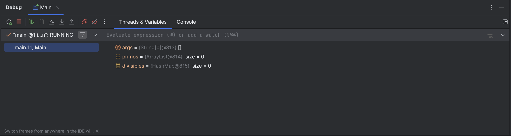

<style> body{
    text-align: justify;
    }
    p{
        text-indent: 2rem;
    } 
</style>

<!-- @import "[TOC]" {cmd="toc" depthFrom=1 depthTo=6 orderedList=false} -->

<!-- code_chunk_output -->

- [Depuración de Software: El Debugger](#depuración-de-software-el-debugger)
- [Uso del debugger de IntelliJ](#uso-del-debugger-de-intellij)

<!-- /code_chunk_output -->


## Depuración de Software: El Debugger

>**Actividad:** Para comprender el funcionamiento del Debugger de IntelliJ, realiza una memoria por escrito de las actividades de este apartado. Usa capturas de pantalla para copiar los resultados obtenidos.

Podemos hacer trazas en programas añadiendo salidas por consola de variables o datos. Esto puede ser efectivo para hacernos una idea de lo que está sucediendo en el código, pero no es muy práctico para hacer un análisis pormenorizado del comportamiento de nuestro programa. En muchos programas es más adecuado usar un **debugger**, que generalmente está integrado en cualquier IDE.

Un **debugger** es una herramienta para inspeccionar y analizar el comportamiento de un programa mientras se ejecuta. De esta forma, nos permite identificar y corregir errores en el código (bugs).

Para controlar el flujo de un programa, indicamos puntos de ruptura (breakpoints), en los cuales se detiene el programa. También podemos realizar ejecuciones paso a paso.

En todo momento, podemos controlar el estado del programa gracias a esta herramienta de depuración.

## Uso del debugger de IntelliJ

Vamos a comprobar el funcionamiento del Debugger con este código en IntelliJ. Crea un proyecto y copia este código:

```java{.line-numbers}
import java.util.ArrayList;
import java.util.HashMap;
import java.util.List;
import java.util.Map;

public class Main {
    public static void main(String[] args) {
        List<Integer> primos = new ArrayList<>();
        Map<Integer, Integer> divisibles = new HashMap<>();

        for(int i = 0; i< 50; i++){
            boolean esPrimo = true;
            int divisores = 0;
            for(int j = 2; j<i; j++){
                if(i % j == 0){
                    esPrimo = false;
                    divisores++;
                }
            }
            if (esPrimo){
                primos.add(i);
            }else{
                divisibles.put(i, divisores);
            }
        }
        for(Integer i : primos){
            System.out.println("El número " + i + " es primo");
        }
        for(Integer i : divisibles.keySet()){
            int divisores = divisibles.get(i);
            String msg = "El número " + i + " no es primo y tiene " + divisores;
            msg += (divisores>1)? " divisores.":" divisor.";
            System.out.println(msg);
        }
    }
}
```

Lo primero que debemos hacer es añadir un punto de ruptura. Para ello hacemos click en la línea 11. Se añade un punto rojo, que es el punto de ruptura. Al hacer click en la ejecución de Debug, al llegar a ese punto el programa se detendrá y nos permitirá inspeccionar las variables.

Los puntos de ruptura pueden ser condicionales o incondicionales. Para añadir una condición a un punto de ruptura, haz click derecho. En la línea 20, añade la condición `esPrimo` para que el programa solo se detenga cuando la variable `esPrimo` sea cierta.

>**Actividad**: 
> Comprueba el funcionamiento de los dos puntos de ruptura. Añade un punto más, siendo uno incondicional y el otro condicional. Después bórralos haciendo click.

Cuando activas la depuración, la información se muestra en la pantalla inferior (donde está normalmente la consola):



En este menú podemos ver los puntos de ruptura, realizar acciones de ejecución paso a paso (que veremos más adelante) y comprobar el valor de las variables.

>**Actividad**: 
> Inspecciona el valor de las variables en el punto de ruptura de la línea 11 cuando `i` vale `12`. ¿Qué información tenemos que no aparece en nuestro código?


Una vez establecido un punto de ruptura, al parar podemos continuar la ejecución del programa paso a paso de las siguientes formas:

- **Step Over**: Ejecuta la línea actual y pasa a la siguiente, sin entrar en los detalles de las funciones llamadas.
- **Step Into**: Entra en el código de las funciones llamadas para inspeccionarlas.
- **Step Out**: Sale de la función actual y regresa al punto donde fue llamada.

Además, contamos con la **Pila de Llamadas** (Call Stack):
- Muestra la secuencia de llamadas a funciones que llevaron al punto actual de ejecución.
- Te ayuda a entender cómo llegaste a un punto específico en el código.

Todas estas opciones están en el menú del debugger. Para comprobar cómo funcionan, vamos a modificar el código de la siguiente forma, añadiendo funciones:

```java {.line-numbers}
import java.util.ArrayList;
import java.util.HashMap;
import java.util.List;
import java.util.Map;

public class Main {
    public static void main(String[] args) {
        List<Integer> primos = new ArrayList<>();
        Map<Integer, Integer> divisibles = new HashMap<>();

        for(int i = 0; i< 50; i++){
            boolean esPrimo = true;
            int divisores = 0;
            for(int j = 2; j<i; j++){
                if(i % j == 0){
                    esPrimo = false;
                    divisores++;
                }
            }
            if (esPrimo){
                primos.add(i);
            }else{
                divisibles.put(i, divisores);
            }
        }
        visualizar(primos);
        visualizar(divisibles);
    }
    private static void visualizar(List<Integer> primos){
        for(Integer i : primos){
            System.out.println("El número " + i + " es primo");
        }
    }
    private static void visualizar (Map<Integer, Integer> divisibles){
        for(Integer i : divisibles.keySet()){
            int divisores = divisibles.get(i);
            String msg = "El número " + i + " no es primo y tiene " + divisores;
            msg += (divisores>1)? " divisores.":" divisor.";
            System.out.println(msg);
        }
    }
}
```
Añade un punto de ruptura en la línea 26 y otro en la línea 38.

>**Actividad:** 
> Prueba las funciones de Step Over, Step Into (desde la línea 26) y Step Out (desde la línea 38). Observa la pila de llamadas y también los valores.
>
> - Prueba primero el *Step Over* desde la línea 26, avanzando 3 pasos. Después, vuelve a ejecutar el debug y prueba el *Step Into* también con tres pasos. ¿Qué diferencia hay?
>
> - Después prueba el *Step Out* desde la línea 38. Describe qué sucede.


