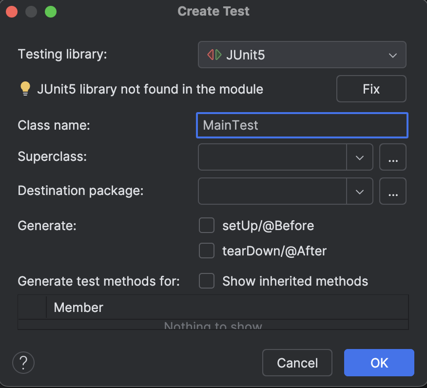

<style> body{
    text-align: justify;
    }
    p{
        text-indent: 2rem;
    } 
</style>

# Herramientas para la prueba de software

En este bloque, vamos a repasar diferentes herramientas para la prueba de software. Primero veremos qué son las anotaciones, un recurso que emplean todos los frameworks para funcionar. Después, veremos las herramientas JUnit y Mockito.


<!-- @import "[TOC]" {cmd="toc" depthFrom=1 depthTo=6 orderedList=false} -->

<!-- code_chunk_output -->

- [Herramientas para la prueba de software](#herramientas-para-la-prueba-de-software)
  - [¿Qué son los **Test de Unidad**?](#qué-son-los-test-de-unidad)
    - [Beneficios de los Test de Unidad](#beneficios-de-los-test-de-unidad)
      - [Ejemplo sencillo de test de unidad](#ejemplo-sencillo-de-test-de-unidad)
    - [Implementación de Test de Unidad en Java usando IntelliJ y JUnit](#implementación-de-test-de-unidad-en-java-usando-intellij-y-junit)
      - [**Paso 1: Configurar el proyecto en IntelliJ con JUnit**](#paso-1-configurar-el-proyecto-en-intellij-con-junit)
      - [**Paso 2: Escribir un Test de Unidad en Java usando JUnit**](#paso-2-escribir-un-test-de-unidad-en-java-usando-junit)
      - [**Paso 3: Ejecutar el Test en IntelliJ**](#paso-3-ejecutar-el-test-en-intellij)
    - [Agregando más tests](#agregando-más-tests)
  - [Diseño de Test de unidad](#diseño-de-test-de-unidad)
  - [Anotaciones en Java](#anotaciones-en-java)
  - [Test de unidad con JUNIT](#test-de-unidad-con-junit)
    - [**1. Configurar JUnit en IntelliJ**](#1-configurar-junit-en-intellij)
    - [**2. Crear la clase a probar**](#2-crear-la-clase-a-probar)
    - [**3. Escribir pruebas con JUnit**](#3-escribir-pruebas-con-junit)
    - [Principales anotaciones de JUnit:](#principales-anotaciones-de-junit)

<!-- /code_chunk_output -->


## ¿Qué son los **Test de Unidad**?

Los **tests de unidad** son pequeñas pruebas automatizadas que se escriben para verificar que una porción específica de código (una "unidad", generalmente una función o método) funcione correctamente. Su propósito es comprobar que una unidad de código aislada haga lo que se espera que haga sin depender de otras partes del sistema.

### Beneficios de los Test de Unidad

1. **Mejora la calidad del código**: Detectan errores en las primeras etapas del desarrollo.
2. **Facilitan el mantenimiento**: Al cambiar el código, los tests ayudan a asegurarse de que no se rompa el comportamiento existente.
3. **Permiten refactorizar con confianza**: Si los tests pasan después de refactorizar, es probable que el código siga funcionando.


#### Ejemplo sencillo de test de unidad

Supongamos que tenemos una clase **Calculadora** en Java, con un método que suma dos números:

```java
public class Calculadora {
    public static int sumar(Integer a, Integer b) {
        return a + b;
    }
}
```

Queremos escribir un test de unidad para verificar que el método `sumar()` funciona correctamente.


### Implementación de Test de Unidad en Java usando IntelliJ y JUnit

#### **Paso 1: Configurar el proyecto en IntelliJ con JUnit**

1. **Crear un nuevo proyecto en IntelliJ** utilizando Maven.

2. **Agregar dependencia de JUnit (si no está configurado automáticamente)**:
   Asegúrate de que el archivo `pom.xml` tenga la siguiente dependencia para JUnit:

   ```xml
   <dependencies>
       <dependency>
           <groupId>org.junit.jupiter</groupId>
           <artifactId>junit-jupiter-api</artifactId>
           <version>5.7.0</version>
           <scope>test</scope>
       </dependency>
       <dependency>
           <groupId>org.junit.jupiter</groupId>
           <artifactId>junit-jupiter-engine</artifactId>
           <version>5.7.0</version>
           <scope>test</scope>
       </dependency>
   </dependencies>
   ```

3. **Crear la clase de test**:
   - En el árbol de directorios de IntelliJ, crea un nuevo paquete llamado `test` (en `src/test/java`).
   - Crea una nueva clase de prueba (ej. `CalculadoraTest`) en ese paquete.

#### **Paso 2: Escribir un Test de Unidad en Java usando JUnit**

Vamos a escribir un test para la clase `Calculadora`:

1. Crea la clase `CalculadoraTest` y usa las anotaciones de **JUnit** para definir tus pruebas:

```java
import org.junit.jupiter.api.Test;
import static org.junit.jupiter.api.Assertions.assertEquals;

public class CalculadoraTest {

    @Test
    public void testSumar() {
        int resultado = Calculadora.sumar(2, 3);
        assertEquals(5, resultado, "La suma de 2 y 3 debe ser 5");
    }
}
```

- **@Test**: Esta anotación indica que el método `testSumar` es una prueba que se debe ejecutar.
- **assertEquals(esperado, actual)**: Verifica si el valor que devuelve el método (en este caso `5`) es igual al valor esperado (también `5`). Si no coincide, el test fallará.

#### **Paso 3: Ejecutar el Test en IntelliJ**

1. Haz clic derecho sobre la clase de prueba `CalculadoraTest` y selecciona "Run 'CalculadoraTest'".
2. Si todo está bien, IntelliJ te mostrará que el test ha pasado exitosamente.


### Agregando más tests

Para asegurarnos de que la clase **Calculadora** se comporta correctamente en diferentes escenarios, podemos agregar más tests. Por ejemplo, un test para sumar números negativos:

```java
@Test
public void testSumarNumerosNegativos() {
    int resultado = Calculadora.sumar(-1, -5);
    assertEquals(-6, resultado, "La suma de -1 y -5 debe ser -6");
}
```

Cada vez que agregues un test, simplemente ejecútalo de nuevo para verificar que todos los casos pasen.

## Diseño de Test de unidad

Cuando creamos los test de unidad, debemos diseñarlos para comprobar valores tanto acertados, como errados o fuera de ámbito. Es tan importante comprobar que hace bien una operación como que el programa sabe enfrentarse a entradas no esperadas. En general, cuando diseñamos un test, creamos una tabla como la que sigue:

|Identificador|Nombre|Entrada de datos|Resultado esperado|Resultado obtenido|
|-------------|------|----------------|------------------|---|
|U1|testSumarNumerosNegativos|Calculadora.sumar(-1, -5)|-6|?|
|U2|testSumarConStrings|Calculadora.sumar(-1, "paco")|`error`|?|

Una buena estrategia es:

- Buscar casos comunes.
- Si procede, buscar casos en el límite de operaciones.
- Comprobar cómo reacciona un método ante entradas inesperadas.

> **Actividad** 
> Números primos
>
> Diseña test de unidad para el siguiente método, tanto en una tabla como en JUNIT.

```java
public class Calculadora {
    public static boolean esPrimo(int numero) {
        if (numero <= 1) return false; 
        for (int i = 2; i * i <= numero; i++) {
            if (numero % i == 0) return false; 
        }
        return true; 
    }
}
```

> **Actividad**
> Sumador de palabras
>
>Diseña test de unidad para el siguiente método, tanto en una tabla como en JUNIT. El método coge dos palabras y suma el valor de todos los caracteres. El valor de un caracter es su número en ASCII.

```java
public class Calculadora {
    public static int sumaPalabras(String palabra1, String palabra2) {
        int suma = 0;
        for (char c : palabra1.toCharArray()) {
            suma += (int) c;
        }
        for (char c : palabra2.toCharArray()) {
            suma += (int) c;
        }
        return suma;
    }
}
```

## Anotaciones en Java 

Para poder funcionar correctamente, los diferentes frameworks de Java y otros lenguajes de programación emplean anotaciones. Las **anotaciones** en Java son una forma especial de **metadatos** que se pueden agregar al código para proporcionar información adicional a los compiladores, herramientas o frameworks. Se identifican con el símbolo `@` seguido del nombre de la anotación.  

```java
@Override
public String toString() {
    return "Ejemplo de anotación";
}
```
En este caso, `@Override` indica que el método `toString()` sobrescribe un método de la superclase.  

Las anotaciones **no cambian la lógica del código**, pero **permiten que herramientas externas lo procesen de manera especial**. Las anotaciones tienen varios propósitos, como:  
- **Reducir código repetitivo**: permiten automatizar configuraciones.  
- **Asegurar buenas prácticas**: por ejemplo, `@Override` previene errores en la herencia.  
- **Facilitar pruebas y frameworks**: como veremos en JUnit, Mockito y, posteriormente, Cucumber.  

## Test de unidad con JUNIT 

JUnit es el framework más utilizado para realizar **pruebas unitarias en Java**. En este tutorial, aprenderás a configurarlo y a escribir pruebas paso a paso.  

> **Actividad**
> Realiza una memoria con capturas de pantalla de este tutorial


### **1. Configurar JUnit en IntelliJ**  

1. **Abre IntelliJ IDEA**.  
2. **Crea un nuevo proyecto** con soporte para **Java**. Usa Maven (aunque también es compatible con Gradle)  
3. **Agrega las dependencias de JUnit** en tu archivo de configuración.  

**Edita el archivo `pom.xml` y agrega dentro de la etiqueta `<dependencies></dependencies>`:

```xml
<dependency>
    <groupId>org.junit.jupiter</groupId>
    <artifactId>junit-jupiter</artifactId>
    <version>LATEST</version> 
    <scope>test</scope>
</dependency>
<dependency>
    <groupId>org.junit.jupiter</groupId>
    <artifactId>junit-jupiter</artifactId>
    <version>LATEST</version>
    <scope>test</scope>
</dependency>
<dependency>
    <groupId>org.junit.jupiter</groupId>
    <artifactId>junit-jupiter</artifactId>
    <version>LATEST</version>
    <scope>test</scope>
</dependency>
```
Si no estuviera creada la etiqueta `dependencies`, añádela. También puedes dejar que sea el propio editor el que añada la dependencia de jUnit de la siguiente forma:
- Crea un archivo de código fuente cualquiera (por ejemplo, Main.java) en la carpeta `src/main/java`.
- Haz click derecho en el nombre de la clase y elige la opción Generate. A continuación, elige la opción Test.

- En esta pantalla te avisará de que JUnit5 no se encuentra en el módulo. Haz click en Fix. Se quedará marcado. Entonces haz click en OK.
- Revisa el archivo `pom.xml` para comprobar que se han añadido las dependencias correctamente (cosa que habrá pasado con un 99% de probabilidades).  

Dentro de la etiqueta `<version></version>` puedes colocar el número de la versión que quieras usar o emplear alguna palabra clave, como `LATEST` que en este caso descargará la versión más reciente de la dependencia. En un entorno experimental, esto es útil. Sin embargo, para una producción real sería mejor escoger una versión y no cambiarla. En este caso, al tratarse de unos apuntes, nos quedamos con la versión `LATEST`.

### **2. Crear la clase a probar**  

Vamos a probar una **clase simple de calculadora**. Crea un nuevo archivo `Calculadora.java` y añade el siguiente código:  

```java
public class Calculadora {
    public int sumar(int a, int b) {
        return a + b;
    }

    public int restar(int a, int b) {
        return a - b;
    }

    public int multiplicar(int a, int b) {
        return a * b;
    }

    public int dividir(int a, int b) {
        if (b == 0) {
            throw new ArithmeticException("No se puede dividir por cero");
        }
        return a / b;
    }
}
```

### **3. Escribir pruebas con JUnit**  

1. **Crea un nuevo archivo de prueba** en `src/test/java` o haz click derecho en el nombre de la clase, selecciona Generate y luego Test.  
2. **Nombra la clase** como `CalculadoraTest.java`. Si usas la opción de Generate, puedes decirle a IntelliJ que además te genere las cabeceras necesarias para testear todos los métodos, así como las opciones de ***setup*** y ***teardown***. La opción de setup `@BeforeEach` ejecuta dicho código antes de cada prueba y la función `@AfterEach` al acabar cada prueba. En este caso, emplearemos solo la de `setup`, pero la de `teardown` puede ser interesante trabajando con propiedades estáticas.
3. **Escribe las pruebas unitarias**. Puedes copiar el siguiente código:  

```java
public class CalculadoraTest {
    private Calculadora calculadora;

    @BeforeEach
    void setUp() {
        calculadora = new Calculadora();
    }

    @Test
    void testSuma() {
        int resultado = calculadora.sumar(5, 3);
        assertEquals(8, resultado, "La suma de 5 + 3 debe ser 8");
    }

    @Test
    void testResta() {
        int resultado = calculadora.restar(10, 4);
        assertEquals(6, resultado, "La resta de 10 - 4 debe ser 6");
    }

    @Test
    void testMultiplicacion() {
        int resultado = calculadora.multiplicar(3, 7);
        assertEquals(21, resultado, "La multiplicación de 3 x 7 debe ser 21");
    }

    @Test
    void testDivision() {
        int resultado = calculadora.dividir(10, 2);
        assertEquals(5, resultado, "La división de 10 / 2 debe ser 5");
    }

    @Test
    void testDivisionPorCero() {
        Exception exception = assertThrows(ArithmeticException.class, () -> calculadora.dividir(10, 0));
        assertEquals("No se puede dividir por cero", exception.getMessage());
    }
}
```
Al copiarlo, verás que te aparecen partes en rojo. Esto es porque no se han importado los módulos. Para resolver ese problema, haz click en cada uno de los elementos en rojo, dale a `show context actions` y dale a importar la clase (esta opción también aparece mantener estático el ratón encima del elemento en rojo). Repite el proceso hasta que todas las importaciones estén correctas.

El código anterior se compone de los siguientes elementos:
- **`@BeforeEach`**: Se ejecuta antes de cada prueba para inicializar la calculadora.  
- **`@Test`**: Marca un método como una prueba de JUnit.  
- **`assertEquals(valor_esperado, valor_real, mensaje)`**: Verifica si el resultado es correcto.  
- **`assertThrows(ArithmeticException.class, () -> calculadora.dividir(10, 0))`**: Verifica que la excepción se lance correctamente.  

Para ejecutar las pruebas, realiza las siguientes acciones:

1. Haz clic derecho en `CalculadoraTest.java` y selecciona **Run 'CalculadoraTest'**.  
2. Verifica que **todas las pruebas pasen** con una marca verde.  
3. Si alguna falla, revisa el mensaje de error y corrige la implementación.

En este caso, no debería fallar ningún test. Prueba qué ocurre cuando falla cambiando algún `valor_esperado`.

Para las pruebas unitarias, el método `assertEquals(_valorEsperado, _valorObtenido)` es suficiente para la mayoría de situaciones, pero se dispone también de especializaciones como `assertFalse`, etc. El propio IntelliJ te propondrá esas opciones cuando sea pertinente.

### Principales anotaciones de JUnit:

| Anotación       | Descripción |
|----------------|------------|
| `@Test`       | Indica que el método es una prueba. |
| `@BeforeEach` | Se ejecuta antes de cada prueba. |
| `@AfterEach`  | Se ejecuta después de cada prueba. |
| `@BeforeAll`  | Se ejecuta una vez antes de todas las pruebas. |
| `@AfterAll`   | Se ejecuta una vez después de todas las pruebas. |

En otros lenguajes de programación, encontramos las siguientes librerías para test de unidad similares a JUnit:
- **PHPUnit** para PHP.
- **xUnit** o **NUnit** para C#.
- **Jest** o **Mocha** en JavaScript).
- **unittest** o **pytest** para python.


