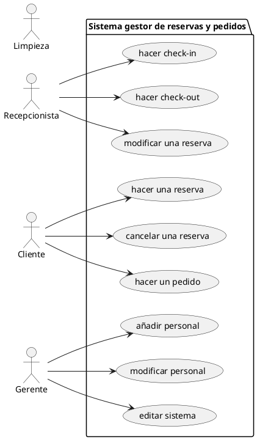

# Modelo examen

## Ejercicio 1: Plan de pruebas
**Diseña las siguientes pruebas para una aplicación determinada:**
- Diseña un plan de pruebas coherente, teniendo en cuenta
    - Pruebas unitarias: diseña escenarios en los que usarías pruebas tipo JUnit (caja negra, basadas en casos de uso). Es necesario representarlas en forma de tabla y solo es necesario hacer 4, pero que sean relevantes.
    - Pruebas de integración: diseña escenarios en los que usarías pruebas tipo Mockito y GitHub Actions (simulación de componentes y tareas automatizadas en cada cambio).  
    - Pruebas de aceptación: diseña escenarios usando pruebas tipo Cucumber, utilizando lenguaje Gherkin para definir los criterios del cliente.  
    - Pruebas de seguridad y otros tipos: diseña escenarios donde se ponga a prueba la robustez y protección del sistema ante fallos o ataques.


### APLICACIÓN:

Estamos desarrollando una **plataforma de gestión de reservas y pedidos para un hotel**. Los roles principales son: *Recepcionista, Cliente, Gerente, y Limpieza*.  
Cada usuario accede desde su propio terminal (dispositivo móvil o PC) utilizando credenciales personalizadas.  
La aplicación se conecta con un sistema de reservas externo vía API REST y también accede a una base de datos SQL.  
Las funcionalidades están representadas en el siguiente diagrama de casos de uso:



### Tabla para las pruebas de unidad:

|ID|Nombre de prueba|método|descripción (precondiciones y pasos)|entrada|salida esperada|salida obtenida|
|--|---------------|--|--|--|--|--|
|1  
|2
|3
|4 

## Ejercicio 2: Trazas

Dado el siguiente código:

```java
public class EjercicioDebug {
    public static void main(String[] args) {
        int[] n = {3, 7, 2, 9, 5};
        int r = 0;
        for (int i = 0; i < n.length; i++) {
            r += procesaNumero(n[i]); // Colocar breakpoint con condición: n[i] > 5
        }
        System.out.println("Resultado: " + r);
        muestraInfoExtra(n);
    }
    static int procesaNumero(int x) {
        int y = 0;
        if (x % 2 == 0) {
            y = x * 2;
        } else {
            y = x * 3;
        }
        System.out.println("Procesando: " + x);
        System.out.println("Temporal: " + y);
        System.out.println("-----");
        return y;
    }
   
    static void muestraInfoExtra(int[] arr) {
        int s = 0;
        for (int i = 0; i < arr.length; i++) {
            s += arr[i];
        }
        for (int i = 0; i < arr.length; i++) {
            if (arr[i] % 2 == 0) {
                System.out.println(arr[i] + " es par");
            } else {
                System.out.println(arr[i] + " es impar");
            }
        }
        System.out.println("Suma total: " + s);
    }
}
```
Coloca un punto de ruptura en la línea indicada con la condición establecida y realiza las siguientes pruebas:
-	En el primer punto de ruptura, ejecuta un step over y continúa hasta la siguiente ruptura.
-	La segunda vez que pare, ejecuta un step into y ejecuta step over 3 veces. Después ejecuta step out.
Refleja el resultado en una traza con tabla de seguimiento de variables y de pasos (como la pila de llamadas del debugger).

## Ejercicio 3: Test

1. Las pruebas de caja blanca…
a)	Sirven para probar el código del programa
b)	Sirven para probar la entrada y salida del programa
c)	Sirven para probar la integración de los componentes del sistema
d)	Son como las pruebas de caja negra, pero las tienes que implementar de forma manual
2. Las pruebas de caja negra…
a)	Sirven para probar el código del programa
b)	Sirven para probar la entrada y salida del programa
c)	Sirven para probar la integración de los componentes del sistema
d)	Son como las pruebas de caja blanca, pero se generan de forma automática
3. Las pruebas de sistema…
a)	Prueban los componentes individuales
b)	Prueban la interacción entre componentes
c)	Prueban el software en su totalidad
d)	Prueban que el software cumple todos los requisitos
4. Las pruebas de unidad…
a)	Prueban los componentes individuales
b)	Prueban la interacción entre componentes
c)	Prueban el software en su totalidad
d)	Prueban que el software cumple todos los requisitos
5. Las pruebas de validación…
a)	Prueban los componentes individuales
b)	Prueban la interacción entre componentes
c)	Prueban el software en su totalidad
d)	Prueban que el software cumple todos los requisitos
6. Las pruebas de integración…
a)	Prueban los componentes individuales
b)	Prueban la interacción entre componentes
c)	Prueban el software en su totalidad
d)	Prueban que el software cumple todos los requisitos
7. Un diagrama de casos de uso…
a)	Nos puede ayudar a realizar pruebas de caja blanca
b)	Nos puede ayudar a realizar pruebas de caja negra
c)	Nos puede ayudar a realizar pruebas de integración
d)	No sirve para planificar pruebas
8. Un diagrama de actividad…
a)	Nos puede ayudar a realizar pruebas de caja blanca
b)	Nos puede ayudar a realizar pruebas de caja negra
c)	Nos puede ayudar a realizar pruebas de integración
d)	No sirve para planificar pruebas
9. Las pruebas exploratorias…
a)	Son pruebas con un enfoque riguroso y exhaustivo de prueba de casos reales
b)	Siguen un plan estructurado
c)	Permiten descubrir errores inesperados
d)	Son alternativas a las pruebas automatizadas
10.  Acerca de ISTQB, podemos decir…
a)	Que es un framework de software para pruebas
b)	Que es un organismo internacional de estándares de todo tipo
c)	 Que reconoce varios tipos de testeo
d)	Que es un organismo internacional de estándares de pruebas de integración continua

11. Qué es la traza de un programa?
a)	La salida del depurador de software
b)	Un sistema consistente en tablas de seguimiento de variables enlazadas
c)	Un registro detallado de la ejecución de un programa
d)	Una prueba que analiza el camino que puede seguir la ejecución de un código
12. La función Step Over de un depurador…
a)	Ejecuta la línea actual y pasa a la siguiente, sin entrar en los detalles de las funciones llamadas
b)	Ejecuta la línea actual y entra en el código de las funciones llamadas para inspeccionarlas
c)	Sale de la función actual y regresa al punto donde fue llamada la función
d)	Muestra la secuencia de llamadas a funciones que llevaron al punto actual de ejecución

## Rubrica

| | ÍTEM | Criterio Evaluación | PESO |
|---|---|---|---
| 1| Diseño del plan de pruebas | 3a | 2
| 1| Pruebas de unidad| 3b, 3f, 3g | 1
| 1| Pruebas de integración| 3i | 1
| 1| Pruebas de aceptación | 3b, 3f, 3g | 1
| 1| Otras pruebas| 3a | 1
| 2| Confección de la traza | 3c, 3d | 2
| 2| Test | TODOS | 2 |
