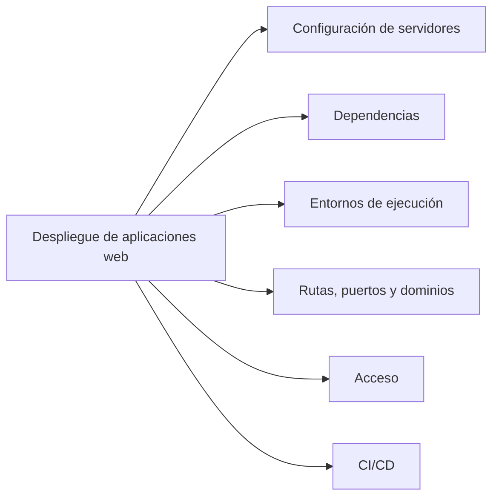
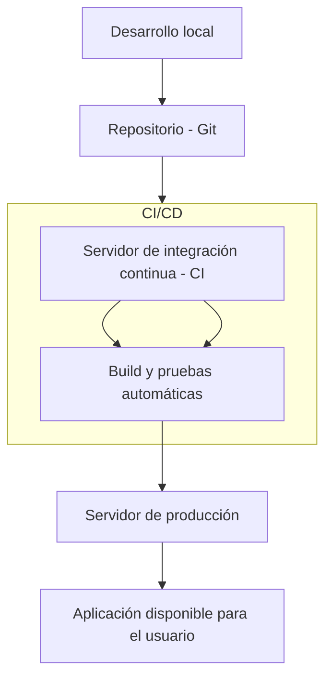

# 1. Despliegue de aplicaciones web

## 1.1 Definición de 'Despliegue de aplicaciones web'

El **despliegue de una aplicación web** consiste en el conjunto de tareas necesarias para que una aplicación desarrollada pueda ponerse en funcionamiento en un entorno real, accesible a través de la red (generalmente Internet o una intranet).

Consiste en preparar correctamente todos los componentes de la aplicación para que esta funcione tal y como se espera en la fase de producción. Esto incluye las siguientes tareas:

- Configuración de servidores web, de aplicaciones, de archivos y de bases de datos
- Instalación de las dependencias necesarias
- Establecimiento de los entornos de ejecución
- Configuración de rutas, puertos y dominios
- Confirmación del acceso correcto (HTTPS, firewalls, roles de usuario, etc.)
- Automatización de procesos de integración continua y despliegue continuo (CI/CD)

## 1.2 Fases comunes en un proceso de despliegue

Aunque varía según la tecnología y complejidad de la aplicación, el proceso suele incluir:

1. **Preparación del entorno de producción**

   * Elección del sistema operativo y configuración básica del servidor.
   * Instalación de software necesario (por ejemplo: Apache, Nginx, Tomcat, PHP, Java, Node.js, bases de datos).

2. **Transferencia de archivos**

   * Subida del código fuente y recursos mediante FTP/SFTP, Git o herramientas de automatización.

3. **Instalación de dependencias**

   * Uso de gestores como `composer`, `npm`, `pip`, `maven` o `gradle` para instalar librerías requeridas.

4. **Configuración del servidor**

   * Virtual hosts, puertos, certificados SSL, variables de entorno.

5. **Puesta en marcha y pruebas**

   * Lanzamiento de la aplicación.
   * Verificación del correcto funcionamiento en producción.

6. **Automatización (CI/CD)**

   * Uso de herramientas como GitHub Actions, GitLab CI, Jenkins, etc. para automatizar el despliegue tras cada cambio o versión.

## 1.3 Finalidad del despliegue

La finalidad de desplegar una aplicación web es hacerla accesible al público objetivo de la misma. Asimismo, su implementación garantiza la optimización del rendimiento, la seguridad y la eficiencia, así como el mantenimiento, la monitorización y la escalabilidad del sistema en un futuro. Es decir, el despliegue de una aplicación web convierte una aplicación en desarrollo en sistema funcional, público y operativo.

## 1.4 Pautas de despliegue en diferentes entornos

### Aplicación PHP en Apache (LAMP)

* Desarrollo local con XAMPP o MAMP.
* Subida al servidor web mediante FTP.
* Configuración de Apache (`VirtualHost`) y PHP.
* Base de datos MySQL importada desde archivo `.sql`.
* El sitio queda accesible desde un dominio o IP.

### Aplicación Java con Spring Boot en Tomcat

* Desarrollo en IntelliJ o Eclipse.
* Empaquetado como `.war` o `.jar`.
* Despliegue en un servidor Tomcat.
* Configuración de base de datos (PostgreSQL, MySQL).
* Uso de `application.properties` para definir rutas, puertos, credenciales, etc.

### Aplicación SPA (Single Page Application)

Una SPA es una aplicación web que interactúa con el usuario de forma dinámica, reescribiendo el contenido de la página con información procedente del servidor, en lugar de recargar la página completa. De esta forma, la aplicación web es más fluida y su comportamiento se asemeja más al de una aplicación de escritorio.

En una SPA, nunca se recarga la página, sino que el contenido se reescribe de forma asíncrona. Hay una gran cantidad de frameworks, como Angular o Vue.js, que tienen este enfoque.

* Frontend en React (SPA) desplegado en Netlify o Vercel.
* Backend (API REST en Node.js o Django) desplegado en un VPS o contenedor Docker.
* Comunicación entre capas mediante fetch/Axios.
* Configuración de variables de entorno y seguridad CORS.

## 1.5 Repercusión del despliegue

El proceso de despliegue no solo marca el final del desarrollo, sino el **inicio de la operación real** de una aplicación. Su correcta ejecución tiene impacto directo en:

* **La disponibilidad del servicio**
* **La experiencia de usuario (UX)**
* **La seguridad de los datos**
* **La capacidad de mantenimiento y actualización**
* **El posicionamiento del proyecto frente a usuarios o clientes**

Errores en el despliegue pueden generar fallos graves en producción, caídas del servicio, fugas de información o pérdida de usuarios.

