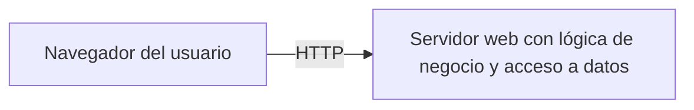
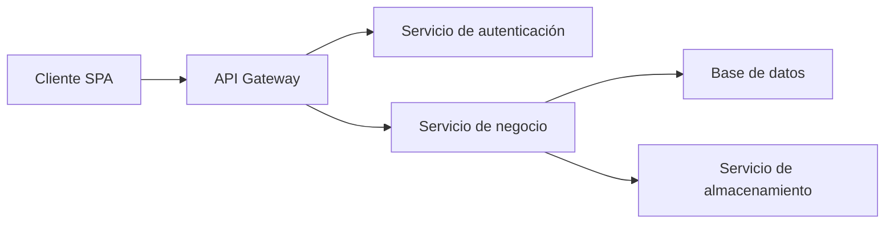
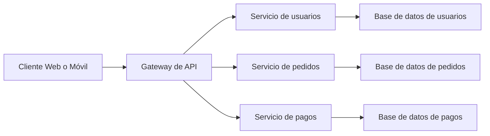

# 2. Arquitecturas Web

## 2.1 Definición de 'Arquitectura Web'

La **arquitectura web** es el diseño estructural que define cómo se organizan, comunican y ejecutan los distintos componentes de una aplicación web. Determina la forma en que los datos fluyen desde el cliente al servidor, cómo se gestionan las peticiones, cómo se estructuran los servicios, y cómo se accede a los datos.

El concepto de arquitectura web está estrechamente ligado al diseño de **sistemas distribuidos**, ya que, en general, una aplicación web está compuesta por distintos elementos ubicados en máquinas distintas, que interactúan a través de la red.

Una arquitectura bien diseñada permite:

* Separar claramente las responsabilidades entre presentación, lógica de negocio y acceso a datos.
* Facilitar el mantenimiento, la escalabilidad y la reutilización del sistema.
* Aumentar la seguridad, el rendimiento y la disponibilidad del servicio.

## 2.2 Modelos de arquitecturas web

A continuación se presentan los principales modelos de arquitectura utilizados en aplicaciones web, con una breve descripción, ventajas, desventajas y ejemplos representativos.

### 2.2.1 Modelo Cliente-Servidor (monolítico)

Es el modelo más básico y el punto de partida histórico de las arquitecturas web. En este esquema, el cliente solicita recursos o acciones al servidor, y este responde generando contenido dinámico o entregando archivos estáticos.



**Características:**

* El servidor gestiona la presentación, la lógica y el acceso a datos.
* Aplicaciones desarrolladas con tecnologías como PHP, JSP o ASP clásicas.
* Toda la lógica reside en un único servidor.

**Ejemplo:** Sitio web en PHP (sin framework), donde cada página `.php` genera directamente HTML con acceso a base de datos embebido.

**Ventajas:**

* Desarrollo simple y directo.
* Fácil despliegue en entornos pequeños.

**Desventajas:**

* Baja escalabilidad.
* Difícil mantenimiento conforme la aplicación crece.

### 2.2.2 Arquitectura en dos capas (2-tier)

En esta arquitectura, la aplicación se divide en dos niveles:

1. Cliente: Interfaz de usuario.
2. Servidor: Lógica de negocio y acceso a datos.

El servidor centraliza más responsabilidad que en el modelo monolítico, aunque sigue existiendo un fuerte acoplamiento.

```mermaid
flowchart LR
    A[Cliente (navegador o aplicación)] --> B[Servidor de aplicaciones + acceso a BD]
    B --> C[Base de datos]
```

**Ejemplo:** Aplicación Java con lógica en el lado del servidor (Servlets, JSP) que conecta directamente con una base de datos MySQL.

**Ventajas:**

* Mejora la organización del código frente al modelo monolítico.
* Mayor control sobre el acceso a datos.

**Desventajas:**

* La lógica y el acceso a datos aún están muy acoplados.
* No es óptima para grandes volúmenes de usuarios simultáneos.

### 2.2.3 Arquitectura en tres capas (3-tier)

Separa claramente tres responsabilidades fundamentales:

1. Capa de presentación (Frontend): interfaz gráfica.
2. Capa de lógica de negocio (Backend): reglas, procesos y flujos.
3. Capa de datos: persistencia de información.


**Ejemplo:** Aplicación con Angular (frontend), backend en Java con Spring Boot, y base de datos PostgreSQL.

**Ventajas:**

* Facilita el mantenimiento y pruebas de cada capa por separado.
* Mejora la seguridad (la base de datos no es accesible desde el cliente).
* Favorece la escalabilidad horizontal.

**Desventajas:**

* Mayor complejidad de desarrollo y despliegue.
* Necesidad de coordinar entre capas.

### 2.2.4 Arquitectura multicapa (N-tier)

Extiende el modelo de tres capas añadiendo más niveles de especialización. Por ejemplo, pueden añadirse capas de servicios, autenticación, caché, procesamiento de datos, etc.



**Ejemplo:** Plataforma educativa con múltiples microservicios: autenticación, usuarios, contenidos, estadísticas, etc.

**Ventajas:**

* Altamente modular.
* Ideal para proyectos con necesidades complejas o escalables.

**Desventajas:**

* Mayor dificultad de implementación, monitoreo y mantenimiento.
* Dependencia de herramientas de orquestación (Docker, Kubernetes).

### 2.2.5 Arquitectura basada en microservicios

Divide la aplicación en múltiples servicios independientes, cada uno con una funcionalidad concreta. Cada servicio es desplegado y escalado de forma individual, y se comunican a través de APIs.



**Ejemplo:** Plataforma de comercio electrónico con servicios separados para usuarios, productos, pagos, inventario, etc.

**Ventajas:**

* Independencia tecnológica entre servicios.
* Mejor tolerancia a fallos.
* Escalabilidad por componentes.

**Desventajas:**

* Mayor complejidad arquitectónica y operativa.
* Comunicación entre servicios más costosa y sujeta a fallos.

### 2.2.6 Arquitectura desacoplada: SPA + API

Este modelo separa completamente el frontend del backend. El cliente (SPA) se encarga de la presentación, y el backend se expone únicamente a través de una API.

```mermaid
flowchart LR
    A[SPA (React / Angular / Vue)] --> B[API REST o GraphQL]
    B --> C[Servicios de negocio]
    C --> D[Base de datos]
```

**Ejemplo:** Frontend en React desplegado en Vercel, backend en Node.js con Express desplegado en un VPS o contenedor Docker.

**Ventajas:**

* Separación clara entre cliente y servidor.
* Permite múltiples clientes (web, móvil, escritorio).
* Facilita el uso de frameworks modernos.

**Desventajas:**

* Necesidad de gestión CORS y autenticación vía tokens.
* Complejidad adicional al haber dos proyectos independientes.

## 2.3 Comparativa general

| Modelo              | Separación de capas | Escalabilidad | Complejidad | Recomendado para                  |
| ------------------- | ------------------- | ------------- | ----------- | --------------------------------- |
| Cliente-Servidor    | Baja                | Baja          | Baja        | Sitios simples y personales       |
| Dos capas (2-tier)  | Media               | Media         | Media       | Aplicaciones internas pequeñas    |
| Tres capas (3-tier) | Alta                | Alta          | Media       | Aplicaciones web empresariales    |
| Multicapa (N-tier)  | Muy alta            | Muy alta      | Alta        | Sistemas grandes y distribuidos   |
| Microservicios      | Muy alta            | Muy alta      | Muy alta    | Plataformas complejas y modulares |
| SPA + API           | Alta                | Alta          | Alta        | Aplicaciones modernas y móviles   |

