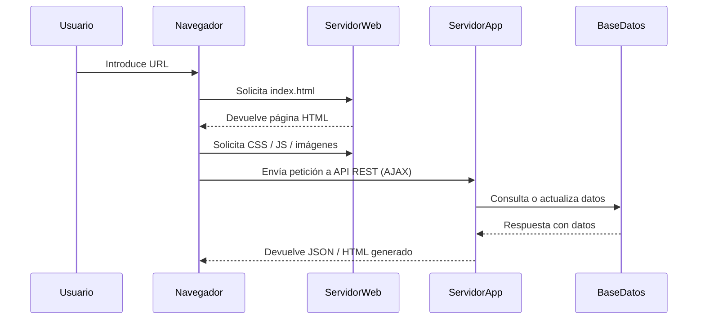

# 4. Estructura y recursos de una aplicación web

## 4.1 ¿Qué es una aplicación web?

Una **aplicación web** es un sistema software accesible a través de un navegador web, que se ejecuta parcial o totalmente en un servidor remoto. A diferencia de los sitios web informativos, las aplicaciones web incluyen lógica de negocio y permiten la interacción directa con el usuario (por ejemplo: paneles de usuario, sistemas de gestión, comercio electrónico, plataformas educativas, etc.).

Estas aplicaciones suelen dividirse en dos grandes partes:

- **Frontend (cliente):** lo que el usuario ve y con lo que interactúa.
- **Backend (servidor):** donde se procesan los datos, se ejecuta la lógica de negocio y se accede a las bases de datos.

## 4.2 Estructura típica de una aplicación web

Aunque depende del lenguaje, framework y arquitectura, la mayoría de aplicaciones web modernas comparten una organización común. A continuación, se describe una estructura genérica para proyectos con separación entre cliente y servidor:

```bash
mi-aplicacion/
├── frontend/              # Aplicación cliente (HTML, CSS, JS, frameworks)
│   ├── public/            # Archivos estáticos (imágenes, favicon, index.html)
│   ├── src/               # Código fuente (componentes, páginas, estilos)
│   └── package.json       # Dependencias y scripts del frontend
│
├── backend/               # Lógica del servidor (API, base de datos)
│   ├── controllers/       # Lógica de control (manejo de peticiones)
│   ├── models/            # Modelos de datos (ORM, clases, esquemas)
│   ├── routes/            # Definición de rutas/endpoints
│   ├── services/          # Lógica de negocio independiente
│   ├── config/            # Configuración (BD, variables de entorno)
│   └── app.js / server.js # Punto de entrada
│
├── database/              # Scripts de base de datos, migraciones
├── .env                   # Variables de entorno (credenciales, puertos)
└── README.md              # Documentación del proyecto
```


## 4.3 Recursos fundamentales

A continuación se describen los tipos de recursos que componen una aplicación web.

### A. Recursos del lado del cliente (Frontend)

| Recurso    | Descripción                                                          |
| ---------- | -------------------------------------------------------------------- |
| HTML       | Estructura de la interfaz (contenido estático).                      |
| CSS        | Estilos visuales: colores, tamaños, distribución.                    |
| JavaScript | Lógica de interacción, animaciones, validación de formularios, AJAX. |
| Imágenes   | Recursos gráficos (JPG, PNG, SVG, etc.).                             |
| Fuentes    | Tipografías externas (por ejemplo desde Google Fonts).               |
| Frameworks | React, Vue, Angular… para SPA y componentes reutilizables.           |

### B. Recursos del lado del servidor (Backend)

| Recurso                   | Descripción                                                          |
| ------------------------- | -------------------------------------------------------------------- |
| Código fuente             | Archivos que gestionan rutas, lógica de negocio, validación, etc.    |
| Bases de datos            | Sistema de almacenamiento persistente (MySQL, PostgreSQL, MongoDB…). |
| APIs REST                 | Interfaz de comunicación entre cliente y servidor a través de HTTP.  |
| Ficheros de configuración | Variables de entorno, puertos, claves secretas.                      |
| Logs                      | Archivos de registro de errores y actividad del sistema.             |


## 4.4 Relación entre estructura y despliegue

La forma en que está estructurada una aplicación web influye directamente en su despliegue:

* **Separación de capas:** facilita la integración y escalabilidad.
* **Modularidad:** mejora el mantenimiento y la actualización.
* **Definición clara de rutas:** evita conflictos entre recursos.
* **Uso de recursos estáticos y dinámicos:** optimiza el rendimiento y la seguridad.

En entornos productivos, los recursos del frontend suelen **compilarse y minificarse**, y luego ser servidos por un servidor web (Apache, Nginx), mientras que el backend se ejecuta en un servidor de aplicaciones que expone una API o renderiza contenido dinámico.


## 4.5 Ejemplo de flujo entre cliente y servidor


