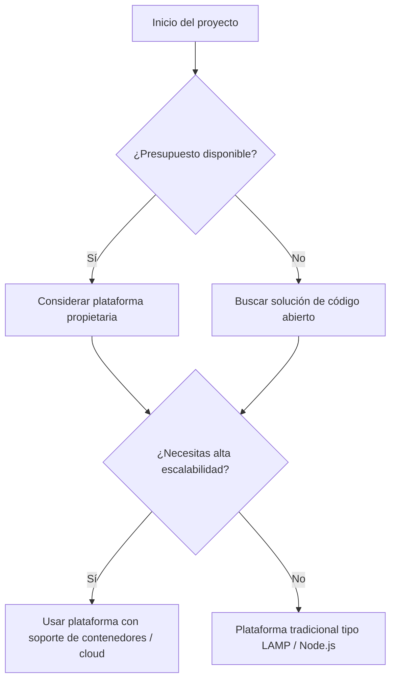

# 5. Plataformas web propietarias y de código abierto

## 5.1 ¿Qué es una plataforma web?

Una **plataforma web** es un entorno de software que permite desarrollar, desplegar, ejecutar y gestionar aplicaciones web. Estas plataformas integran distintos componentes como servidores, frameworks, herramientas de desarrollo, sistemas de autenticación, bases de datos, gestores de contenidos, etc.

En función del tipo de licencia y del acceso al código fuente, podemos distinguir dos grandes tipos:

* **Plataformas propietarias:** Desarrolladas por una empresa; su código no es accesible libremente y suelen requerir licencias de uso.
* **Plataformas de código abierto:** El código fuente está disponible públicamente, lo que permite modificarlo, adaptarlo y redistribuirlo bajo ciertas condiciones (por ejemplo, licencias MIT, GPL, Apache…).

## 5.2 Plataformas propietarias

Son plataformas que pertenecen a una empresa privada. Su uso puede estar restringido mediante licencias, suscripciones o condiciones legales. Algunas son soluciones completas ("plataforma como servicio") y otras son marcos de desarrollo o despliegue.

### Características

* Licencias comerciales.
* Actualizaciones y soporte oficiales.
* Infraestructura cerrada o limitada.
* En algunos casos, menor flexibilidad o dependencia del proveedor (**vendor lock-in**).

### Ejemplos destacados

| Plataforma                         | Tipo                            | Descripción breve                                                                       |
| ---------------------------------- | ------------------------------- | --------------------------------------------------------------------------------------- |
| **Microsoft Azure App Service**    | Plataforma como servicio (PaaS) | Permite desplegar apps web .NET, Java, Node.js, Python, etc., con alta escalabilidad.   |
| **Salesforce Platform**            | PaaS empresarial                | Plataforma para crear apps CRM basadas en web.                                          |
| **Adobe Experience Manager (AEM)** | CMS empresarial                 | Sistema propietario para gestionar contenido web corporativo.                           |
| **Firebase (Google)**              | Backend as a Service (BaaS)     | Solución para apps móviles y web con base de datos, hosting y autenticación integrados. |

## 5.3 Plataformas de código abierto

Permiten desarrollar y desplegar aplicaciones sin coste de licencias y con libertad para acceder, modificar y redistribuir el código fuente. Suelen tener una comunidad activa de desarrolladores y usuarios.

### Características

* Gratuitas (en su mayoría).
* Acceso completo al código fuente.
* Altamente configurables y personalizables.
* Comunidad de soporte y extensiones contribuidas por usuarios.

### Ejemplos destacados

| Plataforma                           | Tipo                        | Descripción breve                                                           |
| ------------------------------------ | --------------------------- | --------------------------------------------------------------------------- |
| **LAMP (Linux, Apache, MySQL, PHP)** | Stack clásico de servidor   | Entorno muy utilizado para aplicaciones PHP.                                |
| **WordPress**                        | CMS (PHP)                   | Plataforma de gestión de contenidos con miles de plugins.                   |
| **Drupal**                           | CMS (PHP)                   | Sistema más modular y técnico que WordPress, muy usado institucionalmente.  |
| **Node.js + Express**                | Backend JS                  | Plataforma ligera para construir APIs y servidores web con JavaScript.      |
| **Spring Boot**                      | Backend (Java)              | Framework para desarrollar y desplegar aplicaciones empresariales con Java. |
| **Docker + Kubernetes**              | Contenedores y orquestación | Entorno de despliegue moderno y portable para apps web y microservicios.    |

## 5.4 Comparativa entre plataformas

| Característica   | Propietarias                           | Código Abierto                        |
| ---------------- | -------------------------------------- | ------------------------------------- |
| Acceso al código | Cerrado                                | Abierto                               |
| Coste            | Licencias o suscripciones              | Generalmente gratuito                 |
| Flexibilidad     | Limitada a lo que permite el proveedor | Muy alta                              |
| Personalización  | Restringida                            | Libre, modificable                    |
| Comunidad        | Soporte oficial, menos abierta         | Comunidad amplia y colaborativa       |
| Ejemplos         | Azure, Firebase, AEM                   | LAMP, WordPress, Node.js, Spring Boot |

## 5.5 Elección de plataforma según necesidades

La elección de una plataforma dependerá de varios factores:

* **Presupuesto del proyecto:** si se requiere soporte profesional o si se puede asumir mantenimiento autónomo.
* **Tamaño y tipo de la aplicación:** aplicaciones sencillas pueden alojarse en soluciones cerradas; las complejas suelen necesitar mayor control.
* **Requisitos técnicos:** lenguajes, escalabilidad, seguridad, integración con otros sistemas.
* **Requisitos legales o de privacidad:** acceso al código fuente, control sobre los datos, cumplimiento normativo (por ejemplo, RGPD).

